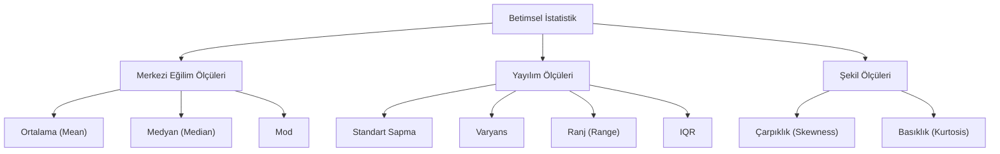

## 📌 Özet
Betimsel istatistik, karmaşık veri kümelerini anlamlı ve yönetilebilir özetlere dönüştüren, veri biliminin temel taşlarından biridir. Verinin merkezini belirlemek için kullanılan merkezi eğilim ölçüleri (ortalama, medyan, mod), verinin ne kadar yayıldığını gösteren yayılım ölçüleri (varyans, standart sapma, IQR) ve dağılımın simetrisini tanımlayan şekil ölçüleri (çarpıklık, basıklık) bu alanın ana bileşenleridir. Keşifsel veri analizi (EDA) sürecinin ilk ve en kritik adımı olan bu yöntemler, verideki potansiyel anomalileri, dağılım türlerini ve değişkenler arasındaki temel eğilimleri henüz ileri düzey modelleme aşamasına geçmeden anlamamıza olanak tanır. Özetle betimsel istatistik, verinin sayısal bir "kimlik kartını" çıkararak veriden anlamlı çıkarımlar yapmamızı sağlayan ilk araç setidir.

## 🧠 Detay

### Betimsel İstatistik Bileşenleri


### Merkezi Eğilim Ölçüleri
```python
import numpy as np
import pandas as pd
from scipy import stats

veri = [23, 45, 12, 67, 34, 89, 23, 45, 56, 34]

print(np.mean(veri))          # Ortalama: 42.8
print(np.median(veri))        # Medyan: 39.5
print(stats.mode(veri))       # Mod: 23 (en sık)
```

### Yayılım Ölçüleri
```python
print(np.std(veri))           # Standart sapma
print(np.var(veri))           # Varyans
print(np.max(veri) - np.min(veri))  # Ranj

# Çeyrekler
Q1 = np.percentile(veri, 25)
Q2 = np.percentile(veri, 50)  # medyan
Q3 = np.percentile(veri, 75)
IQR = Q3 - Q1
```

### Şekil Ölçüleri
```python
from scipy import stats

# Çarpıklık (Skewness)
# 0: simetrik, >0: sağa çarpık, <0: sola çarpık
print(stats.skew(veri))

# Basıklık (Kurtosis)
# 0: normal, >0: sivri, <0: yassı
print(stats.kurtosis(veri))
```

### Pandas ile Özet
```python
s = pd.Series(veri)
print(s.describe())
#  count    10.0
#  mean     42.8
#  std      23.4
#  min      12.0
#  25%      23.0
#  50%      39.5
#  75%      55.25
#  max      89.0
```

### Frekans Tablosu
```python
df["kategori"].value_counts()
df["kategori"].value_counts(normalize=True) * 100  # yüzde
```

## 💡 Bağlantılar
- [[DS - EDA - Keşifsel Veri Analizi]]
- [[İstatistik - Olasılık Dağılımları]]
- [[İstatistik - Korelasyon Analizi]]

## ❓ Sorular / Anlamadıklarım
- Ortalama mı, medyan mı? Hangisi ne zaman daha iyi?
- Standart sapma ile varyans arasındaki pratik fark?

## 🔗 Kaynaklar
- https://docs.scipy.org/doc/scipy/reference/stats.html
