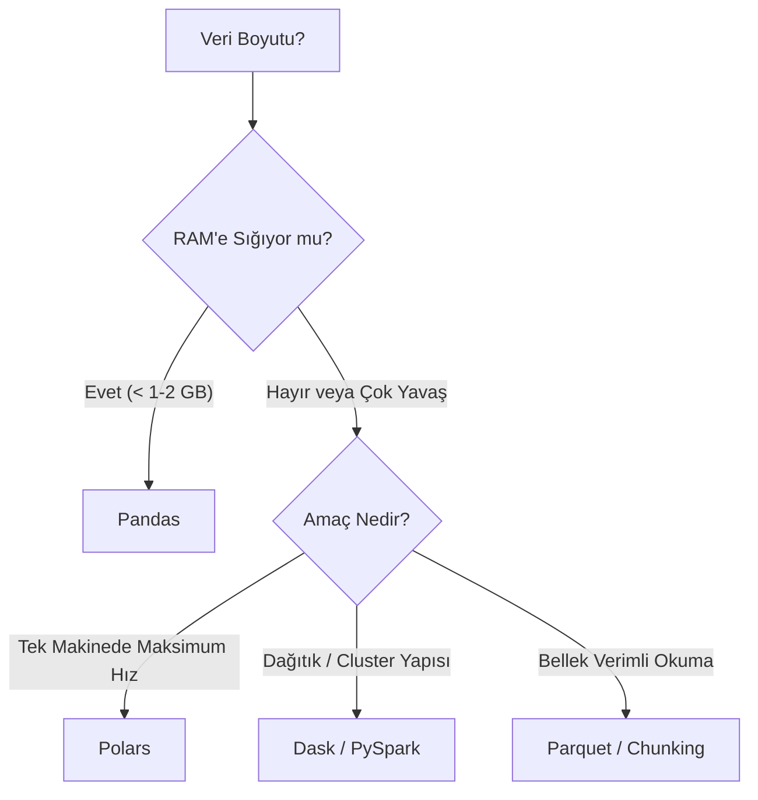

## 📌 Özet
Geleneksel Pandas kütüphanesi, veriyi tamamen belleğe (RAM) yükleme zorunluluğu ve tek çekirdekli (single-core) çalışma yapısı nedeniyle milyonlarca satırlık büyük veri setlerinde (Big Data) performans darboğazları yaşatır. Bu engelleri aşmak için geliştirilen Polars, Rust tabanlı mimarisi ve sorguları yürütmeden önce optimize eden "lazy evaluation" (tembel değerlendirme) stratejisi ile tek bir makinede olağanüstü hızlar sunar. Dask ise, veriyi küçük parçalara (chunks) ayırarak işlemci çekirdeklerine veya dağıtık sunucu kümelerine iş yükünü paylaştırarak Pandas'ın ölçeklenebilirliğini artırır. Büyük veri dünyasında sadece doğru kütüphaneyi seçmek değil, aynı zamanda veriyi sütun bazlı (columnar) ve sıkıştırılmış Parquet gibi formatlarda saklamak da işlem verimliliği için hayati öneme sahiptir.

---

## 🧠 Detay

### 🗺️ Büyük Veri İşleme Stratejisi



### 1. Polars (Hız Canavarı) ⭐
Rust diliyle yazılmıştır ve paralel işlemeyi otomatik yapar. Pandas'tan çok daha hızlıdır. "Lazy Evaluation" sayesinde sorgu planını (query plan) çalışmadan önce optimize eder.
```python
import polars as pl

df = pl.read_csv("buyuk_veri.csv")
# Sorgular (Lazy evaluation ile optimize edilir)
df.filter(pl.col("gelir") > 1000).group_by("sehir").agg(pl.mean("yas"))
```

### 2. Dask (Paralel ve Dağıtık)
Büyük veriyi küçük parçalara (chunks) ayırarak işlemci çekirdeklerine dağıtır. "Lazy" çalışır, işlem sonucu `compute()` çağrılana kadar hesaplanmaz.
```python
import dask.dataframe as dd

df = dd.read_csv("milyonlarca_satir.csv")
res = df.groupby("kategori").tutar.mean().compute() # compute() ile işlem başlar
```

### 3. Verimli Depolama: Parquet
CSV yerine sütun bazlı (columnar) Parquet formatı kullanmak:
- Daha az yer kaplar.
- Sadece gereken sütunları okumayı sağlar.
- Veri tiplerini korur.

---

## 💡 Bağlantılar
- [[DS - Pandas Temel Kullanım]]
- [[DS - Veri Okuma ve Yazma]]

## ❓ Sorular / Anlamadıklarım
- Pandas 2.0 ile gelen PyArrow desteği Polars'a rakip olabilir mi?

## 🔗 Kaynaklar
- https://pola-rs.github.io/polars-book/
- https://docs.dask.org/
