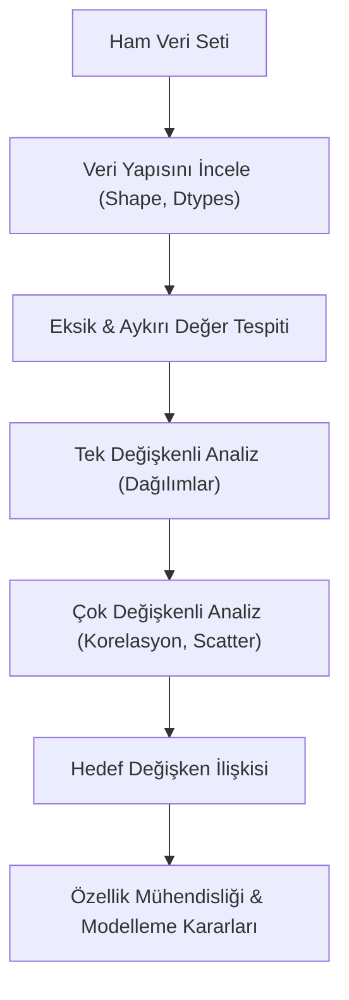

## 📌 Özet
Keşifsel Veri Analizi (EDA), veri bilimcinin modelleme aşamasına geçmeden önce veriyi derinlemesine "tanıma" ve "konuşturma" sürecidir. Bir dedektiflik çalışmasına benzeyen bu süreçte; verinin genel yapısı incelenir, eksik veya aykırı değerler tespit edilir ve değişkenler arasındaki gizli ilişkiler hem istatistiksel özetler hem de görselleştirme teknikleriyle ortaya çıkarılır. EDA, kurulan hipotezlerin doğrulanmasını sağladığı gibi, veri setindeki yapısal hataların erkenden fark edilmesine ve daha güçlü öznitelik mühendisliği (feature engineering) kararları alınmasına bilimsel bir temel oluşturur. İyi yapılandırılmış bir EDA süreci, projenin geri kalanındaki model başarısının ve stratejik çıkarımların en büyük belirleyicisidir.

## 🧠 Detay

### EDA İş Akışı


### EDA Adımları
```
1. Veriye genel bakış (Pandas metodları)
2. Eksik değer analizi (Missing values)
3. Betimsel istatistik (Describe)
4. Dağılım analizi (Histogram, Boxplot)
5. Kategorik değişken analizi (Barplot, Counts)
6. Korelasyon analizi (Heatmap)
7. Aykırı değer tespiti (Outliers)
```

### 1. Genel Bakış
```python
import pandas as pd
import seaborn as sns
import matplotlib.pyplot as plt

df = pd.read_csv("veri.csv")

print(df.shape)
print(df.head())
print(df.dtypes)
print(df.info())
```

### 2. Eksik Değer Analizi
```python
eksik = df.isnull().sum()
eksik_oran = eksik / len(df) * 100
print(pd.DataFrame({"Eksik": eksik, "Oran(%)": eksik_oran}))
```

### 3. Betimsel İstatistik
```python
print(df.describe())
print(df.describe(include="object"))  # kategorik
```

### 4. Sayısal Değişken Dağılımı
```python
sayisal = df.select_dtypes(include="number").columns

fig, axes = plt.subplots(len(sayisal)//3 + 1, 3, figsize=(15, 10))
for i, col in enumerate(sayisal):
    sns.histplot(df[col], kde=True, ax=axes[i//3, i%3])
plt.tight_layout()
```

### 5. Kategorik Değişken Analizi
```python
kategorik = df.select_dtypes(include="object").columns

for col in kategorik:
    print(f"\n{col}:")
    print(df[col].value_counts())
```

### 6. Korelasyon Analizi
```python
sns.heatmap(df.corr(), annot=True, cmap="coolwarm", center=0)
```

### 7. Hedef Değişken ile İlişki
```python
# Sayısal → hedef
for col in sayisal:
    sns.scatterplot(data=df, x=col, y="hedef")
    plt.show()

# Kategorik → hedef
for col in kategorik:
    sns.boxplot(data=df, x=col, y="hedef")
    plt.show()
```

## 💡 Bağlantılar
- [[DS - Pandas Veri Temizleme]]
- [[DS - Seaborn İstatistiksel Grafikler]]
- [[İstatistik - Betimsel İstatistik]]
- [[İstatistik - Korelasyon Analizi]]

## ❓ Sorular / Anlamadıklarım
- EDA ne zaman yeterlidir, ne zaman daha derin analiz gerekir?
- Otomatik EDA araçları (ydata-profiling) ne zaman kullanılmalı?

## 🔗 Kaynaklar
- https://pandas-profiling.ydata.ai
