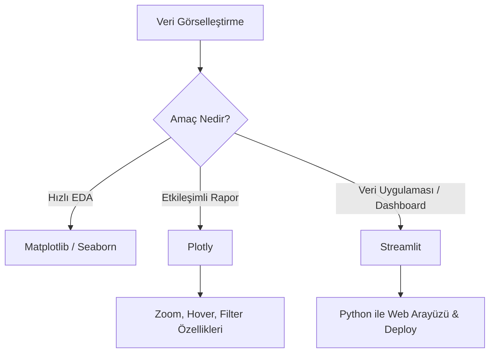

## 📌 Özet
Etkileşimli görselleştirme, statik grafiklerin ötesine geçerek kullanıcının veriyle doğrudan temas kurmasını sağlar ve analiz sürecini interaktif bir deneyime dönüştürür. Plotly kütüphanesi; detaylı hover (üzerine gelince bilgi alma), dinamik zoom ve anlık filtreleme özellikleri ile karmaşık veri setlerinin keşfini kolaylaştırırken, Streamlit bu görselleştirmeleri saniyeler içinde profesyonel birer web uygulamasına veya interaktif dashboard'a dönüştürme imkanı sunar. Veri bilimciler için Streamlit, HTML/CSS veya JavaScript uzmanlığı gerektirmeden, sadece Python kullanarak fonksiyonel arayüzler, veri giriş formları ve dinamik raporlama araçları oluşturmanın en verimli yoludur. Bu araç seti, teknik bulguların paydaşlara etkileyici ve anlaşılır bir şekilde sunulması için kritik bir köprü görevi görür.

---

## 🧠 Detay

### 🗺️ Görselleştirme Araç Seçimi



### 1. Plotly ile Etkileşimli Grafik
```python
import plotly.express as px

fig = px.scatter(df, x="gelir", y="harcama", color="sehir", 
                 hover_data=['yas'], title="Gelir vs Harcama")
fig.show()
```

### 2. Streamlit ile Veri Uygulaması
Streamlit, sadece Python kullanarak birkaç satırda dashboard yapmanızı sağlar.

```python
import streamlit as st
import pandas as pd

st.title("Satış Dashboard")
dosya = st.file_uploader("CSV Yükle")

if dosya:
    df = pd.read_csv(dosya)
    st.write(df.head())
    st.line_chart(df['satis'])
    
    sehir = st.selectbox("Şehir Seç", df['sehir'].unique())
    filtre = df[df['sehir'] == sehir]
    st.metric("Toplam Satış", filtre['satis'].sum())
```

---

## 💡 Bağlantılar
- [[DS - Veri Görselleştirme İlkeleri]]
- [[DS - Matplotlib Temel Grafikler]]
- [[DS - Seaborn İstatistiksel Grafikler]]

## ❓ Sorular / Anlamadıklarım
- Streamlit uygulamaları nasıl deploy edilir? (Streamlit Cloud, Heroku veya Docker).

## 🔗 Kaynaklar
- https://plotly.com/python/
- https://streamlit.io/
