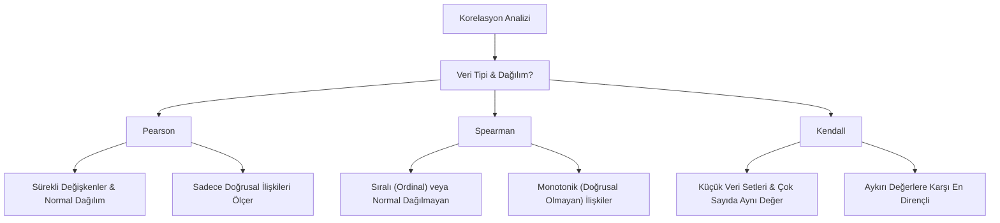

## 📌 Özet
Korelasyon analizi, iki veya daha fazla değişken arasındaki istatistiksel ilişkinin yönünü, gücünü ve anlamlılığını belirlemek için kullanılan temel bir yöntemdir. Değişkenler arasındaki doğrusal bağımlılığı ölçen korelasyon katsayısı -1 (tam ters yönlü ilişki) ile +1 (tam aynı yönlü ilişki) arasında değer alırken, 0 değeri değişkenler arasında doğrusal bir bağ olmadığını simgeler. Veri biliminde bu analiz; hedef değişkeni etkileyen en güçlü öznitelikleri belirlemek, modellerde sapmaya yol açabilecek çoklu doğrusallık (multicollinearity) sorunlarını tespit etmek ve veri setindeki yapısal bağımlılıkları anlamak için kritiktir. Ancak analiz sürecinde "korelasyonun nedensellik olmadığı" (correlation is not causation) prensibi daima akılda tutulmalı ve p-değeri ile istatistiksel anlamlılık kontrol edilmelidir.

## 🧠 Detay

### Korelasyon Yöntemi Seçimi


### Pearson Korelasyonu
```python
import numpy as np
import pandas as pd
from scipy import stats
import seaborn as sns

# İki değişken arası
r, p = stats.pearsonr(df["yas"], df["gelir"])
print(f"r={r:.3f}, p={p:.4f}")

# Tüm sayısal sütunlar
df.corr(method="pearson")
```

### Korelasyon Yorumlama
| r değeri | Yorum |
|----------|-------|
| 0.9 - 1.0 | Çok güçlü pozitif |
| 0.7 - 0.9 | Güçlü pozitif |
| 0.5 - 0.7 | Orta pozitif |
| 0.3 - 0.5 | Zayıf pozitif |
| 0.0 - 0.3 | Çok zayıf |
| Negatif | Ters yönde |

### Spearman Korelasyonu
```python
# Sıralama bazlı, doğrusal olmayan ilişkiler için
r, p = stats.spearmanr(df["yas"], df["gelir"])
df.corr(method="spearman")
```

### Isı Haritası
```python
import matplotlib.pyplot as plt

plt.figure(figsize=(10, 8))
sns.heatmap(
    df.corr(),
    annot=True,
    fmt=".2f",
    cmap="coolwarm",
    center=0,
    square=True
)
plt.title("Korelasyon Matrisi")
plt.show()
```

### Hedef Değişkenle Korelasyon
```python
# ML öncesi özellik seçimi için
korelasyonlar = df.corr()["hedef"].sort_values(ascending=False)
print(korelasyonlar)

# Görselleştir
korelasyonlar.drop("hedef").plot(kind="bar")
plt.title("Hedef Değişkenle Korelasyon")
plt.show()
```

### Dikkat Edilecekler
```python
# Korelasyon ≠ Nedensellik!
# Yüksek korelasyon → ilişki var, ama neden değil

# Çok yüksek korelasyon → multicollinearity
# VIF ile kontrol
from statsmodels.stats.outliers_influence import variance_inflation_factor
```

## 💡 Bağlantılar
- [[DS - EDA - Keşifsel Veri Analizi]]
- [[DS - Betimsel İstatistik]]
- [[ML - Özellik Seçimi]]

## ❓ Sorular / Anlamadıklarım
- Pearson ve Spearman korelasyonu ne zaman hangisini kullanmalıyım?
- Multicollinearity modeli nasıl etkiler?

## 🔗 Kaynaklar
- https://docs.scipy.org/doc/scipy/reference/generated/scipy.stats.pearsonr.html
