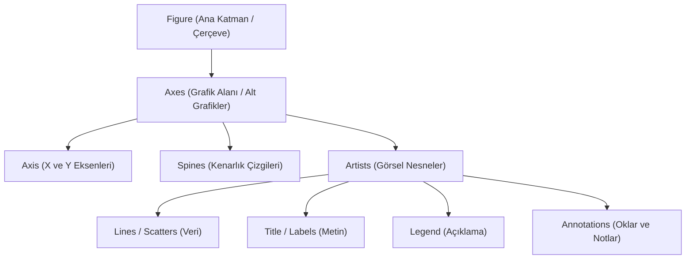

## 📌 Özet
Matplotlib grafik özelleştirme, ham veriyi etkileyici bir görsel hikayeye dönüştürmenin ve profesyonel kalitede raporlar sunmanın temel yoludur. Grafiklerin sadece sayısal olarak doğru olması yetmez; renk paleti seçimi, yazı tipi hiyerarşisi, lejant yerleşimi ve stratejik açıklama notları (annotations) ile izleyicinin dikkati verideki en kritik bulgulara çekilmelidir. Matplotlib'in esnek yapısı, hazır stillerin (ggplot, seaborn vb.) ötesine geçerek her bir görsel bileşenin milimetrik düzeyde kontrol edilmesine olanak tanır. Doğru bir özelleştirme süreci, teknik karmaşıklığı sadeleştirerek bulguların hem estetik bir bütünlük içinde sunulmasını hem de teknik açıdan daha kolay yorumlanmasını sağlar.

## 🧠 Detay

### Matplotlib Nesne Hiyerarşisi


### Stil ve Renk
```python
import matplotlib.pyplot as plt
import numpy as np

# Hazır stiller
plt.style.use("seaborn-v0_8")
plt.style.use("ggplot")
plt.style.use("dark_background")

# Renk seçenekleri
plt.plot(x, y, color="#FF5733")       # hex
plt.plot(x, y, color="tab:blue")      # isimli
plt.plot(x, y, color=(0.1, 0.5, 0.8)) # RGB
```

### Çizgi Stili ve Marker
```python
plt.plot(x, y, linestyle="--")    # kesikli
plt.plot(x, y, linestyle=":")     # noktalı
plt.plot(x, y, marker="o")        # daire
plt.plot(x, y, marker="^")        # üçgen
plt.plot(x, y, marker="s")        # kare
plt.plot(x, y, linewidth=2.5, markersize=8)
```

### Legend ve Annotasyon
```python
plt.plot(x, y1, label="Eğitim")
plt.plot(x, y2, label="Test")
plt.legend(loc="upper right", fontsize=12)

# Nokta işaretleme
plt.annotate("Maksimum",
    xy=(3, 6),
    xytext=(4, 5),
    arrowprops=dict(arrowstyle="->"))
```

### Eksen Özelleştirme
```python
plt.xlim(0, 10)
plt.ylim(-5, 15)
plt.xticks([0,2,4,6,8,10], fontsize=10, rotation=45)
plt.yticks(fontsize=10)
plt.xlabel("Zaman", fontsize=14)
plt.ylabel("Değer", fontsize=14)
plt.title("Başlık", fontsize=16, fontweight="bold")
```

### İkinci Y Ekseni
```python
fig, ax1 = plt.subplots()
ax2 = ax1.twinx()

ax1.plot(x, y1, color="blue", label="Satış")
ax2.plot(x, y2, color="red", label="Kar")

ax1.set_ylabel("Satış", color="blue")
ax2.set_ylabel("Kar", color="red")
```

### Renk Haritası (Colormap)
```python
scatter = plt.scatter(x, y, c=z, cmap="viridis")
plt.colorbar(scatter, label="Değer")
```

## 💡 Bağlantılar
- [[DS - Matplotlib Temel Grafikler]]
- [[DS - Seaborn İstatistiksel Grafikler]]

## ❓ Sorular / Anlamadıklarım
- `tight_layout()` ve `constrained_layout` farkı?
- En iyi renk körlüğü dostu renk paleti hangisi?

## 🔗 Kaynaklar
- https://matplotlib.org/stable/gallery/index.html
