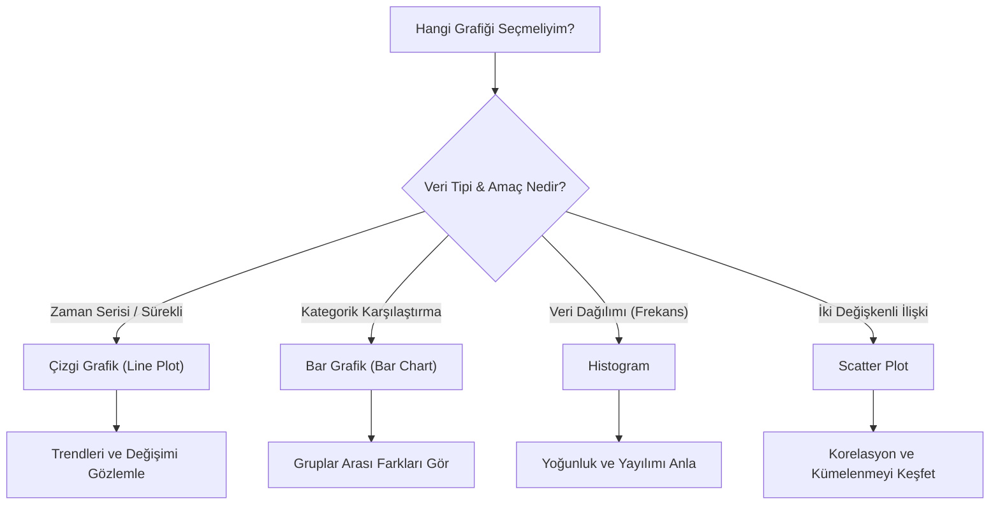

## 📌 Özet
Matplotlib, Python ekosistemindeki veri görselleştirme araçlarının atası ve en güçlü temel taşıdır. Düşük seviyeli (low-level) bir kütüphane olması sayesinde, bir grafiğin her bir bileşeni üzerinde tam kontrol imkanı sunar ve Seaborn gibi daha yüksek seviyeli kütüphanelerin üzerine inşa edildiği çekirdek yapıyı oluşturur. Veri biliminde; zaman serisi trendlerini gözlemlemek için çizgi grafikler, kategorik karşılaştırmalar için bar grafikler, veri dağılımını analiz etmek için histogramlar ve değişkenler arası korelasyonu keşfetmek için scatter plot'lar en temel analiz araçlarıdır. Etkili bir görselleştirme süreci, eldeki veri setinin doğasına ve yanıt aranan soruya en uygun grafik türünü seçmekle başlar; Matplotlib bu seçimi gerçeğe dönüştürmek için sınırsız esneklik sağlar.

## 🧠 Detay

### Grafik Türü Seçim Rehberi


### Kurulum ve Import
```python
pip install matplotlib
import matplotlib.pyplot as plt
import numpy as np
```

### Çizgi Grafik
```python
x = [1, 2, 3, 4, 5]
y = [2, 4, 6, 8, 10]

plt.figure(figsize=(8, 5))
plt.plot(x, y, color="blue", linewidth=2, marker="o")
plt.title("Çizgi Grafik")
plt.xlabel("X Ekseni")
plt.ylabel("Y Ekseni")
plt.grid(True)
plt.show()
```

### Bar Grafik
```python
kategoriler = ["A", "B", "C", "D"]
degerler = [23, 45, 12, 67]

plt.bar(kategoriler, degerler, color="steelblue")
plt.title("Bar Grafik")
plt.show()

# Yatay bar
plt.barh(kategoriler, degerler)
```

### Histogram
```python
veri = np.random.randn(1000)

plt.hist(veri, bins=30, color="green", edgecolor="black")
plt.title("Histogram")
plt.show()
```

### Scatter Plot
```python
x = np.random.randn(100)
y = 2 * x + np.random.randn(100)

plt.scatter(x, y, alpha=0.5, color="red")
plt.title("Scatter Plot")
plt.show()
```

### Alt Grafikler (Subplots)
```python
fig, axes = plt.subplots(1, 2, figsize=(12, 5))

axes[0].plot(x, y)
axes[0].set_title("Sol Grafik")

axes[1].hist(veri, bins=20)
axes[1].set_title("Sağ Grafik")

plt.tight_layout()
plt.show()
```

### Grafik Kaydetme
```python
plt.savefig("grafik.png", dpi=150, bbox_inches="tight")
```

## 💡 Bağlantılar
- [[DS - Matplotlib Grafik Özelleştirme]]
- [[DS - Seaborn İstatistiksel Grafikler]]
- [[DS - EDA - Keşifsel Veri Analizi]]

## ❓ Sorular / Anlamadıklarım
- `fig, ax` kullanımı ile `plt.plot()` arasındaki fark?
- `figsize` değerlerini nasıl ayarlamalıyım?

## 🔗 Kaynaklar
- https://matplotlib.org/stable/tutorials/introductory/pyplot.html
