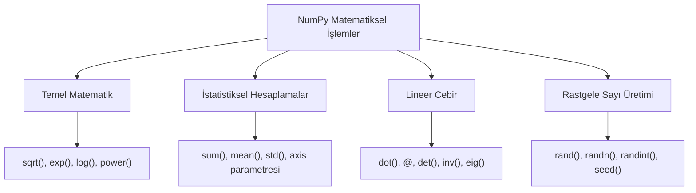

## 📌 Özet
NumPy, veri analizi ve makine öğrenmesi modellerinin temelini oluşturan yüksek performanslı matematiksel ve istatistiksel hesaplama araçları sunar. Vektörel işlemler sayesinde döngülere gerek kalmadan büyük veri setleri üzerinde logaritmik, üstel ve trigonometrik dönüşümler hızla gerçekleştirilebilir. Kapsamlı istatistik fonksiyonları ile verinin merkezi eğilim ve yayılım ölçüleri (ortalama, medyan, standart sapma vb.) hem tüm array hem de belirli eksenler bazında kolayca hesaplanır. Ayrıca, `linalg` modülü ile karmaşık lineer cebir işlemleri ve `random` modülü ile gelişmiş olasılık dağılımlarına dayalı veri üretimi standart hale getirilmiştir.

## 🧠 Detay



### Temel Matematiksel İşlemler
```python
import numpy as np

a = np.array([1, 4, 9, 16])
print(np.sqrt(a))     # [1. 2. 3. 4.]
print(np.exp(a))      # e üssü
print(np.log(a))      # doğal log
print(np.abs([-1,-2,3]))  # [1 2 3]
print(np.power(a, 2)) # kare
```

### İstatistiksel Fonksiyonlar
```python
a = np.array([2, 4, 6, 8, 10])

print(np.sum(a))       # 30
print(np.mean(a))      # 6.0
print(np.median(a))    # 6.0
print(np.std(a))       # 2.83
print(np.var(a))       # 8.0
print(np.min(a))       # 2
print(np.max(a))       # 10
print(np.percentile(a, 75))  # 8.0
```

### Eksen Boyunca İşlem
```python
b = np.array([[1, 2, 3],
              [4, 5, 6]])

print(np.sum(b))           # 21 (tümü)
print(np.sum(b, axis=0))   # [5 7 9] (sütun toplamı)
print(np.sum(b, axis=1))   # [6 15] (satır toplamı)
print(np.mean(b, axis=0))  # sütun ortalaması
```

### Lineer Cebir
```python
A = np.array([[1, 2], [3, 4]])
B = np.array([[5, 6], [7, 8]])

print(np.dot(A, B))        # matris çarpımı
print(A @ B)               # aynı şey
print(np.linalg.det(A))    # determinant
print(np.linalg.inv(A))    # ters matris
degerler, vektorler = np.linalg.eig(A)  # özdeğerler
```

### Rastgele Sayılar
```python
np.random.seed(42)              # tekrarlanabilirlik

np.random.rand(3, 3)            # [0,1) uniform
np.random.randn(3, 3)           # normal dağılım
np.random.randint(0, 10, (3,3)) # tam sayı
np.random.choice([1,2,3,4,5], 3) # örnekleme
```

## 💡 Bağlantılar
- [[DS - NumPy Temel Kullanım]]
- [[İstatistik - Betimsel İstatistik]]
- [[İstatistik - Olasılık Dağılımları]]

## ❓ Sorular / Anlamadıklarım
- `np.dot` ile `@` operatörü arasındaki fark?
- Seed neden önemli, ne zaman kullanmalıyım?

## 🔗 Kaynaklar
- https://numpy.org/doc/stable/reference/routines.math.html
