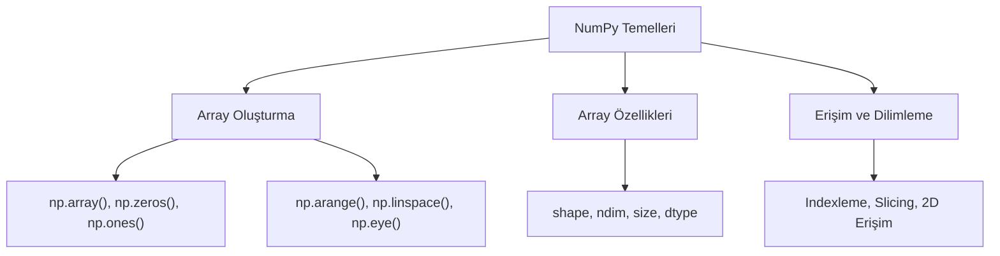

## 📌 Özet
NumPy (Numerical Python), Python programlama dilinde bilimsel hesaplamalar ve veri manipülasyonu için kullanılan en temel kütüphanedir. Çok boyutlu dizi yapısı olan `ndarray` nesnesi, standart Python listelerine kıyasla çok daha hızlı ve bellek verimli bir çalışma ortamı sunar. Pandas, Scikit-learn ve TensorFlow gibi popüler veri bilimi araçları, veri yapılarının temelinde NumPy'ı kullanarak karmaşık matematiksel işlemleri optimize ederler. Array oluşturma, veri tiplerini yönetme ve dilimleme (slicing) tekniklerini anlamak, modern veri analizi süreçlerine adım atmak için kritik bir öneme sahiptir.

## 🧠 Detay



### Kurulum ve Import
```python
pip install numpy
import numpy as np
```

### Array Oluşturma
```python
# Listeden array
a = np.array([1, 2, 3, 4, 5])
print(a)           # [1 2 3 4 5]
print(a.dtype)     # int64
print(a.shape)     # (5,)

# 2D array
b = np.array([[1, 2, 3],
              [4, 5, 6]])
print(b.shape)     # (2, 3)

# Hazır arrayler
np.zeros((3, 3))       # sıfırlar
np.ones((2, 4))        # birler
np.eye(3)              # birim matris
np.arange(0, 10, 2)    # [0,2,4,6,8]
np.linspace(0, 1, 5)   # [0, 0.25, 0.5, 0.75, 1]
```

### Temel Özellikler
```python
a = np.array([[1,2,3],[4,5,6]])

print(a.shape)    # (2, 3)
print(a.ndim)     # 2
print(a.size)     # 6
print(a.dtype)    # int64
```

### Indexleme ve Dilimleme
```python
a = np.array([10, 20, 30, 40, 50])
print(a[0])       # 10
print(a[-1])      # 50
print(a[1:4])     # [20 30 40]
print(a[::2])     # [10 30 50]

# 2D
b = np.array([[1,2,3],[4,5,6]])
print(b[0, 1])    # 2
print(b[:, 1])    # [2, 5] → 2. sütun
print(b[1, :])    # [4, 5, 6] → 2. satır
```

## 💡 Bağlantılar
- [[DS - NumPy Array İşlemleri]]
- [[DS - NumPy Matematiksel İşlemler]]
- [[DS - Pandas Temel Kullanım]]

## ❓ Sorular / Anlamadıklarım
- Python listesi ile NumPy array arasındaki hız farkı ne kadar?
- `dtype` neden önemli, ne zaman değiştirmeliyim?

## 🔗 Kaynaklar
- https://numpy.org/doc/stable/user/quickstart.html
