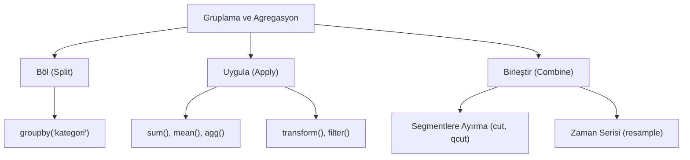

## 📌 Özet
Pandas'ta gruplama ve agregasyon işlemleri, büyük veri setlerini belirli kategoriler altında toplayarak verinin genel eğilimlerini özetlemek için kullanılır. `groupby` yapısı, veriyi "böl-uygula-birleştir" (split-apply-combine) stratejisiyle işleyerek toplam, ortalama ve sayım gibi temel istatistiklerin yanı sıra karmaşık fonksiyonların da gruplar üzerinde çalıştırılmasına imkan tanır. `agg` fonksiyonu ile farklı sütunlara farklı istatistikler uygulanabilirken, `transform` ve `filter` metodları grup bazlı veri dönüşümü ve elemenin kapılarını açar. Ayrıca `resample`, `cut` ve `qcut` gibi araçlar, zaman serilerini ve sürekli sayısal değişkenleri mantıklı segmentlere ayırarak derinlemesine analiz yapmayı kolaylaştırır.

## 🧠 Detay



### Temel groupby
```python
import pandas as pd

# Tek sütunla grupla
df.groupby("kategori")["satis"].sum()
df.groupby("kategori")["satis"].mean()
df.groupby("kategori")["satis"].count()
```

### agg() ile Çoklu Agregasyon
```python
df.groupby("kategori").agg({
    "satis": ["sum", "mean", "max"],
    "musteri": "count",
    "kar": "sum"
})

# Yeniden adlandır
df.groupby("kategori").agg(
    toplam_satis=("satis", "sum"),
    ort_satis=("satis", "mean"),
    musteri_sayisi=("musteri", "count")
)
```

### transform() — Grup Değerlerini Satıra Yaz
```python
# Grubun ortalamasını her satıra ekle
df["grup_ort"] = df.groupby("kategori")["satis"].transform("mean")

# Grubun toplamına oranı
df["oran"] = df["satis"] / df.groupby("kategori")["satis"].transform("sum")
```

### filter() — Grup Filtreleme
```python
# Toplam satışı 1000'den büyük grupları tut
df.groupby("kategori").filter(lambda x: x["satis"].sum() > 1000)
```

### resample() — Zaman Serisi Gruplama
```python
df["tarih"] = pd.to_datetime(df["tarih"])
df.set_index("tarih", inplace=True)

df.resample("M")["satis"].sum()   # aylık toplam
df.resample("W")["satis"].mean()  # haftalık ortalama
```

### cut() ve qcut() — Sayısal Gruplama
```python
# Yaşa göre kategoriler oluştur
df["yas_grubu"] = pd.cut(df["yas"],
    bins=[0, 18, 35, 60, 100],
    labels=["çocuk", "genç", "orta", "yaşlı"]
)

# Eşit frekanslı dilimleme
df["dilim"] = pd.qcut(df["gelir"], q=4,
    labels=["düşük","orta-düşük","orta-yüksek","yüksek"]
)
```

## 💡 Bağlantılar
- [[DS - Pandas DataFrame İşlemleri]]
- [[DS - Pandas Merge ve Join]]
- [[DS - EDA - Keşifsel Veri Analizi]]

## ❓ Sorular / Anlamadıklarım
- `transform` ile `apply` arasındaki fark nedir?
- `resample` için index neden datetime olmalı?

## 🔗 Kaynaklar
- https://pandas.pydata.org/docs/user_guide/groupby.html
