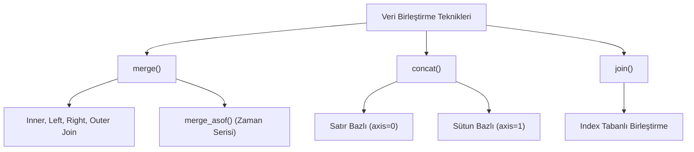

## 📌 Özet
Pandas'ta tablo birleştirme işlemleri, farklı kaynaklardan gelen veri setlerini ortak anahtarlar (keys) üzerinden ilişkilendirerek tek bir yapı altında toplama sürecidir. `merge` fonksiyonu, SQL dünyasındaki JOIN mantığını (inner, left, right, outer) birebir karşılayarak esnek bir birleştirme imkanı sunarken; `concat` fonksiyonu tabloları satır veya sütun bazında birbiri ardına eklemek (stacking) için kullanılır. Index tabanlı birleştirmeler için `join` metodu tercih edilirken, zaman serisi gibi tam eşleşme sağlanamayan durumlarda en yakın değeri bulan `merge_asof` kritik bir rol oynar. Bu teknikler, dağınık verilerin entegrasyonu ve kapsamlı analiz raporlarının oluşturulması için vazgeçilmez araçlardır.

## 🧠 Detay



### merge() — SQL JOIN Karşılığı
```python
import pandas as pd

musteriler = pd.DataFrame({
    "id": [1, 2, 3],
    "isim": ["Ali", "Ayşe", "Veli"]
})

siparisler = pd.DataFrame({
    "siparis_id": [101, 102, 103],
    "musteri_id": [1, 1, 2],
    "urun": ["Kalem", "Defter", "Silgi"]
})

# Inner join (kesişim)
pd.merge(musteriler, siparisler,
         left_on="id", right_on="musteri_id")

# Left join (sol tablo tümü)
pd.merge(musteriler, siparisler,
         left_on="id", right_on="musteri_id",
         how="left")

# Right join
pd.merge(..., how="right")

# Outer join (birleşim)
pd.merge(..., how="outer")
```

### Join Türleri
| Tür | Açıklama |
|-----|----------|
| `inner` | Sadece eşleşenler |
| `left` | Sol tüm + eşleşen sağ |
| `right` | Sağ tüm + eşleşen sol |
| `outer` | Tümü |

### concat() — Yığma
```python
# Aynı sütunlu tabloları üst üste ekle
df_toplam = pd.concat([df_ocak, df_subat, df_mart])
df_toplam = pd.concat([df1, df2], ignore_index=True)

# Yan yana ekle
df_yan = pd.concat([df1, df2], axis=1)
```

### join() — Index Bazlı
```python
df1.join(df2, on="id", how="left")
```

### merge_asof() — Zaman Serisi Birleştirme
```python
# En yakın değere göre birleştir
pd.merge_asof(df1, df2, on="tarih")
```

## 💡 Bağlantılar
- [[DS - Pandas Temel Kullanım]]
- [[DS - Pandas DataFrame İşlemleri]]
- [[DS - Pandas Gruplama ve Agregasyon]]

## ❓ Sorular / Anlamadıklarım
- `merge` ile `join` arasındaki fark ne zaman önemli?
- Çok büyük tablolarda merge nasıl optimize edilir?

## 🔗 Kaynaklar
- https://pandas.pydata.org/docs/user_guide/merging.html
