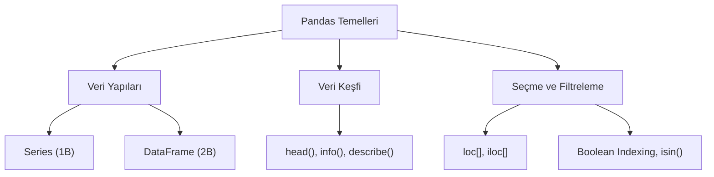

## 📌 Özet
Pandas, Python programlama dilinde yüksek performanslı, esnek ve kolay kullanımlı veri yapıları sağlayan bir veri analizi kütüphanesidir. Temel veri yapıları olan `Series` (tek boyutlu) ve `DataFrame` (iki boyutlu tablo) nesneleri, heterojen verilerin bir arada saklanmasını ve üzerinde karmaşık sorguların (filtreleme, seçme, dönüşüm vb.) saniyeler içinde yürütülmesini sağlar. Pandas, eksik veri yönetimi, veri hizalama ve farklı veri kaynaklarından okuma/yazma gibi gelişmiş özellikleriyle modern veri bilimi projelerinin vazgeçilmez bir parçasıdır. Veri keşfi aşamasında `head`, `describe` ve `info` gibi metodlar, veri setinin genel yapısını hızlıca kavramamıza yardımcı olur.

## 🧠 Detay



### Kurulum ve Import
```python
pip install pandas
import pandas as pd
import numpy as np
```

### Series ve DataFrame
```python
# Series → 1 boyutlu
s = pd.Series([10, 20, 30], index=["a","b","c"])
print(s["b"])   # 20

# DataFrame → 2 boyutlu tablo
df = pd.DataFrame({
    "isim": ["Ali", "Ayşe", "Veli"],
    "yas": [25, 30, 22],
    "sehir": ["İstanbul", "Ankara", "İzmir"]
})
```

### Temel Bilgi
```python
print(df.head())       # ilk 5 satır
print(df.tail(3))      # son 3 satır
print(df.shape)        # (3, 3)
print(df.columns)      # sütun isimleri
print(df.dtypes)       # veri tipleri
print(df.info())       # genel bilgi
print(df.describe())   # istatistikler
```

### Sütun ve Satır Seçimi
```python
# Sütun seçimi
print(df["isim"])
print(df[["isim", "yas"]])

# Satır seçimi
print(df.loc[0])           # index ile
print(df.iloc[0])          # pozisyon ile
print(df.loc[0:1, "isim":"yas"])  # dilim
```

### Filtreleme
```python
# 25 yaşından büyükler
gencler = df[df["yas"] > 25]

# Birden fazla koşul
filtre = df[(df["yas"] > 22) & (df["sehir"] == "İstanbul")]

# isin()
df[df["sehir"].isin(["İstanbul", "Ankara"])]
```

### Yeni Sütun Ekleme
```python
df["yasli_mi"] = df["yas"] > 28
df["yas_2"] = df["yas"] * 2
```

## 💡 Bağlantılar
- [[DS - Pandas DataFrame İşlemleri]]
- [[DS - Pandas Veri Okuma ve Yazma]]
- [[DS - Pandas Veri Temizleme]]

## ❓ Sorular / Anlamadıklarım
- `loc` ile `iloc` arasındaki fark nedir?
- Series ile DataFrame ne zaman birbirine dönüştürülür?

## 🔗 Kaynaklar
- https://pandas.pydata.org/docs/user_guide/10min.html
