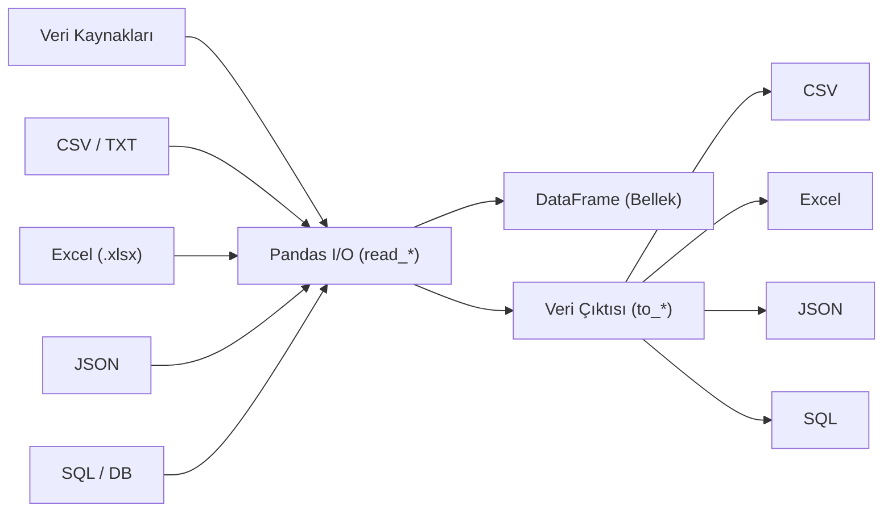

## 📌 Özet
Pandas, veri bilimcilerin farklı veri ekosistemleriyle etkileşim kurmasını sağlayan kapsamlı Giriş/Çıkış (I/O) araçlarına sahiptir. CSV ve Excel gibi yaygın ofis formatlarından, JSON gibi web tabanlı veri yapılarına ve ilişkisel veritabanlarından (SQL) doğrudan veri çekmeye kadar geniş bir yelpazeyi destekler. Veri okuma sırasında sunulan `sep`, `encoding`, `index_col` ve `nrows` gibi parametreler, ham veriyi belleğe alırken optimize etmeyi ve hataları önlemeyi sağlar. Bu yetenekler, verinin analiz için hazır hale getirilmesindeki ilk ve en kritik adım olan veri entegrasyonu sürecini standartlaştırır.

## 🧠 Detay



### CSV Okuma ve Yazma
```python
import pandas as pd

# Okuma
df = pd.read_csv("veri.csv")
df = pd.read_csv("veri.csv", encoding="utf-8")
df = pd.read_csv("veri.csv", sep=";")          # noktalı virgül ayraç
df = pd.read_csv("veri.csv", index_col=0)       # ilk sütun index
df = pd.read_csv("veri.csv", nrows=100)         # ilk 100 satır

# Yazma
df.to_csv("sonuc.csv", index=False, encoding="utf-8")
```

### Excel Okuma ve Yazma
```python
# Okuma
df = pd.read_excel("veri.xlsx")
df = pd.read_excel("veri.xlsx", sheet_name="Sayfa1")
df = pd.read_excel("veri.xlsx", skiprows=2)

# Yazma
df.to_excel("sonuc.xlsx", index=False, sheet_name="Sonuç")

# Birden fazla sayfa
with pd.ExcelWriter("coklu.xlsx") as writer:
    df1.to_excel(writer, sheet_name="Veri")
    df2.to_excel(writer, sheet_name="Özet")
```

### JSON Okuma ve Yazma
```python
df = pd.read_json("veri.json")
df.to_json("sonuc.json", orient="records", force_ascii=False)
```

### SQL Bağlantısı
```python
import sqlite3

con = sqlite3.connect("veritabani.db")
df = pd.read_sql("SELECT * FROM tablo", con)
df.to_sql("yeni_tablo", con, if_exists="replace", index=False)
```

### URL'den Okuma
```python
url = "https://example.com/veri.csv"
df = pd.read_csv(url)
```

### Veri Önizleme
```python
print(df.head(10))
print(df.shape)
print(df.memory_usage(deep=True).sum() / 1024**2, "MB")
```

## 💡 Bağlantılar
- [[DS - Pandas Temel Kullanım]]
- [[DS - Pandas Veri Temizleme]]
- [[Python - JSON İşlemleri]]

## ❓ Sorular / Anlamadıklarım
- Büyük CSV dosyaları için `chunksize` nasıl kullanılır?
- `encoding` hatası alırsam ne yapmalıyım?

## 🔗 Kaynaklar
- https://pandas.pydata.org/docs/user_guide/io.html
