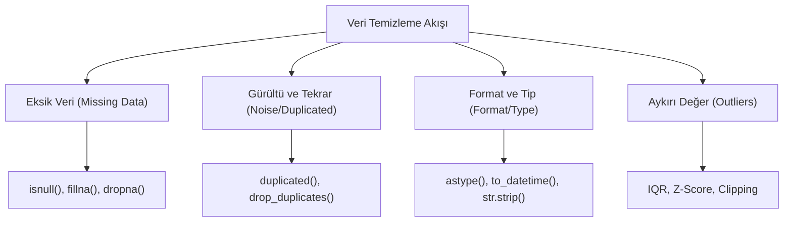

## 📌 Özet
Veri temizleme, veri biliminin en zaman alıcı fakat en kritik aşamasıdır; çünkü modellerin kalitesi doğrudan beslendikleri verinin temizliğine bağlıdır ("çöp içeri, çöp dışarı" prensibi). Pandas, eksik değerlerin tespiti (`isnull`), doldurulması (`fillna`) veya silinmesi (`dropna`) gibi işlemleri esnek parametrelerle yönetmeyi sağlar. Ayrıca, veri setindeki gürültüyü azaltmak için tekrar eden satırların ayıklanması, veri tiplerinin standardize edilmesi ve metin verilerinin temizlenmesi gibi rutin işlemler Pandas fonksiyonlarıyla otomatikleştirilebilir. IQR gibi yöntemlerle aykırı değerlerin (outliers) tespiti ve yönetilmesi, istatistiksel analizlerin ve makine öğrenmesi modellerinin doğruluğunu garanti altına alır.

## 🧠 Detay



### Eksik Değer Tespiti
```python
import pandas as pd
import numpy as np

df.isnull().sum()           # sütun bazında eksik sayısı
df.isnull().sum() / len(df) # oranı
df.isnull().any(axis=1)     # eksik satır var mı
```

### Eksik Değer Doldurma
```python
# Sabit değerle doldur
df["yas"].fillna(0)
df["sehir"].fillna("Bilinmiyor")

# İstatistikle doldur
df["yas"].fillna(df["yas"].mean())
df["yas"].fillna(df["yas"].median())

# İleri/geri doldur (zaman serisi)
df.fillna(method="ffill")  # önceki değer
df.fillna(method="bfill")  # sonraki değer
```

### Eksik Değer Silme
```python
df.dropna()                          # herhangi NaN olan satır
df.dropna(subset=["yas", "sehir"])   # belirli sütunlarda NaN
df.dropna(thresh=3)                  # en az 3 değer olan
df.dropna(axis=1)                    # NaN sütunu sil
```

### Tekrar Eden Satırlar
```python
df.duplicated().sum()
df.drop_duplicates(inplace=True)
df.drop_duplicates(subset=["isim", "yas"])
```

### Veri Tipi Dönüşümü
```python
df["yas"] = df["yas"].astype(int)
df["tarih"] = pd.to_datetime(df["tarih"])
df["fiyat"] = pd.to_numeric(df["fiyat"], errors="coerce")
```

### String Temizleme
```python
df["isim"] = df["isim"].str.strip()          # boşluk sil
df["isim"] = df["isim"].str.lower()          # küçük harf
df["sehir"] = df["sehir"].str.replace("İst.", "İstanbul")
```

### Aykırı Değer Tespiti (IQR)
```python
Q1 = df["yas"].quantile(0.25)
Q3 = df["yas"].quantile(0.75)
IQR = Q3 - Q1

alt = Q1 - 1.5 * IQR
ust = Q3 + 1.5 * IQR

temiz = df[(df["yas"] >= alt) & (df["yas"] <= ust)]
```

## 💡 Bağlantılar
- [[DS - Pandas Temel Kullanım]]
- [[DS - EDA - Keşifsel Veri Analizi]]
- [[DS - Aykırı Değer Analizi]]

## ❓ Sorular / Anlamadıklarım
- Eksik veriyi doldurmak mı yoksa silmek mi daha iyi?
- IQR dışındaki aykırı değer yöntemleri neler?

## 🔗 Kaynaklar
- https://pandas.pydata.org/docs/user_guide/missing_data.html
