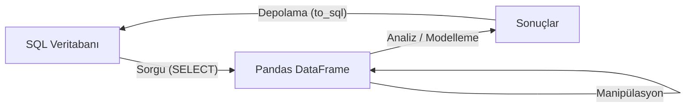

## 📌 Özet
Veri bilimciler için SQL, veri kaynaklarına erişmek, büyük veri setlerini filtrelemek ve analiz için gerekli alt kümeleri oluşturmak için kritik bir beceridir. Veritabanı yönetim sistemleri ile kurulan bu etkileşim, verinin ham halden temizlenmiş ve yapılandırılmış hale getirilmesi sürecinin ilk adımıdır. SQLite ve SQLAlchemy gibi araçlar sayesinde Python ve Pandas ekosistemi ile tam uyumlu çalışarak veritabanı işlemlerini kolaylaştırır. Verimli sorgu yazımı, veri biliminde zaman ve kaynak tasarrufu sağlayan en temel yetkinliklerden biridir.

## 🧠 Detay

### 🔄 Veri Akış Şeması



### SQLite ile Temel Kullanım
```python
import sqlite3
import pandas as pd

# Bağlan
con = sqlite3.connect("veritabani.db")

# Oku
df = pd.read_sql("SELECT * FROM musteriler", con)

# Yaz
df.to_sql("tablo_adi", con, if_exists="replace", index=False)

con.close()
```

### Temel SQL Sorguları
```sql
-- Tümünü getir
SELECT * FROM musteriler;

-- Filtreleme
SELECT isim, yas FROM musteriler WHERE yas > 25;

-- Sıralama
SELECT * FROM musteriler ORDER BY yas DESC;

-- Gruplama
SELECT sehir, COUNT(*) as sayi, AVG(yas) as ort_yas
FROM musteriler
GROUP BY sehir
HAVING COUNT(*) > 5;

-- Join
SELECT m.isim, s.urun, s.tutar
FROM musteriler m
INNER JOIN siparisler s ON m.id = s.musteri_id;
```

### Parametreli Sorgu (Güvenli)
```python
yas_siniri = 25
sehir = "İstanbul"

df = pd.read_sql(
    "SELECT * FROM musteriler WHERE yas > ? AND sehir = ?",
    con,
    params=(yas_siniri, sehir)
)
```

### SQLAlchemy (ORM)
```python
from sqlalchemy import create_engine

engine = create_engine("sqlite:///veritabani.db")
df = pd.read_sql("SELECT * FROM tablo", engine)
df.to_sql("yeni_tablo", engine, if_exists="append", index=False)
```

### Pandas ile SQL Benzeri İşlemler
```python
# SQL → Pandas karşılıkları
# SELECT → df[["sütun"]]
# WHERE  → df[df["kol"] > deger]
# GROUP BY → df.groupby()
# ORDER BY → df.sort_values()
# JOIN → pd.merge()
# LIMIT → df.head()
```

## 💡 Bağlantılar
- [[DS - Pandas Merge ve Join]]
- [[DS - Pandas Veri Okuma ve Yazma]]
- [[DS - EDA - Keşifsel Veri Analizi]]

## ❓ Sorular / Anlamadıklarım
- SQLAlchemy ne zaman direkt sqlite3'ten daha iyi?
- Büyük tablolarda sorgu optimizasyonu nasıl yapılır?

## 🔗 Kaynaklar
- https://pandas.pydata.org/docs/reference/api/pandas.read_sql.html
- https://www.sqlalchemy.org/
