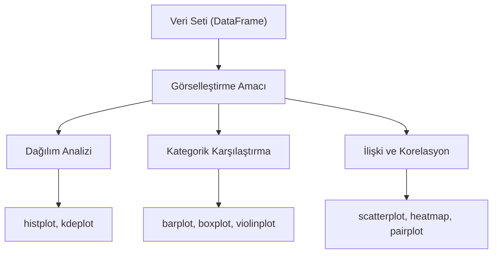

## 📌 Özet
Seaborn, Matplotlib altyapısını kullanarak verileri daha estetik ve istatistiksel açıdan anlamlı bir şekilde görselleştiren güçlü bir kütüphanedir. Veri biliminde EDA (Keşifsel Veri Analizi) sürecini hızlandıran bu araç, karmaşık veri setlerini tek bir satır kodla görselleştirmeyi sağlar. Pandas DataFrame yapılarıyla doğrudan entegrasyonu sayesinde sütun bazlı analizlerde büyük kolaylık sunar. Hem dağılım, hem ilişki hem de kategorik veriler için özelleşmiş fonksiyonlar barındırır.

## 🧠 Detay

### 📊 Seaborn Çalışma Akışı



### Kurulum ve Import
```python
pip install seaborn
import seaborn as sns
import matplotlib.pyplot as plt

sns.set_theme(style="whitegrid")
```

### Dağılım Grafikleri
```python
# Histogram + KDE
sns.histplot(df["yas"], kde=True, bins=20)

# KDE (Kernel Density Estimate)
sns.kdeplot(df["yas"], fill=True)

# İki değişken dağılımı
sns.jointplot(data=df, x="yas", y="gelir", kind="scatter")
```

### Kategorik Grafikler
```python
# Bar grafik
sns.barplot(data=df, x="sehir", y="gelir", estimator="mean")

# Box plot
sns.boxplot(data=df, x="kategori", y="satis")

# Violin plot
sns.violinplot(data=df, x="kategori", y="satis")

# Strip plot
sns.stripplot(data=df, x="kategori", y="satis")

# Count plot
sns.countplot(data=df, x="sehir")
```

### İlişki Grafikleri
```python
# Scatter plot
sns.scatterplot(data=df, x="yas", y="gelir", hue="cinsiyet")

# Line plot
sns.lineplot(data=df, x="tarih", y="satis", hue="urun")

# Regresyon çizgisi
sns.regplot(data=df, x="yas", y="gelir")
```

### Korelasyon Isı Haritası
```python
korelasyon = df.corr()
sns.heatmap(korelasyon,
    annot=True,
    fmt=".2f",
    cmap="coolwarm",
    center=0)
plt.title("Korelasyon Matrisi")
```

### Pair Plot
```python
# Tüm değişken çiftleri
sns.pairplot(df, hue="kategori", diag_kind="kde")
```

## 💡 Bağlantılar
- [[DS - Matplotlib Temel Grafikler]]
- [[DS - EDA - Keşifsel Veri Analizi]]
- [[İstatistik - Korelasyon Analizi]]

## ❓ Sorular / Anlamadıklarım
- Box plot ile violin plot ne zaman hangisini seçmeliyim?
- `hue` parametresi nasıl çalışır?

## 🔗 Kaynaklar
- https://seaborn.pydata.org/tutorial.html
