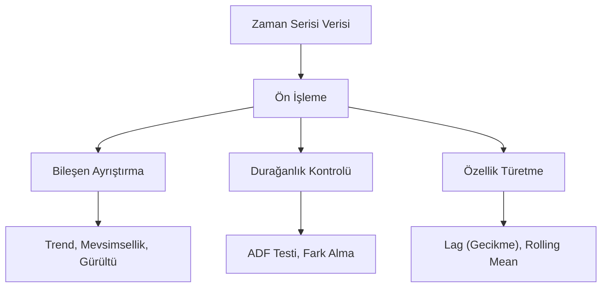

## 📌 Özet
Zaman serisi analizi, verilerin zaman içindeki değişimini ve bu değişimdeki kalıpları inceleyen istatistiksel bir yöntemdir. Satış tahmini, borsa hareketleri ve hava durumu gibi geleceğe yönelik öngörü gerektiren alanlarda temel taşı niteliğindedir. Zaman serisi verileri; trend, mevsimsellik, döngüsellik ve rassal gürültü gibi bileşenlere ayrılarak analiz edilir. Bu alandaki çalışmalar, geçmiş verilerdeki örüntüleri yakalayarak kurumların stratejik planlama yapmasına ve riskleri minimize etmesine olanak tanır.

## 🧠 Detay

### 📈 Zaman Serisi Analiz Akışı



### DatetimeIndex Oluşturma
```python
import pandas as pd
import numpy as np

df["tarih"] = pd.to_datetime(df["tarih"])
df.set_index("tarih", inplace=True)
df.sort_index(inplace=True)

# Tarih aralığı oluştur
tarihler = pd.date_range(start="2024-01-01", end="2024-12-31", freq="D")
tarihler_aylik = pd.date_range(start="2024-01", periods=12, freq="M")
```

### Yeniden Örnekleme (Resample)
```python
# Günlükten aylığa
aylik = df["satis"].resample("M").sum()
aylik_ort = df["satis"].resample("M").mean()

# Haftalık
haftalik = df["satis"].resample("W").agg({
    "satis": "sum",
    "musteri": "count"
})
```

### Hareketli Ortalama
```python
# Basit hareketli ortalama
df["7_gun_ort"] = df["satis"].rolling(window=7).mean()
df["30_gun_ort"] = df["satis"].rolling(window=30).mean()

# Üstel hareketli ortalama
df["ema"] = df["satis"].ewm(span=7).mean()
```

### Gecikme (Lag) Özellikleri
```python
df["lag_1"] = df["satis"].shift(1)   # 1 gün önce
df["lag_7"] = df["satis"].shift(7)   # 1 hafta önce

# Fark alma
df["fark_1"] = df["satis"].diff(1)
df["yuzde_degisim"] = df["satis"].pct_change()
```

### Bileşen Ayrıştırma
```python
from statsmodels.tsa.seasonal import seasonal_decompose

sonuc = seasonal_decompose(df["satis"], model="additive", period=12)
sonuc.plot()
# trend, seasonal, residual bileşenleri
```

### Durağanlık Testi
```python
from statsmodels.tsa.stattools import adfuller

test = adfuller(df["satis"])
print(f"ADF İstatistiği: {test[0]:.4f}")
print(f"p-değeri: {test[1]:.4f}")
# p < 0.05 → durağan
```

## 💡 Bağlantılar
- [[DS - Pandas Gruplama ve Agregasyon]]
- [[DS - Matplotlib Temel Grafikler]]
- [[ML - ARIMA ve Zaman Serisi Tahmin]]

## ❓ Sorular / Anlamadıklarım
- Durağan olmayan seriyi nasıl durağan hale getiririm?
- Mevsimsellik periyodunu nasıl belirlerim?

## 🔗 Kaynaklar
- https://pandas.pydata.org/docs/user_guide/timeseries.html
- https://www.statsmodels.org/stable/tsa.html
