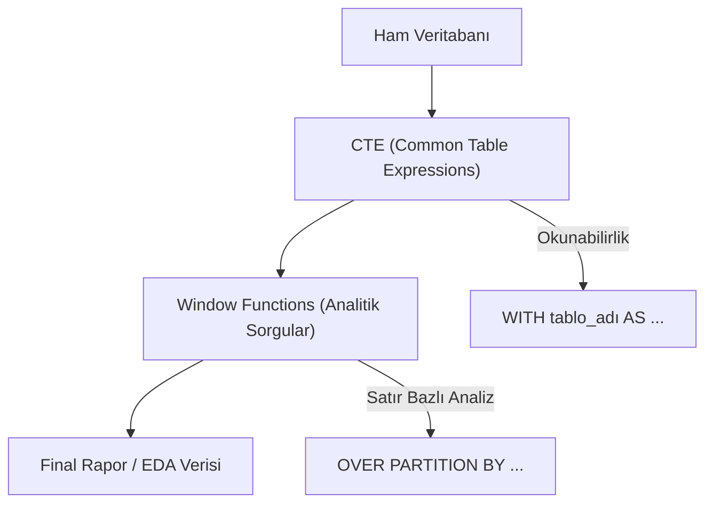

## 📌 Özet
İleri düzey SQL, karmaşık veri analitiği problemlerini veritabanı seviyesinde çözmek için kullanılan yetkinlikler bütünüdür. Common Table Expressions (CTE) ile sorgu okunabilirliği artırılırken, Window Functions sayesinde satır bazlı karmaşık hesaplamalar ve kümülatif analizler zahmetsizce gerçekleştirilir. Bu ileri teknikler, büyük veri setlerini işleme performansını optimize eder ve karmaşık iş mantığını SQL sorgularına gömerek analiz süreçlerini standartlaştırır. Profesyonel bir veri analisti için bu yapılar, veriden değer üretme hızını ve kapasitesini belirleyen en önemli araçlardır.

---

## 🧠 Detay

### 🗺️ İleri Düzey SQL Sorgu Yapısı



### 1. Common Table Expressions (CTE)
Sorguları parçalara ayırarak geçici sonuç tabloları oluşturur. Okunabilirliği artırır.
```sql
WITH aylik_satis AS (
    SELECT musteri_id, SUM(tutar) as toplam
    FROM satislar
    GROUP BY musteri_id
)
SELECT * FROM aylik_satis WHERE toplam > 1000;
```

### 2. Window Functions ⭐
Veriyi gruplandırmadan, her satır için bir hesaplama yapmanızı sağlar. `OVER()` yan tümcesi ile kullanılır.

| Fonksiyon | Açıklama |
|-----------|----------|
| **ROW_NUMBER()** | Her satıra benzersiz bir sıra numarası verir. |
| **RANK()** | Aynı değerlere aynı sırayı verir (boşluk bırakır). |
| **DENSE_RANK()** | Aynı değerlere aynı sırayı verir (boşluk bırakmaz). |
| **LAG() / LEAD()** | Önceki veya sonraki satırın değerine erişir. |
| **SUM() OVER()** | Kümülatif toplam hesaplar. |

```sql
SELECT 
    tarih, satis,
    SUM(satis) OVER (ORDER BY tarih) as kumulatif_satis,
    LAG(satis) OVER (ORDER BY tarih) as onceki_gun_satis
FROM gunluk_satislar;
```

---

## 💡 Bağlantılar
- [[DS - SQL ve Veritabanı Kullanımı]]
- [[DS - Pandas Gruplama ve Agregasyon]]

## ❓ Sorular / Anlamadıklarım
- Window functions ile GROUP BY arasındaki temel fark nedir? (Group by satırları birleştirir, Window function satır bazında kalır).

## 🔗 Kaynaklar
- Mode SQL Tutorial - Advanced
- PostgreSQL Documentation
