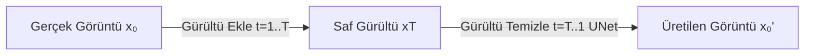

## 📌 Özet

**Diffusion modelleri**, görüntüye kademeli olarak gürültü ekleyip (forward process) ardından bu gürültüyü adım adım temizlemeyi (reverse process) öğrenen üretici modellerdir. GAN'ların yerini büyük ölçüde almış, **Stable Diffusion**, **DALL-E**, **Midjourney**'nin temelini oluşturur.



---

## 🧠 Detay

### Forward Process (Gürültü Ekleme)

Her adımda görüntüye küçük Gaussian gürültü eklenir:

```
q(xₜ | xₜ₋₁) = N(xₜ; √(1-βₜ) xₜ₋₁, βₜI)
```

- **βₜ**: gürültü takviyesi (noise schedule), genellikle lineer ya da cosine
- T = 1000 adımda görüntü saf gürültüye dönüşür

### Reverse Process (Gürültü Temizleme)

```python
import torch
from diffusers import DDPMPipeline

# Önceden eğitilmiş model ile görüntü üret
pipeline = DDPMPipeline.from_pretrained("google/ddpm-celebahq-256")
image = pipeline().images[0]
image.save("üretilen.png")
```

### Stable Diffusion Mimarisi

```
Metin Prompt
     │
     ▼ CLIP Text Encoder
Text Embeddings
     │
     ▼ Cross-Attention (UNet içinde)
Latent Space (z)  ←──  VAE Encoder (eğitimde)
     │  UNet (Denoiser)
     ▼
Temizlenmiş Latent
     │
     ▼ VAE Decoder
Çıktı Görüntüsü (512x512 → 768x768 vb.)
```

**Neden Latent Space?**
- 512×512 piksel = 786K boyut → çok pahalı
- Latent space (64×64×4) = 16K boyut → ~50x daha hızlı

### Temel Bileşenler

| Bileşen | Rol | Model |
|---|---|---|
| **VAE** | Görüntü ↔ latent uzayı | AutoencoderKL |
| **UNet** | Gürültü tahmini | UNet2DConditionModel |
| **CLIP** | Metin → embedding | CLIPTextModel |
| **Scheduler** | Gürültü adımları | DDIM, PNDM, DPMSolver |

### Diffusers ile Stable Diffusion

```python
from diffusers import StableDiffusionPipeline
import torch

pipe = StableDiffusionPipeline.from_pretrained(
    "runwayml/stable-diffusion-v1-5",
    torch_dtype=torch.float16
).to("cuda")

image = pipe(
    prompt="A futuristic city with neon lights, cyberpunk style",
    negative_prompt="blurry, low quality",
    num_inference_steps=50,     # daha fazla = daha kaliteli ama yavaş
    guidance_scale=7.5,         # prompt uyum katsayısı (CFG)
    height=512,
    width=512,
).images[0]
```

### Guidance Scale (CFG) Etkisi

| CFG Değeri | Etki |
|---|---|
| 1–3 | Prompt'a az bağlı, yaratıcı |
| 7–8 | Denge (önerilen) |
| 15+ | Prompt'a çok bağlı, bozulma riski |

### ControlNet ile Kontrollü Üretim

```python
from diffusers import StableDiffusionControlNetPipeline, ControlNetModel

# Kenar haritası (canny) ile yönlendirme
controlnet = ControlNetModel.from_pretrained(
    "lllyasviel/sd-controlnet-canny",
    torch_dtype=torch.float16
)
pipe = StableDiffusionControlNetPipeline.from_pretrained(
    "runwayml/stable-diffusion-v1-5",
    controlnet=controlnet,
    torch_dtype=torch.float16
).to("cuda")
```

### SDXL ve Sonrası

- **SDXL (2023):** 1024×1024, daha iyi metin anlayışı, 2 UNet
- **SD3 (2024):** Multimodal Diffusion Transformer (DiT)
- **Flux (2024):** Flow matching, daha hızlı ve kaliteli

---

## 💡 Bağlantılar
- [[DL - Giriş ve YSA Temelleri (Perceptron, Activation Functions)]]
- [[DL - Generative Adversarial Networks (GAN)]]
- [[DL - Transformer Mimarisi ve Attention Mekanizması]]
- [[LLM - Fine-tuning Stratejileri]]

## ❓ Sorular / Anlamadıklarım

## 🔗 Kaynaklar
- [Ho et al. 2020 - DDPM](https://arxiv.org/abs/2006.11239)
- [Rombach et al. 2022 - LDM (Stable Diffusion)](https://arxiv.org/abs/2112.10752)
- [Hugging Face Diffusers](https://huggingface.co/docs/diffusers)
