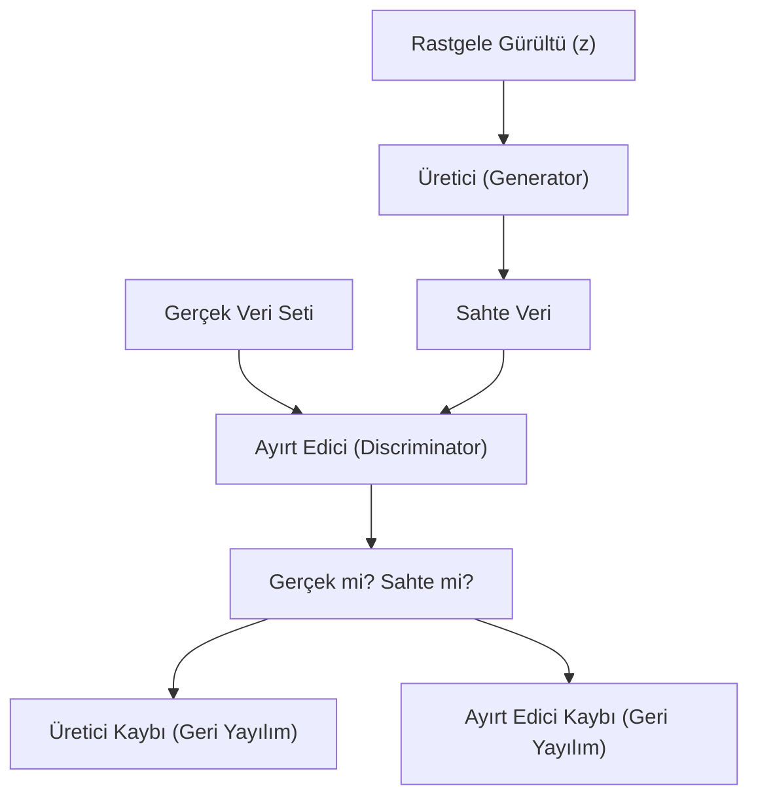

## 📌 Özet
Çekişmeli Üretici Ağlar (GAN), Ian Goodfellow tarafından 2014 yılında önerilen ve iki farklı sinir ağının birbiriyle rekabet ederek öğrenmesini sağlayan devrim niteliğinde bir mimaridir. Bu yapıda, "Generator" (Üretici) gerçek verilere benzeyen sahte veriler oluşturmaya çalışırken, "Discriminator" (Ayırt Edici) kendisine gelen verinin gerçek mi yoksa üretici tarafından yapılmış bir sahte mi olduğunu tespit etmeye çalışır. Bu iki ağ arasındaki etkileşim, bir "sıfır toplamlı oyun" (zero-sum game) olarak modellenir. Süreç sonunda üretici, ayırt ediciyi kandırabilecek kadar gerçekçi veriler üretmeyi öğrenir. GAN'ler günümüzde görüntü sentezleme, stil transferi, süper çözünürlük ve derin sahte (deepfake) teknolojilerinde temel taşı görevi görmektedir.



## 🤺 İki Oyuncu: Üretici vs Ayırt Edici

### 1. Üretici (Generator)
Rastgele bir gürültü vektörünü (latent space) alır ve bunu hedef veri dağılımına (örneğin bir resme) dönüştürür. Amacı, $D(G(z))$ değerini maksimize etmektir (Ayırt edicinin sahte veriye "gerçek" deme olasılığını artırmak).

### 2. Ayırt Edici (Discriminator)
Bir sınıflandırıcıdır. Verinin gerçek örnekten ($x$) mi yoksa üreticiden ($G(z)$) mi geldiğini tahmin eder. Amacı, doğru sınıflandırma yapma başarısını maksimize etmektir.

## ⚠️ Karşılaşılan Zorluklar
- **Mode Collapse:** Üreticinin sadece birkaç çeşit başarılı örnek üretmeye başlaması ve çeşitliliği kaybetmesi.
- **Nash Equilibrium:** İki ağın birbirini mükemmel şekilde dengelediği noktaya ulaşmanın zorluğu (Eğitim dengesizliği).
- **Vanishing Gradient:** Ayırt edici çok güçlü olduğunda üreticinin öğrenecek gradyan bulamaması.

## 🚀 GAN Türleri
- **DCGAN (Deep Convolutional GAN):** Evrişimli katmanlar kullanarak daha kararlı görüntü üretimi sağlar.
- **CycleGAN:** Eşleşmemiş veri setleri arasında stil transferi (örneğin attan zebraya dönüşüm) yapar.
- **StyleGAN:** NVIDIA tarafından geliştirilen, yüksek çözünürlüklü ve kontrol edilebilir yüz sentezleme mimarisidir.

## 💻 Eğitim Mantığı (Keras-like)
```python
# Ayırt Edici Eğitimi
d_loss_real = discriminator.train_on_batch(real_images, valid_labels)
d_loss_fake = discriminator.train_on_batch(generated_images, fake_labels)

# Üretici Eğitimi (Combined Model)
# Ayırt edici dondurulur, sadece üretici güncellenir
g_loss = combined_model.train_on_batch(noise, valid_labels)
```
