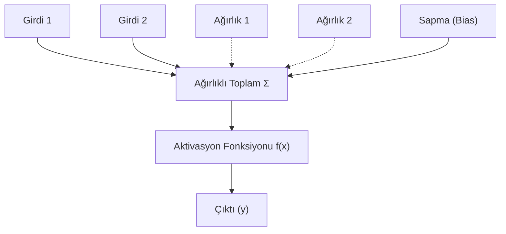

## 📌 Özet
Yapay Sinir Ağları (YSA), insan beyninin çalışma prensiplerinden esinlenerek geliştirilen ve veriden öğrenme yeteneğine sahip matematiksel modellerdir. Perceptron, bir YSA'nın en temel birimi olup, girdilerin ağırlıklı toplamını bir eşik değerinden geçirerek çıktı üretir. Çok katmanlı yapılarda, doğrusal olmayan problemleri çözebilmek için aktivasyon fonksiyonları kritik bir rol oynar. Aktivasyon fonksiyonları, bir sinirin ateşlenip ateşlenmeyeceğine karar vererek ağın karmaşık örüntüleri öğrenmesini sağlar. ReLU, Sigmoid ve Tanh gibi fonksiyonlar, gradyan akışını ve öğrenme hızını doğrudan etkileyen temel bileşenlerdir.



## 🧠 Yapay Sinir Hücresi (Perceptron)
Perceptron, 1958 yılında Frank Rosenblatt tarafından önerilen en basit sinir ağı mimarisidir. Matematiksel olarak şu şekilde ifade edilir:
$$y = f(\sum_{i=1}^{n} w_i x_i + b)$$

- **Girdiler ($x$):** Dış dünyadan veya önceki katmandan gelen veriler.
- **Ağırlıklar ($w$):** Her girdinin çıktı üzerindeki önem derecesini belirler.
- **Bias ($b$):** Modelin esnekliğini artırır, aktivasyonun tetiklenmesi için gereken eşiği ayarlar.

## ⚡ Aktivasyon Fonksiyonları
Doğrusal modellerin kapasitesini artırmak ve "Non-linearity" (doğrusal olmama) özelliği kazandırmak için kullanılırlar.

### 1. Sigmoid
Lojistik regresyonda yaygın kullanılır. Çıktıyı [0, 1] arasına sıkıştırır.
- **Formül:** $\sigma(x) = \frac{1}{1 + e^{-x}}$
- **Dezavantaj:** "Vanishing Gradient" (kaybolan gradyanlar) problemi.

### 2. ReLU (Rectified Linear Unit)
Derin öğrenmede varsayılan tercihtir. Negatif değerleri sıfırlar, pozitifleri olduğu gibi bırakır.
- **Formül:** $f(x) = \max(0, x)$
- **Avantaj:** Hesaplama hızı ve seyreklik (sparsity).

### 3. Tanh (Hyperbolic Tangent)
Veriyi [-1, 1] arasına merkezler. Genellikle gizli katmanlarda Sigmoid'den daha iyi performans gösterir.
- **Formül:** $f(x) = \frac{e^x - e^{-x}}{e^x + e^{-x}}$

## 💻 Python Örneği (Numpy)
```python
import numpy as np

def relu(x):
    return np.maximum(0, x)

def sigmoid(x):
    return 1 / (1 + np.exp(-x))

# Basit bir ileri besleme (forward pass)
inputs = np.array([1.0, 2.0])
weights = np.array([0.5, -0.2])
bias = 0.1

z = np.dot(inputs, weights) + bias
output = relu(z)
print(f"Çıktı: {output}")
```
