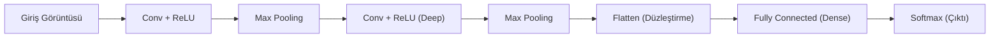

## 📌 Özet
Konvolsiyonel Sinir Ağları (CNN), özellikle görsel verilerdeki mekânsal hiyerarşileri ve örüntüleri yakalamak için tasarlanmış bir derin öğrenme mimarisidir. Geleneksel tam bağlantılı ağların aksine, CNN'ler "filtreler" (kernels) kullanarak görüntü üzerindeki yerel özellikleri (kenarlar, dokular, şekiller) öğrenir. Bu mimari; öznitelik çıkarımı yapan konvolsiyon katmanları, boyut azaltma sağlayan havuzlama (pooling) katmanları ve sınıflandırmayı gerçekleştiren tam bağlantılı (dense) katmanlardan oluşur. CNN'ler, parametre paylaşımı özelliği sayesinde görsel işlemede hem hesaplama verimliliği sağlar hem de "nesne değişmezliği" (translation invariance) özelliğini modele kazandırır. Günümüzde nesne tanıma, tıbbi görüntü analizi ve otonom araçlar gibi pek çok kritik alanda standart çözüm olarak kullanılmaktadır.



## 📐 CNN Temel Kavramları

### 1. Konvolsiyon (Convolution)
Küçük bir matrisin (filtre) görüntü üzerinde gezdirilerek piksellerle çarpılması işlemidir. Bu işlem sonucunda "Feature Map" (Öznitelik Haritası) oluşur.
- **Stride:** Filtrenin her adımda kaç piksel kayacağını belirler.
- **Padding:** Görüntü kenarlarına sıfır ekleyerek boyut kaybını önler.

### 2. Havuzlama (Pooling)
Öznitelik haritasının boyutunu küçülterek hesaplama yükünü azaltır ve aşırı öğrenmeyi (overfitting) engeller.
- **Max Pooling:** Bölgedeki en büyük değeri seçer (en yaygın).
- **Average Pooling:** Bölgedeki değerlerin ortalamasını alır.

## 🏛️ Popüler CNN Mimarileri
1. **LeNet-5:** El yazısı tanıma için geliştirilen ilk başarılı CNN.
2. **AlexNet:** 2012 ImageNet yarışmasını kazanarak derin öğrenme devrimini başlatan mimari.
3. **VGGNet:** Çok küçük (3x3) filtreler ve derin yapısı ile bilinir.
4. **ResNet:** "Residual Connections" (Artık Bağlantılar) sayesinde çok derin ağların (150+ katman) eğitilmesini mümkün kılmıştır.

## 💻 PyTorch Örneği
```python
import torch.nn as nn

class SimpleCNN(nn.Module):
    def __init__(self):
        super(SimpleCNN, self).__init__()
        # Giriş: 3 kanallı (RGB) görüntü
        self.conv1 = nn.Conv2d(3, 32, kernel_size=3, padding=1)
        self.pool = nn.MaxPool2d(2, 2)
        self.fc1 = nn.Linear(32 * 16 * 16, 10) # 32x32 giriş için

    def forward(self, x):
        x = self.pool(torch.relu(self.conv1(x)))
        x = x.view(-1, 32 * 16 * 16) # Flatten
        x = self.fc1(x)
        return x
```
