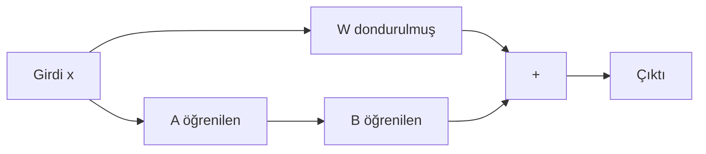

## 📌 Özet

**PEFT (Parameter-Efficient Fine-Tuning)**, büyük modellerin tamamını yeniden eğitmek yerine yalnızca küçük bir parametre kümesini güncelleyerek özelleştirme yapma yaklaşımıdır. **LoRA**, bu ailenin en yaygın yöntemidir ve milyarlarca parametreli modelleri tüketici GPU'larında fine-tune etmeyi mümkün kılar.

> Llama 3 70B → tam fine-tune ~140GB VRAM | LoRA fine-tune → ~24GB VRAM

---

## 🧠 Detay

### LoRA (Low-Rank Adaptation) Prensibi

Ağırlık matrisini ∆W güncellemek yerine, düşük boyutlu iki matrisin çarpımı olarak ifade edilir:

```
W' = W + ∆W = W + B × A

W ∈ R^(d×k)  →  orijinal ağırlık (dondurulmuş)
A ∈ R^(r×k)  →  öğrenilen matris (r << min(d,k))
B ∈ R^(d×r)  →  öğrenilen matris
r = rank (genellikle 4, 8, 16, 64)
```



### PEFT Yöntemleri Karşılaştırması

| Yöntem | Eğitilen Param % | VRAM | Performans |
|---|---|---|---|
| **Tam Fine-tune** | 100% | Çok yüksek | ✅✅✅ |
| **LoRA** | 0.1–1% | Düşük | ✅✅✅ |
| **QLoRA** | 0.1–1% | Çok düşük (4-bit) | ✅✅ |
| **Prefix Tuning** | <1% | Düşük | ✅ |
| **Adapter** | 1–4% | Orta | ✅✅ |

### HuggingFace PEFT ile LoRA

```python
from transformers import AutoModelForCausalLM, AutoTokenizer
from peft import LoraConfig, get_peft_model, TaskType

# Temel model
model = AutoModelForCausalLM.from_pretrained(
    "meta-llama/Meta-Llama-3-8B",
    device_map="auto",
    torch_dtype=torch.bfloat16
)

# LoRA konfigürasyonu
lora_config = LoraConfig(
    task_type=TaskType.CAUSAL_LM,
    r=16,                          # rank
    lora_alpha=32,                 # ölçekleme faktörü
    target_modules=["q_proj", "v_proj"],  # hangi katmanlar
    lora_dropout=0.05,
    bias="none"
)

# LoRA uygula
model = get_peft_model(model, lora_config)
model.print_trainable_parameters()
# trainable params: 3,407,872 || all params: 8,033,669,120 || 0.04%
```

### QLoRA — 4-bit Quantization + LoRA

```python
from transformers import BitsAndBytesConfig

# 4-bit quantization
bnb_config = BitsAndBytesConfig(
    load_in_4bit=True,
    bnb_4bit_quant_type="nf4",        # NormalFloat4
    bnb_4bit_compute_dtype=torch.bfloat16,
    bnb_4bit_use_double_quant=True    # çift quantization
)

model = AutoModelForCausalLM.from_pretrained(
    "meta-llama/Meta-Llama-3-70B",    # 70B model!
    quantization_config=bnb_config,
    device_map="auto"
)
# 70B model ~35GB yerine ~20GB ile çalışır
```

### Eğitim Döngüsü (TRL ile)

```python
from trl import SFTTrainer
from transformers import TrainingArguments

training_args = TrainingArguments(
    output_dir="./lora-finetuned",
    num_train_epochs=3,
    per_device_train_batch_size=4,
    gradient_accumulation_steps=4,
    learning_rate=2e-4,
    fp16=True,
    logging_steps=10,
    save_strategy="epoch"
)

trainer = SFTTrainer(
    model=model,
    train_dataset=dataset,
    peft_config=lora_config,
    dataset_text_field="text",
    max_seq_length=2048,
    args=training_args
)
trainer.train()
```

### LoRA Adapter Birleştirme

```python
# Fine-tune sonrası adapter'ı orijinal ağırlıklarla birleştir
model = model.merge_and_unload()
model.save_pretrained("merged-model")
```

### Rank (r) Seçimi Rehberi

| r Değeri | Kullanım Senaryosu |
|---|---|
| 4–8 | Küçük domain adaptasyonu |
| 16–32 | Orta ölçekli görev uyarlaması |
| 64–128 | Kapsamlı davranış değişikliği |

---

## 💡 Bağlantılar
- [[DL - Transfer Learning ve Fine-tuning Teknikleri]]
- [[LLM - Fine-tuning Stratejileri]]
- [[DL - Diffusion Modelleri ve Stable Diffusion Mimarisi]]
- [[DL - Model Optimizasyonu (Pruning, Quantization)]]

## ❓ Sorular / Anlamadıklarım

## 🔗 Kaynaklar
- [Hu et al. 2021 - LoRA](https://arxiv.org/abs/2106.09685)
- [Dettmers et al. 2023 - QLoRA](https://arxiv.org/abs/2305.14314)
- [HuggingFace PEFT Docs](https://huggingface.co/docs/peft)
