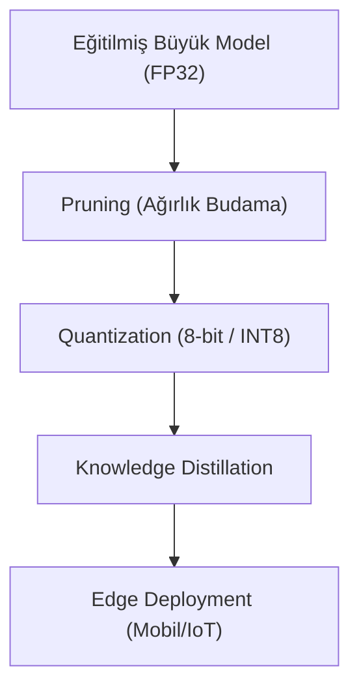

## 📌 Özet
Model optimizasyonu, eğitilmiş derin öğrenme modellerinin performansını (doğruluk) minimum düzeyde feda ederek, bellek kullanımını azaltma ve çıkarım (inference) hızını artırma sürecidir. Özellikle mobil cihazlar, IoT birimleri ve gömülü sistemler gibi kısıtlı donanımlarda modellerin çalıştırılabilmesi için bu teknikler hayati önem taşır. Pruning (budama) ile gereksiz ağırlıklar temizlenir, Quantization (nicemleme) ile ağırlıkların hassasiyeti (örneğin 32-bit'ten 8-bit'e) düşürülür. Ayrıca, "Knowledge Distillation" tekniği ile büyük ve karmaşık bir "Öğretmen" modelin bilgisi, daha küçük ve hızlı bir "Öğrenci" modele aktarılır. Bu yöntemlerin kombinasyonu, modellerin hem enerji verimli hem de gerçek zamanlı çalışmasına olanak tanır.



## ✂️ Pruning (Budama)
Ağın performansına katkısı düşük olan ağırlıkların veya nöronların ağdan çıkarılmasıdır.
- **Unstructured Pruning:** Tekil ağırlıkların sıfırlanması. Bellek kazancı sağlar ancak özel donanım desteği gerektirir.
- **Structured Pruning:** Tüm kanalların veya katmanların çıkarılması. Standart donanımlarda doğrudan hızlanma sağlar.
- **Süreç:** Eğit -> Budama yap -> İnce ayar (Fine-tuning) yap.

## 🔢 Quantization (Nicemleme)
Model ağırlıklarını ve aktivasyonlarını daha düşük bit derinliğinde temsil etme işlemidir.
- **Post-Training Quantization (PTQ):** Eğitim bittikten sonra ağırlıkları dönüştürme. Hızlıdır ancak doğruluk kaybı olabilir.
- **Quantization Aware Training (QAT):** Eğitimin bir parçası olarak nicemleme hatalarının modele öğretilmesi. Daha yüksek doğruluk sağlar.
- **Dönüşüm:** Float32 (4 byte) $\rightarrow$ Int8 (1 byte). Bellekte 4 kat kazanç sağlar.

## 🎓 Knowledge Distillation (Bilgi Damıtma)
Karmaşık bir modelin (Teacher) çıktı olasılık dağılımını (soft targets), daha küçük bir modele (Student) hedef olarak verme işlemidir.
- **Mantık:** Öğrenci model sadece "doğru/yanlış" etiketlerini değil, öğretmenin sınıflar arasındaki "benzerlik" ilişkilerini de öğrenir.

## 💻 PyTorch Pruning Örneği
```python
import torch.nn.utils.prune as prune

model = SimpleNet()
parameters_to_prune = (
    (model.fc1, 'weight'),
    (model.fc2, 'weight'),
)

# En küçük ağırlıkların %20'sini buda
prune.global_unstructured(
    parameters_to_prune,
    pruning_method=prune.L1Unstructured,
    amount=0.2,
)
```

## 📈 Faydaları
- **Hız:** Daha az işlem gücü ile daha hızlı çıkarım.
- **Depolama:** Model dosyası boyutunda %75-90 arası küçülme.
- **Enerji:** Batarya ömrünü koruyan düşük güç tüketimi.
