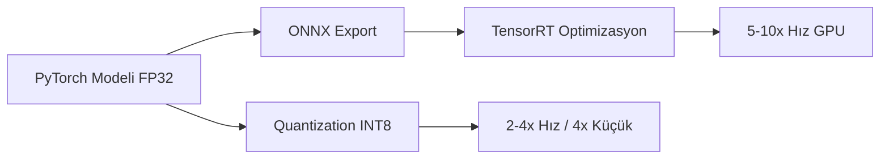

## 📌 Özet

Eğitilmiş modeli production'a almak, eğitmekten farklı zorluklar getirir: **gecikme (latency)**, **bellek (memory)** ve **maliyet (cost)** üçlüsünü dengelemek gerekir. Quantization, ONNX ve TensorRT bu üçlüyü iyileştiren temel tekniklerdir.



---

## 🧠 Detay

### 1. Quantization (Sayısal Hassasiyet Düşürme)

| Format | Bit | Boyut Azalma | Hız | Doğruluk Kaybı |
|---|---|---|---|---|
| **FP32** | 32 | 1x (temel) | Temel | Yok |
| **FP16** | 16 | 2x | 1.5–2x | Minimal |
| **BF16** | 16 | 2x | 1.5–2x | Minimal |
| **INT8** | 8 | 4x | 2–4x | Küçük |
| **INT4** | 4 | 8x | 3–5x | Orta |

```python
import torch

# Post-Training Quantization (PTQ) — eğitim gerekmez
model = torch.quantization.quantize_dynamic(
    model,
    {torch.nn.Linear},     # hangi katmanlar quantize edilsin
    dtype=torch.qint8
)

# Kayıt ve yükleme
torch.save(model.state_dict(), "model_int8.pt")
```

### 2. Quantization Aware Training (QAT)

```python
# Eğitim sırasında quantization simülasyonu
model.qconfig = torch.quantization.get_default_qat_qconfig("fbgemm")
model_prepared = torch.quantization.prepare_qat(model.train())

# Normal eğitim döngüsü
for epoch in range(n_epochs):
    train(model_prepared, ...)

# Gerçek quantization
model_quantized = torch.quantization.convert(model_prepared.eval())
```

### 3. ONNX Export

```python
import torch.onnx

# ONNX'e export
dummy_input = torch.randn(1, 3, 224, 224)  # örnek girdi şekli

torch.onnx.export(
    model,
    dummy_input,
    "model.onnx",
    export_params=True,
    opset_version=17,
    input_names=["input"],
    output_names=["output"],
    dynamic_axes={
        "input": {0: "batch_size"},    # dinamik batch boyutu
        "output": {0: "batch_size"}
    }
)
```

**ONNX Runtime ile Inference:**

```python
import onnxruntime as ort
import numpy as np

session = ort.InferenceSession(
    "model.onnx",
    providers=["CUDAExecutionProvider", "CPUExecutionProvider"]
)

input_data = np.random.randn(1, 3, 224, 224).astype(np.float32)
outputs = session.run(None, {"input": input_data})
```

### 4. TensorRT Optimizasyonu

```python
import tensorrt as trt
import torch
from torch2trt import torch2trt

# PyTorch → TensorRT
model = model.eval().cuda()
x = torch.ones(1, 3, 224, 224).cuda()

model_trt = torch2trt(
    model,
    [x],
    fp16_mode=True,        # FP16 optimizasyon
    max_batch_size=32,
    max_workspace_size=1 << 30  # 1GB
)

# Inference
with torch.no_grad():
    y_trt = model_trt(x)
```

### 5. LLM için özel: llama.cpp / ctransformers

```python
from llama_cpp import Llama

# GGUF format (llama.cpp quantized model)
llm = Llama(
    model_path="llama-3-8b-instruct.Q4_K_M.gguf",
    n_ctx=4096,        # context penceresi
    n_gpu_layers=35,   # kaç katman GPU'ya yüklensin
    n_threads=8        # CPU thread sayısı
)

output = llm(
    "### Kullanıcı:\nPython nedir?\n\n### Asistan:",
    max_tokens=256,
    stop=["### Kullanıcı:"]
)
print(output["choices"][0]["text"])
```

### Seçim Rehberi

```
Senaryo → Öneri
─────────────────────────────────────────
CPU'da servis (cloud maliyeti kısıt)  → INT8 + ONNX Runtime
GPU'da servis (max throughput)         → TensorRT FP16
Edge device (mobil/IoT)               → INT4 + tflite/coreml
LLM local çalıştırma                  → GGUF Q4_K_M (llama.cpp)
Araştırma / doğruluk kritik           → FP32 / BF16
```

---

## 💡 Bağlantılar
- [[DL - Model Optimizasyonu (Pruning, Quantization)]]
- [[DL - LoRA ve Parameter-Efficient Fine-Tuning (PEFT)]]
- [[MLOps - Model Packaging ve BentoML]]
- [[API - ML Modeli Servis Etmek]]

## ❓ Sorular / Anlamadıklarım

## 🔗 Kaynaklar
- [PyTorch Quantization](https://pytorch.org/docs/stable/quantization.html)
- [ONNX Runtime](https://onnxruntime.ai/)
- [llama.cpp](https://github.com/ggerganov/llama.cpp)
