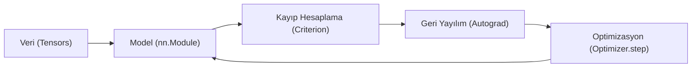

## 📌 Özet
PyTorch, dinamik hesaplama grafiği (Dynamic Computational Graph) yapısı sayesinde esnek ve Pythonic bir geliştirme deneyimi sunan açık kaynaklı bir derin öğrenme kütüphanesidir. Temel veri birimi olan Tensor'lar, GPU üzerinde yüksek performanslı matematiksel işlemler yapılmasına olanak tanır. `nn.Module` sınıfı, katmanların ve modellerin tanımlanması için standart bir yapı sunarken; `autograd` mekanizması türev alma işlemlerini otomatikleştirir. Model geliştirme süreci veri yükleme, model tanımlama, kayıp fonksiyonu seçimi ve optimizasyon döngüsü olmak üzere dört ana aşamadan oluşur. Bu esneklik, PyTorch'u özellikle akademik araştırmalarda ve karmaşık mimarilerin geliştirilmesinde öncelikli tercih haline getirir.



## 🏗️ PyTorch Temel Bileşenleri

### 1. Tensors
Numpy dizilerine benzer ancak GPU üzerinde çalışabilirler.
```python
import torch

x = torch.tensor([1, 2, 3], dtype=torch.float32)
y = torch.randn(3, 3) # Rastgele normal dağılım
if torch.cuda.is_available():
    x = x.to("cuda") # GPU'ya taşıma
```

### 2. Autograd (Otomatik Türev)
`requires_grad=True` olan tensorlar üzerindeki tüm işlemler takip edilir ve `backward()` çağrıldığında gradyanlar hesaplanır.

### 3. nn.Module
Modeller bu sınıftan türetilir. `__init__` içinde katmanlar tanımlanır, `forward` içinde veri akışı belirlenir.

## 🚀 Örnek: Basit Bir MLP Modeli
```python
import torch.nn as nn
import torch.optim as optim

class SimpleNet(nn.Module):
    def __init__(self):
        super(SimpleNet, self).__init__()
        self.fc1 = nn.Linear(784, 128)
        self.relu = nn.ReLU()
        self.fc2 = nn.Linear(128, 10)
    
    def forward(self, x):
        x = self.fc1(x)
        x = self.relu(x)
        x = self.fc2(x)
        return x

model = SimpleNet()
criterion = nn.CrossEntropyLoss()
optimizer = optim.Adam(model.parameters(), lr=0.001)

# Eğitim Döngüsü (Taslak)
# optimizer.zero_grad()
# outputs = model(inputs)
# loss = criterion(outputs, labels)
# loss.backward()
# optimizer.step()
```

## 🛠️ PyTorch Avantajları
- **Dinamik Grafik:** Çalışma zamanında (runtime) grafik yapısı değiştirilebilir.
- **Pythonic:** Standart Python hata ayıklama araçlarıyla (pdb) uyumludur.
- **Geniş Ekosistem:** Torchvision, Torchaudio ve Torchtext gibi yardımcı kütüphaneler mevcuttur.
