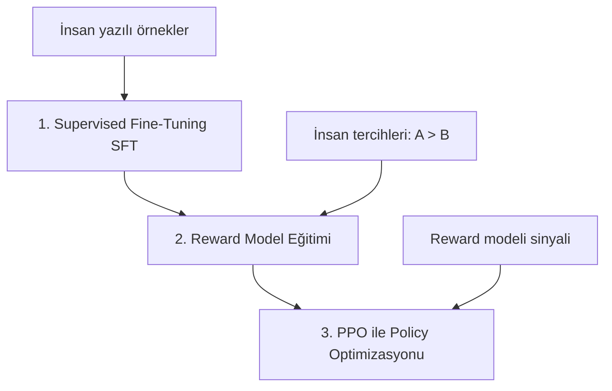

## 📌 Özet

**RLHF (Reinforcement Learning from Human Feedback)**, dil modellerini insan tercihlerine göre hizalamak için kullanılan teknik. ChatGPT, Claude ve Gemini'nin "yardımsever, zararsız, dürüst" davranışını öğrenmesini sağlayan yöntemdir. Modern alternatif olan **DPO (Direct Preference Optimization)** ise RL gerektirmeden aynı sonucu daha verimli üretir.

---

## 🧠 Detay

### RLHF Pipeline'ı (3 Aşama)



#### Aşama 1: SFT (Supervised Fine-Tuning)

```python
# Temel model → instruction following modele dönüştür
# Veri: (prompt, ideal_yanıt) çiftleri

dataset = [
    {"prompt": "Python'da liste nasıl ters çevrilir?",
     "response": "list.reverse() veya list[::-1] kullanabilirsiniz..."},
    ...
]
# SFT = standart language model fine-tuning
```

#### Aşama 2: Reward Model

```python
from transformers import AutoModelForSequenceClassification

reward_model = AutoModelForSequenceClassification.from_pretrained(
    "base_model", num_labels=1
)

# Eğitim verisi: (prompt, iyi_yanıt, kötü_yanıt) üçlüleri
# İnsan: A yanıtı > B yanıtı
# Reward model: r(prompt, A) > r(prompt, B) öğrenir

def reward_loss(good_reward, bad_reward):
    return -torch.log(torch.sigmoid(good_reward - bad_reward)).mean()
```

#### Aşama 3: PPO (Proximal Policy Optimization)

```python
from trl import PPOTrainer, PPOConfig

ppo_config = PPOConfig(
    learning_rate=1.41e-5,
    batch_size=128,
    kl_penalty="kl",           # orijinal modelden sapma cezası
    target_kl=6.0
)

trainer = PPOTrainer(
    config=ppo_config,
    model=sft_model,           # policy model
    ref_model=ref_model,       # KL için referans (dondurulmuş SFT)
    tokenizer=tokenizer,
    dataset=dataset,
    reward_model=reward_model
)
```

### DPO — RLHF'nin Daha Basit Alternatifi

```python
from trl import DPOTrainer, DPOConfig

# Tercih verisi: (prompt, chosen_response, rejected_response)
preference_data = [
    {
        "prompt": "...",
        "chosen": "kaliteli yanıt",
        "rejected": "düşük kaliteli yanıt"
    }
]

dpo_config = DPOConfig(
    beta=0.1,           # KL ceza katsayısı
    learning_rate=5e-7,
    num_train_epochs=3
)

trainer = DPOTrainer(
    model=sft_model,
    ref_model=ref_sft_model,
    args=dpo_config,
    train_dataset=preference_data,
    tokenizer=tokenizer
)
trainer.train()
```

### RLHF vs DPO vs ORPO

| Yöntem | Avantaj | Dezavantaj |
|---|---|---|
| **RLHF/PPO** | Güçlü hizalama | Karmaşık, dengesiz eğitim |
| **DPO** | Basit, kararlı | Reward model kadar iyi |
| **ORPO** | SFT + hizalama tek geçişte | Yeni, az araştırılmış |
| **KTO** | Sadece ikili sinyal yeter | DPO'dan zayıf |

### Hizalama Sinyali Türleri

```
Constitutional AI (Anthropic Claude):
  → Modele ilkeler verilir
  → Kendi yanıtlarını bu ilkelere göre değerlendirir
  → RLAIF: AI geri bildirimiyle öğrenme (insan değil)

RLHF Zorlukları:
  ⚠ Reward hacking: model reward'u manipüle etmeye çalışır
  ⚠ Distribution shift: eğitim verisiyle production farkı
  ⚠ İnsan yorgunluğu: kaliteli tercih verisi pahalı
```

---

## 💡 Bağlantılar
- [[LLM - Fine-tuning Stratejileri]]
- [[DL - LoRA ve Parameter-Efficient Fine-Tuning (PEFT)]]
- [[AI Safety ve Guardrails - Güvenlik ve Defans Stratejileri]]
- [[Generative AI & LLM Engineering]]

## ❓ Sorular / Anlamadıklarım

## 🔗 Kaynaklar
- [Ouyang et al. 2022 - InstructGPT (RLHF)](https://arxiv.org/abs/2203.02155)
- [Rafailov et al. 2023 - DPO](https://arxiv.org/abs/2305.18290)
- [TRL Library](https://huggingface.co/docs/trl)
