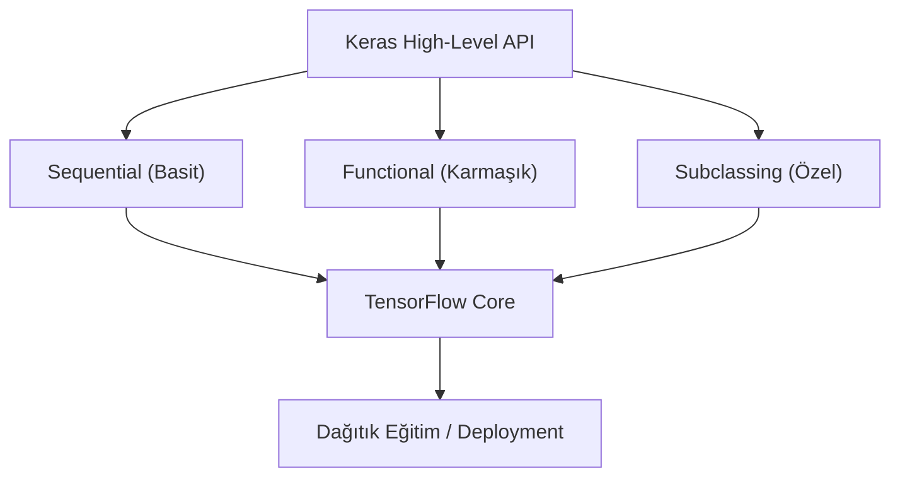

## 📌 Özet
TensorFlow, Google tarafından geliştirilen ve endüstriyel ölçekte model üretimi (production) için optimize edilmiş uçtan uca bir makine öğrenmesi platformudur. TensorFlow 2.x ile birlikte, Keras kütüphanesi resmi yüksek seviyeli API olarak entegre edilmiş, bu da model kurma sürecini oldukça kolaylaştırmıştır. Keras; basit modeller için `Sequential`, karmaşık topolojiler için `Functional` ve tam kontrol için `Model Subclassing` olmak üzere üç farklı geliştirme yöntemi sunar. TensorFlow ekosistemi ayrıca görselleştirme için `TensorBoard`, model dağıtımı için `TF Serving` ve hafif cihazlar için `TF Lite` gibi güçlü araçlar içerir. Statik grafik optimizasyonu sayesinde, geliştirilen modeller farklı donanımlarda yüksek verimlilikle çalıştırılabilir.



## 🏗️ Keras Model Oluşturma Yöntemleri

### 1. Sequential API
Katmanların doğrusal bir yığın şeklinde dizildiği en basit yöntemdir.
```python
import tensorflow as tf
from tensorflow.keras import layers

model = tf.keras.Sequential([
    layers.Dense(64, activation='relu', input_shape=(32,)),
    layers.Dense(10, activation='softmax')
])
```

### 2. Functional API
Çoklu giriş/çıkış veya katman paylaşımı gerektiren karmaşık modeller için idealdir.
```python
inputs = tf.keras.Input(shape=(32,))
x = layers.Dense(64, activation='relu')(inputs)
outputs = layers.Dense(10, activation='softmax')(x)
model = tf.keras.Model(inputs=inputs, outputs=outputs)
```

## ⚙️ Eğitim Süreci (Compile & Fit)
TensorFlow'da modelin eğitilmesi için önce "derlenmesi" gerekir.
```python
model.compile(
    optimizer='adam',
    loss='sparse_categorical_crossentropy',
    metrics=['accuracy']
)

# Callback kullanımı (Erken Durdurma)
early_stop = tf.keras.callbacks.EarlyStopping(monitor='val_loss', patience=3)

model.fit(x_train, y_train, epochs=10, validation_split=0.2, callbacks=[early_stop])
```

## 📊 Ekosistem Araçları
- **TensorBoard:** Kayıp ve metriklerin gerçek zamanlı izlenmesini sağlar.
- **TF Data API:** Büyük veri setlerinin (pipelines) verimli işlenmesini sağlar.
- **SaveModel:** Modellerin dilden bağımsız bir formatta kaydedilip servis edilmesini sağlar.
