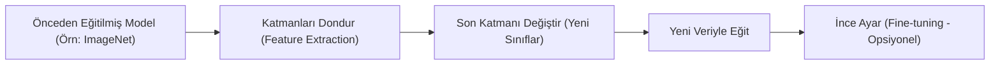

## 📌 Özet
Transfer Learning (Transfer Öğrenme), bir problem için önceden eğitilmiş güçlü bir modelin kazandığı bilgilerin, benzer bir alandaki yeni bir problem için kullanılması tekniğidir. Bu yöntem, özellikle eldeki veri setinin küçük olduğu durumlarda modelin sıfırdan eğitilmesi yerine, ImageNet gibi devasa veri setlerinde eğitilmiş modellerin (ResNet, VGG, BERT vb.) temel öznitelikleri (kenarlar, dokular, dil yapıları) zaten öğrenmiş olmasından faydalanır. Süreç genellikle modelin ilk katmanlarının dondurulması (frozen) ve son katmanlarının yeni probleme uygun olarak değiştirilip eğitilmesini içerir. Fine-tuning aşamasında ise, dondurulan katmanların bir kısmı çok düşük bir öğrenme hızıyla tekrar eğitilerek modelin hedef veriye tam uyumu sağlanır. Bu yaklaşım hem eğitim süresini kısaltır hem de çok daha yüksek başarı oranlarına ulaşılmasını sağlar.



## 🛠️ Temel Yaklaşımlar

### 1. Feature Extraction (Öznitelik Çıkarımı)
Önceden eğitilmiş modelin "base" (taban) kısmı sabit tutulur. Sadece en sondaki sınıflandırıcı katman (head) sıfırlanır ve yeni veriyle eğitilir.
- **Ne zaman?** Yeni veri seti çok küçükse ve orijinal veri setine benziyorsa.

### 2. Fine-tuning (İnce Ayar)
Modelin son katmanları eğitildikten sonra, taban modelin üst katmanlarının kilidi açılır ve tüm ağ (veya bir kısmı) çok düşük bir `learning rate` ile tekrar eğitilir.
- **Ne zaman?** Yeni veri seti büyükse veya orijinal veri setinden farklıysa.

## 🔑 Başarı İçin İpuçları
- **Öğrenme Hızı (Learning Rate):** Fine-tuning sırasında sıfırdan eğitime göre 10 kat veya daha düşük bir öğrenme hızı kullanılmalıdır ($10^{-5}$ gibi).
- **Dondurulacak Katman Sayısı:** Ağın derinlerine inildikçe öznitelikler genelden (kenarlar) özele (nesne parçaları) değişir. Yeni veriniz çok farklıysa daha fazla katmanı eğitmeniz gerekebilir.

## 💻 PyTorch Örneği (ResNet18)
```python
import torchvision.models as models
import torch.nn as nn

# 1. Hazır modeli yükle
model = models.resnet18(pretrained=True)

# 2. Tüm parametreleri dondur
for param in model.parameters():
    param.requires_grad = False

# 3. Son katmanı (fc) değiştir (Örn: 10 sınıf için)
num_ftrs = model.fc.in_features
model.fc = nn.Linear(num_ftrs, 10)

# 4. Sadece son katman eğitilecek (requires_grad=True olanlar)
optimizer = torch.optim.Adam(model.fc.parameters(), lr=0.001)
```

## 🌟 Popüler Önceden Eğitilmiş Modeller
- **Görüntü:** ResNet, Inception, MobileNet, EfficientNet.
- **Metin (NLP):** BERT, RoBERTa, GPT, T5.
- **Ses:** Wav2Vec, Whisper.
