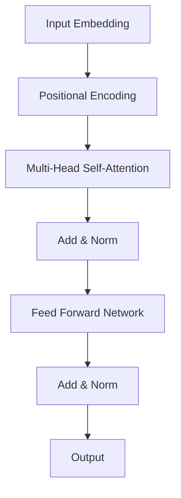

## 📌 Ozet
Transformer, 2017 de yayınlanan "Attention Is All You Need" makalesiyle derin öğrenmede devrim yaratan bir mimaridir. Ardışık veri işleme (RNN/LSTM) yerine paralel veri işlemeyi mümkün kılan "Self-Attention" mekanizmasını kullanır. Günümüzdeki GPT, BERT ve Llama gibi modellerin temel taşıdır.

## 🧠 Detay

### 1. Self-Attention Mekanizması
- **Query (Q):** Aranan bilgi.
- **Key (K):** Mevcut bilgi etiketi.
- **Value (V):** Mevcut bilginin kendisi.
- Matematiksel olarak: `Attention(Q, K, V) = softmax(QK^T / sqrt(dk))V`

### 2. Neden Üstün?
- **Paralelleştirme:** Tüm kelimeler aynı anda işlenir (RNN deki gibi sırayla değil).
- **Long-range Dependencies:** Cümlenin başındaki bir kelime ile sonundaki arasındaki ilişkiyi doğrudan kurabilir.

## 💡 Baglantilar
- [[DL - Yinelemeli Sinir Ağları (RNN) ve LSTM]]
- [[LLM - Giriş ve Temel Kavramlar (Transformer, Tokens)]]
