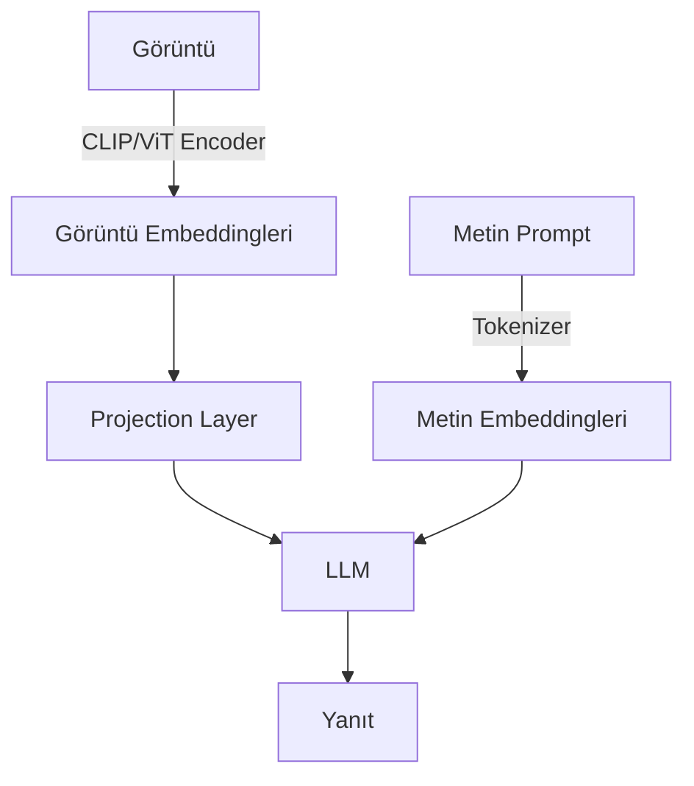

## 📌 Özet

**Vision Transformer (ViT)**, görüntüyü sabit boyutlu yamalar (patches) olarak bölerek NLP'deki Transformer mimarisini bilgisayarlı görüye uygular. CLIP ise görüntü-metin çiftlerini ortak bir gömme uzayında öğrenerek multimodal AI'ın temelini atmıştır.


---

## 🧠 Detay

### ViT Mimarisi

```python
from transformers import ViTForImageClassification, ViTImageProcessor
from PIL import Image

processor = ViTImageProcessor.from_pretrained("google/vit-base-patch16-224")
model = ViTForImageClassification.from_pretrained("google/vit-base-patch16-224")

image = Image.open("kedi.jpg")
inputs = processor(images=image, return_tensors="pt")

outputs = model(**inputs)
predicted_class = outputs.logits.argmax(-1).item()
label = model.config.id2label[predicted_class]
print(f"Tahmin: {label}")
```

**ViT Patch Boyutu Seçimi:**

| Patch Boyutu | Patch Sayısı (224x224) | Hız | Doğruluk |
|---|---|---|---|
| 16×16 | 196 | Orta | Yüksek |
| 32×32 | 49 | Hızlı | Orta |
| 14×14 | 256 | Yavaş | En yüksek |

### CLIP (Contrastive Language-Image Pretraining)

```
Eğitim: 400M (görüntü, metin) çifti
Amaç: Eşleşen çiftlerin kosinüs benzerliğini artır,
       eşleşmeyenleri azalt (InfoNCE loss)
```

```python
from transformers import CLIPProcessor, CLIPModel
import torch

model = CLIPModel.from_pretrained("openai/clip-vit-base-patch32")
processor = CLIPProcessor.from_pretrained("openai/clip-vit-base-patch32")

# Zero-shot görüntü sınıflandırma
image = Image.open("araba.jpg")
texts = ["bir araba fotoğrafı", "bir köpek fotoğrafı", "bir bina fotoğrafı"]

inputs = processor(text=texts, images=image, return_tensors="pt", padding=True)
outputs = model(**inputs)

probs = outputs.logits_per_image.softmax(dim=1)
print(f"En yüksek ihtimal: {texts[probs.argmax()]}")
```

### Multimodal Modeller (LLM + Görüntü)



| Model | Görüntü Encoder | Dil Modeli | Özellik |
|---|---|---|---|
| **LLaVA** | CLIP ViT-L | Vicuna/Llama | Açık kaynak |
| **GPT-4V** | Kapalı | GPT-4 | En güçlü |
| **Gemini** | Kapalı | Gemini | Video+ses+görüntü |
| **Claude 3.x** | Kapalı | Claude | 100K context + görüntü |
| **InternVL** | InternViT | InternLM | Açık, rekabetçi |

### LLaVA Kullanımı

```python
from transformers import LlavaNextProcessor, LlavaNextForConditionalGeneration
import torch

model = LlavaNextForConditionalGeneration.from_pretrained(
    "llava-hf/llava-v1.6-mistral-7b-hf",
    torch_dtype=torch.float16,
    device_map="auto"
)
processor = LlavaNextProcessor.from_pretrained("llava-hf/llava-v1.6-mistral-7b-hf")

image = Image.open("grafik.png")
prompt = "[INST] <image>\nBu grafiği detaylı açıkla. [/INST]"

inputs = processor(prompt, image, return_tensors="pt").to("cuda")
output = model.generate(**inputs, max_new_tokens=500)
print(processor.decode(output[0], skip_special_tokens=True))
```

### Stable Diffusion ile CLIP

Stable Diffusion'da CLIP text encoder, metin promptunu görüntü üretimine rehberlik eden embed vektörüne çevirir. İnce ayar (fine-tuning) için **Textual Inversion** ve **DreamBooth** bu CLIP bileşenini kullanır.

---

## 💡 Bağlantılar
- [[DL - Transformer Mimarisi ve Attention Mekanizması]]
- [[DL - Diffusion Modelleri ve Stable Diffusion Mimarisi]]
- [[DL - Konvolsiyonel Sinir Ağları (CNN) ve Görüntü İşleme]]
- [[LLM - Giriş ve Temel Kavramlar (Transformer, Tokens)]]

## ❓ Sorular / Anlamadıklarım

## 🔗 Kaynaklar
- [Dosovitskiy et al. 2020 - ViT](https://arxiv.org/abs/2010.11929)
- [Radford et al. 2021 - CLIP](https://arxiv.org/abs/2103.00020)
- [LLaVA Project](https://llava-vl.github.io/)
