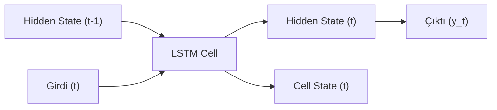

## 📌 Özet
Yinelemeli Sinir Ağları (RNN), sıralı verilerin (metin, ses, zaman serileri) analizi için tasarlanmış, geçmiş bilgileri bir "bellek" (hidden state) içerisinde tutabilen özel bir ağ türüdür. Geleneksel ağların aksine, RNN'lerin çıktıları sadece mevcut girişe değil, aynı zamanda önceki adımlardan gelen bilgilere de bağlıdır. Ancak standart RNN'ler, uzun dizilerde "Vanishing Gradient" (kaybolan gradyanlar) sorunu nedeniyle uzun süreli bağımlılıkları öğrenmekte zorlanırlar. Bu sorunu aşmak için geliştirilen LSTM (Long Short-Term Memory) ve GRU (Gated Recurrent Unit) mimarileri, "kapı" (gate) mekanizmaları kullanarak hangi bilginin saklanacağını veya silineceğini kontrol ederler. Bu sayede modeller, cümledeki bir kelimenin çok ilerideki bir kelimeyle olan ilişkisini başarıyla modelleyebilir.



## 🔄 RNN Mantığı
RNN'ler her adımda aynı parametreleri ($W_{hh}, W_{xh}, W_{hy}$) paylaşarak diziyi işler.
- **Formül:** $h_t = \tanh(W_{hh} h_{t-1} + W_{xh} x_t + b_h)$
- **Sorun:** Geriye doğru türev alındığında (BPTT), gradyanlar üstel olarak küçülebilir (kaybolabilir) veya büyüyebilir (patlayabilir).

## 🔒 LSTM (Long Short-Term Memory)
LSTM, uzun vadeli belleği korumak için üç ana kapı kullanır:

1. **Forget Gate (Unutma Kapısı):** Önceki hücre durumundan hangi bilgilerin atılacağına karar verir.
2. **Input Gate (Giriş Kapısı):** Hücre durumuna hangi yeni bilgilerin ekleneceğini belirler.
3. **Output Gate (Çıkış Kapısı):** Hücre durumunun hangi kısmının çıktı olarak verileceğini seçer.

## 💻 PyTorch ile LSTM Kullanımı
```python
import torch.nn as nn

class LSTMModel(nn.Module):
    def __init__(self, vocab_size, embedding_dim, hidden_dim):
        super(LSTMModel, self).__init__()
        self.embedding = nn.Embedding(vocab_size, embedding_dim)
        self.lstm = nn.LSTM(embedding_dim, hidden_dim, batch_first=True)
        self.fc = nn.Linear(hidden_dim, 1)

    def forward(self, x):
        embedded = self.embedding(x)
        # lstm_out: [batch, seq_len, hidden_dim]
        # hn: son gizli durum
        lstm_out, (hn, cn) = self.lstm(embedded)
        out = self.fc(hn[-1])
        return out
```

## 🎯 Uygulama Alanları
- **NLP:** Cümle tamamlama, duygu analizi, makine çevirisi.
- **Zaman Serisi:** Hisse senedi tahmini, hava durumu analizi.
- **Ses İşleme:** Konuşmadan metne (Speech-to-Text).
