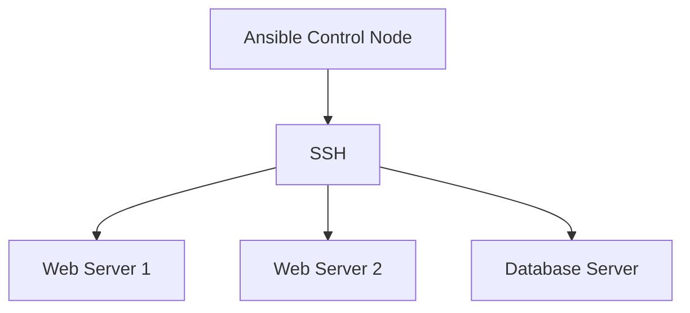

## 📌 Özet
Ansible, sunucu konfigürasyonu ve uygulama dağıtımı süreçlerini otomatikleştiren, ajansız (agentless) çalışan bir açık kaynaklı araçtır. SSH protokolü üzerinden çalışması, hedef sunucularda ekstra bir yazılım kurulmasına gerek bırakmaz. Playbook'lar, Ansible'ın temel yapı taşları olup, otomasyon adımlarını YAML formatında deklaratif olarak tanımlar. Role'lar ise karmaşık playbook'ları daha yönetilebilir parçalara bölen, tekrar kullanılabilen modüler yapılarıdır. Variable, template, task, handler gibi bileşenleri organize etmek için role dizin yapısı standart bir iskelet sunar. Ansible Galaxy, topluluk tarafından oluşturulmuş hazır role'ların paylaşıldığı platformdur.

## 🚀 Detaylar

### Playbook'lar
Playbook'lar, bir veya daha fazla "play" içeren dosyalardır. Her play, belirli bir host grubunda çalıştırılacak task'ları (görevleri) tanımlar.

#### Örnek Playbook
```yaml
---
- name: Web Server Kurulumu ve Konfigürasyonu
  hosts: webservers
  become: yes

  tasks:
    - name: Nginx paketini yükle
      apt:
        name: nginx
        state: present
        update_cache: yes

    - name: Nginx servisini başlat ve etkinleştir
      service:
        name: nginx
        state: started
        enabled: yes

    - name: Özel index.html kopyala
      copy:
        src: files/index.html
        dest: /var/www/html/index.html
        owner: www-data
        group: www-data
        mode: '0644'
      notify: Nginx'i yeniden başlat

  handlers:
    - name: Nginx'i yeniden başlat
      service:
        name: nginx
        state: restarted
```

### Role Yapısı (Ansible Roles)
Role'lar, değişkenleri, task'ları, dosyaları ve template'leri bağımsız olarak kullanılabilecek şekilde yapılandırır. `ansible-galaxy init role_name` komutu ile oluşturulabilir.

Dizin Yapısı:
- `tasks/main.yml`: Ana görev listesi.
- `handlers/main.yml`: Handler'lar.
- `templates/`: Jinja2 template dosyaları.
- `files/`: Statik dosyalar.
- `vars/main.yml`: Role'a özel değişkenler.
- `defaults/main.yml`: Varsayılan değişken değerleri.
- `meta/main.yml`: Role bağımlılıkları ve yazar bilgisi.

### Mimari Görünüm


