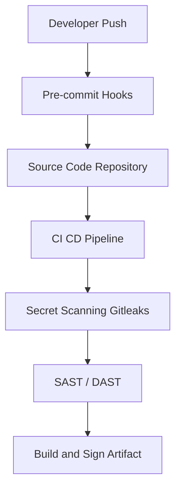

## 📌 Özet
CI/CD süreçlerinin güvenliği, modern yazılım geliştirme döngüsünün en hassas noktalarından biridir ve güvenliğin sola kaydırılması (Shift-Left) yaklaşımının merkezindedir. Pipeline güvenliği, kod depolarına yetkisiz erişimlerin engellenmesi, yapı araçlarının (build tools) bütünlüğünün korunması ve dağıtım ortamlarına güvenli erişimin sağlanması işlemlerini kapsar. Geliştiricilerin yanlışlıkla GitHub veya GitLab gibi depolara API anahtarları, şifreler veya token'lar yüklemesi büyük risk oluşturur. Secret tarama araçları, commit geçmişinde veya pull request aşamasında bu tür hassas verileri tespit ederek uyarır veya işlemleri durdurur. Gitleaks ve TruffleHog, bu amaçla kullanılan güçlü açık kaynaklı araçlardır. Ek olarak, pipeline ortam değişkenlerinin şifrelenmesi ve dış secret yönetim araçları (HashiCorp Vault vb.) ile entegrasyonu kritik öneme sahiptir.

## 🚀 Detaylar

### Secret Tarama Süreçleri
Secret tarama, hem geliştirici ortamında pre-commit hook'lar ile, hem de CI/CD pipeline'larında otomatik bir adım olarak uygulanmalıdır.

#### Gitleaks Kullanımı
Gitleaks, depolarda commit edilmiş sızıntıları (secrets, api keys vb.) bulur.

**Örnek GitHub Actions Workflow ile Gitleaks:**
```yaml
name: Secret Scanning
on: [push, pull_request]

jobs:
  gitleaks:
    name: Run Gitleaks
    runs-on: ubuntu-latest
    steps:
      - name: Checkout Code
        uses: actions/checkout@v3
        with:
          fetch-depth: 0
      - name: Gitleaks Scan
        uses: gitleaks/gitleaks-action@v2
        env:
          GITHUB_TOKEN: ${{ secrets.GITHUB_TOKEN }}
```

### Pipeline Güvenliği Best Practices
1. **İlke-Yetki (Least Privilege):** CI/CD runner'larına sadece gerekli kaynaklara erişim izni verin.
2. **Ephemeral Runners:** Kısa ömürlü ve izole runner ortamları kullanın.
3. **Artifact İmzalama (Sigstore/Cosign):** Üretilen imajların ve dosyaların bütünlüğünü garanti altına alın.
4. **Secret Management:** Hassas bilgileri pipeline env variable'ları yerine dış bir sistemden (Vault, AWS Secrets Manager) çekin.

### Mimari Görünüm


