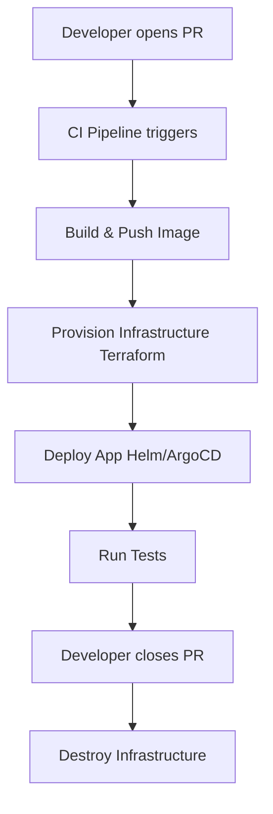

## 📌 Özet
Dinamik ortamlar (ephemeral environments), yazılım geliştirme sürecinde sadece ihtiyaç duyulduğunda oluşturulan ve işlevi bittiğinde silinen kısa ömürlü, izole altyapılardır. Özellikle Pull Request (PR) veya Feature Branch düzeyinde oluşturulan bu ortamlar, geliştiricilere ve test ekiplerine kod ana dallara birleşmeden önce bağımsız test yapma imkanı sunar. IaC araçları (Terraform, Pulumi) ve Kubernetes (Namespaces, vCluster) kullanılarak bu süreç tamamen otomatikleştirilir. Altyapı otomasyonu, sadece kaynak yaratmayı değil, aynı zamanda maliyet kontrolü (kaynakların yok edilmesi) ve güvenlik standartlarının korunmasını da sağlar. Dinamik ortamlar, darboğazları ortadan kaldırarak çevikliği ve DevSecOps hızını maksimize eder.

## 🚀 Detaylar

### Dinamik Ortam Yaklaşımları

1. **Namespace Tabanlı İzolasyon (Kubernetes):**
   Her PR için Kubernetes üzerinde yeni bir Namespace açılır, uygulamanın tüm bileşenleri (veri tabanı, frontend, backend) bu Namespace içerisine deploy edilir. PR kapandığında Namespace silinir.
2. **vCluster (Sanal Kümeler):**
   Aynı Kubernetes kümesi içerisinde mantıksal olarak ayrılmış tam yetkili sanal kümeler yaratılır. Bu yaklaşım, multi-tenancy gerektiren karmaşık izolasyon senaryolarında daha güvenlidir.
3. **Bulut Kaynakları Üretme (Terraform Workspaces):**
   PR spesifik bir ortam için Terraform Workspace yaratılır ve yeni EC2, RDS gibi kalıcı bulut kaynakları geçici süreyle provizyonlanır.

### Örnek GitHub Actions ile Ephemeral Environment
Pull request açıldığında ortam oluşturup, kapandığında yok eden bir otomasyon senaryosu.

```yaml
name: Dynamic Environment
on:
  pull_request:
    types: [opened, synchronize, closed]

jobs:
  deploy-env:
    if: github.event.action != 'closed'
    runs-on: ubuntu-latest
    steps:
      - name: Deploy to K8s
        run: |
          kubectl create namespace pr-${{ github.event.number }}
          helm install my-app ./chart -n pr-${{ github.event.number }}

  destroy-env:
    if: github.event.action == 'closed'
    runs-on: ubuntu-latest
    steps:
      - name: Destroy K8s Environment
        run: |
          helm uninstall my-app -n pr-${{ github.event.number }}
          kubectl delete namespace pr-${{ github.event.number }}
```

### Avantajlar ve Zorluklar
- **Avantajlar:** Paralel geliştirme ve test imkanı, staging ortamındaki beklemelerin sona ermesi, maliyet optimizasyonu.
- **Zorluklar:** Veritabanı state yönetimi ve seed datası hazırlamak karmaşık olabilir. Dış servis bağlantılarının (Third-party API) dinamik ortamlar için izole edilmesi zordur.

### Mimari Görünüm


