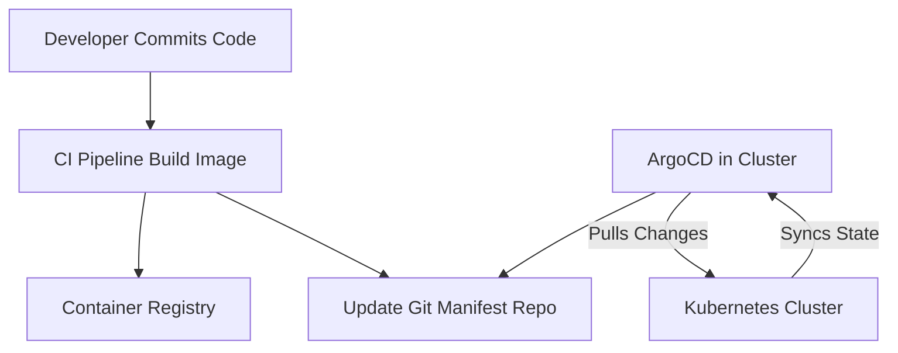

## 📌 Özet
GitOps, sistem altyapısının ve uygulamaların istenen durumu için tek bir "gerçeklik kaynağı" (single source of truth) olarak Git depolarını kullanan modern bir dağıtım metodolojisidir. Bu yaklaşımda sistemdeki her değişiklik bir Git commit'i olarak işlenir; pull request incelemeleri sayesinde otomatize, izlenebilir ve güvenli bir süreç elde edilir. ArgoCD, Kubernetes ortamları için geliştirilmiş, deklaratif ve GitOps tabanlı öncü bir sürekli dağıtım (Continuous Delivery) aracıdır. ArgoCD, kümedeki mevcut durum ile Git deposundaki manifestlerde tanımlanan istenen durumu sürekli karşılaştırır. Sapmalar (drift) tespit edildiğinde geliştiricileri uyarır veya sistemi otomatik olarak senkronize ederek yapılandırma sürüklenmesini (configuration drift) engeller.

## 🚀 Detaylar

### GitOps Prensipleri
1. **Deklaratif Tanımlama:** Tüm sistem deklaratif bir yapıyla (YAML/JSON) ifade edilmelidir.
2. **Değişmez Depolama:** İstenen sistem durumu, Git gibi versiyon kontrol sistemlerinde tutulur.
3. **Otomatik Senkronizasyon:** Onaylanan değişiklikler otomatik olarak sisteme uygulanabilir.
4. **Sürekli Doğrulama (Reconciliation):** Yazılım ajanı (ArgoCD gibi) sistemin gerçek durumu ile Git üzerindeki durumun eşleştiğinden sürekli emin olur.

### ArgoCD Application CRD
ArgoCD, dağıtımları Kubernetes Custom Resource (CRD) kullanarak yönetir.

#### Örnek Application Tanımlaması
```yaml
apiVersion: argoproj.io/v1alpha1
kind: Application
metadata:
  name: my-app
  namespace: argocd
spec:
  project: default
  source:
    repoURL: 'https://github.com/my-org/my-app-manifests.git'
    targetRevision: HEAD
    path: kustomize-guestbook
  destination:
    server: 'https://kubernetes.default.svc'
    namespace: guestbook
  syncPolicy:
    automated:
      prune: true
      selfHeal: true
```

### Güvenlik Avantajları
GitOps, CI (Continuous Integration) aracı ile ortam arasındaki yetkiyi ayırır. CI aracı Kubernetes'e doğrudan erişim sağlamaz; sadece imajı üretir ve manifest deposunu günceller. Kubernetes cluster içindeki ArgoCD aracı değişiklikleri çekerek (Pull-based) güvenliği artırır.

### Mimari Görünüm


