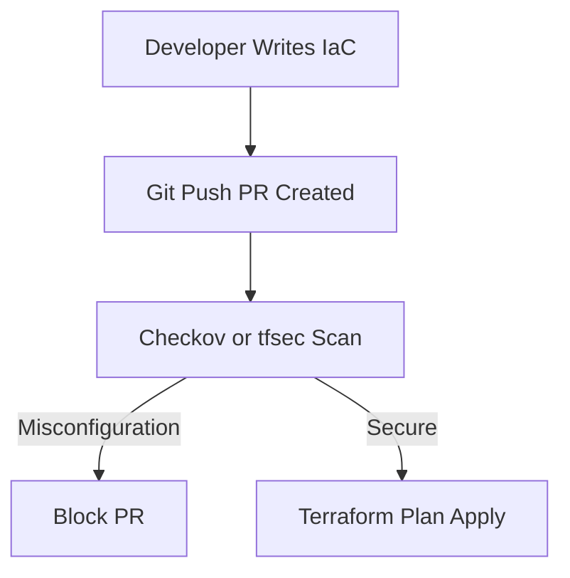

## 📌 Özet
Infrastructure as Code (IaC) yaklaşımları, altyapıyı kod olarak yönetmemize olanak tanırken, aynı zamanda güvenlik hatalarının geniş çaplı sistemlere hızla yayılması riskini de barındırır. IaC güvenlik taramaları, altyapı dağıtılmadan önce Terraform, CloudFormation veya Kubernetes manifestleri gibi kod dosyalarını analiz ederek potansiyel miskonfigürasyonları tespit etmeyi amaçlar. Checkov ve tfsec (Aqua Security tarafından Trivy altında birleştirildi), sektördeki en yaygın statik kod analizi (SAST) araçlarındandır. Bu araçlar, şifrelenmemiş veritabanları, herkese açık (public) bırakılmış S3 bucket'lar veya açık bırakılmış kritik portlar gibi yapılandırma hatalarını CI/CD sürecinde bularak geliştiriciye anında geri bildirim sağlar. Güvenlik ihlallerinin önlenmesinde ilk savunma hattı olarak görev alırlar.

## 🚀 Detaylar

### tfsec (Trivy IaC)
tfsec, özellikle Terraform kodları için optimize edilmiş, yerel kaynaklarda hızlı taramalar yapabilen bir araçtır.

#### Kurulum ve Kullanım
```bash
# Terraform projesinin olduğu dizinde çalıştırılır
tfsec .
```

### Checkov
Palo Alto Networks (Prisma Cloud) destekli Checkov; Terraform, CloudFormation, Kubernetes, ARM, Serverless framework ve Ansible dosyalarını tarayabilir. 1000'den fazla hazır politika içerir.

#### Örnek Checkov Tarama Komutu
```bash
checkov -d /path/to/iac/code
```

#### Örnek Checkov Çıktısı (Kötü Konfigürasyon)
Örneğin public olarak ayarlanmış bir S3 bucket tarandığında:
```text
Check: CKV_AWS_20: "S3 buckets should not be publicly accessible"
    FAILED for resource: aws_s3_bucket.my_bucket
    File: /main.tf:10-15
```

### Custom Policy (Özel Kural) Yazımı
Checkov, Python veya YAML ile özel kurallar yazılmasına imkan tanır.
```yaml
metadata:
  name: "Ensure all S3 buckets have environment tags"
  id: "CKV_CUSTOM_1"
  category: "GENERAL_SECURITY"
definition:
  cond_type: "attribute"
  resource_types:
    - "aws_s3_bucket"
  attribute: "tags.Environment"
  operator: "exists"
```

### Mimari Görünüm


