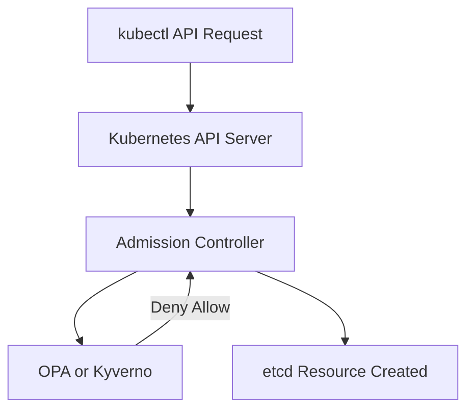

## 📌 Özet
Policy as Code (PaC), güvenlik ve uyumluluk kurallarının yüksek seviyeli kod formunda tanımlanması ve uygulanması yaklaşımıdır. Bu sayede, güvenlik politikaları manuel denetimlerden çıkıp CI/CD süreçlerinde otomatik olarak test edilebilen, sürümlendirilebilen yapılar haline gelir. Open Policy Agent (OPA), Rego dili kullanarak farklı platformlarda uygulanabilen evrensel bir politika motorudur. OPA Gatekeeper, Kubernetes ortamlarında admission controller olarak çalışarak, cluster'a gönderilen istekleri kurallara göre kabul veya reddeder. Kyverno ise Kubernetes-native bir politika motorudur ve Rego dili gerektirmeden YAML tabanlı, daha kolay yönetilebilir kurallar oluşturmayı sağlar. Bu araçlar, konteyner imajlarının güvenilirliği, etiket standartları veya kaynak limitleri gibi birçok kuralı otomatik olarak uygular.

## 🚀 Detaylar

### Open Policy Agent (OPA) ve Rego
OPA politikaları, deklaratif bir dil olan Rego ile yazılır. 

#### Örnek Rego Politikası: Root olarak çalışan konteynerleri engelle
```rego
package kubernetes.admission

deny[msg] {
    input.request.kind.kind == "Pod"
    container := input.request.object.spec.containers[_]
    not container.securityContext.runAsNonRoot
    msg := sprintf("Konteyner '%v' root kullanıcısı olarak çalışmamalıdır.", [container.name])
}
```

### Kyverno (Kubernetes Native Policy Management)
Kyverno, politikaları Kubernetes resource'ları (Custom Resource Definitions - CRD) olarak yönetir. YAML ile kural tanımlamak, Kubernetes uzmanları için daha sezgiseldir.

#### Örnek Kyverno ClusterPolicy: 'team' etiketi zorunluluğu
```yaml
apiVersion: kyverno.io/v1
kind: ClusterPolicy
metadata:
  name: require-team-label
spec:
  validationFailureAction: enforce
  rules:
  - name: check-for-labels
    match:
      any:
      - resources:
          kinds:
          - Pod
    validate:
      message: "Pod oluşturmak için 'team' etiketi zorunludur."
      pattern:
        metadata:
          labels:
            team: "?*"
```

### Mimari Görünüm


