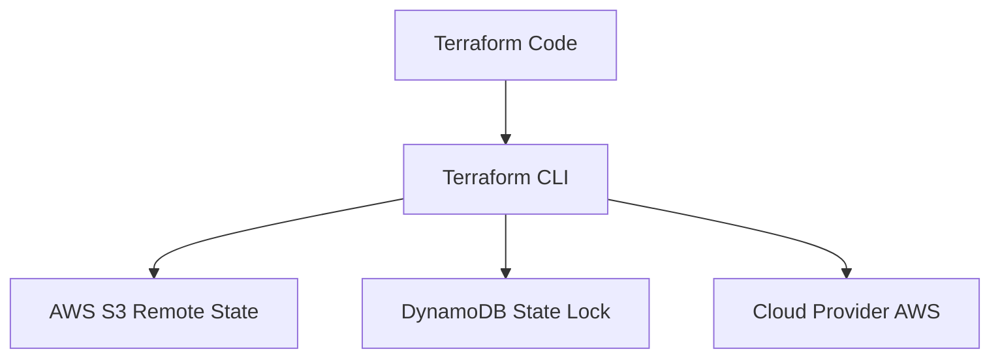

## 📌 Özet
Terraform, altyapıyı kod olarak (IaC) yönetmek için endüstri standardı haline gelmiş güçlü bir araçtır. İleri seviye kullanımında modüler mimari, kodun tekrar kullanılabilirliğini ve yönetilebilirliğini artırarak karmaşık altyapıları basitleştirir. State yönetimi, Terraform'un gerçek dünya altyapısı ile kod arasındaki bağlantıyı kurduğu kritik bir mekanizmadır. Uzak state depolama (remote state) ve state kilitleri (state locking), ekiplerin aynı altyapı üzerinde güvenle çalışmasını sağlar. Ayrıca, workspace'ler kullanılarak farklı ortamların (dev, staging, prod) tek bir konfigürasyon üzerinden izole edilmesi sağlanabilir. Güvenlik ve performans için state dosyalarının şifrelenmesi ve erişim izinlerinin sıkı bir şekilde yapılandırılması büyük önem taşır.

## 🚀 Detaylar

### Terraform Modülleri (Modules)
Modüller, birbiriyle ilişkili kaynakları tek bir mantıksal birim olarak gruplayan konteynerlerdir.

- **Root Module**: Terraform'un çalıştırıldığı ana dizindir.
- **Child Module**: Root modül veya başka modüller tarafından çağrılan modüllerdir.

#### Örnek Modül Kullanımı
```hcl
module "vpc" {
  source  = "terraform-aws-modules/vpc/aws"
  version = "3.14.2"

  name = "my-vpc"
  cidr = "10.0.0.0/16"

  azs             = ["eu-west-1a", "eu-west-1b", "eu-west-1c"]
  private_subnets = ["10.0.1.0/24", "10.0.2.0/24", "10.0.3.0/24"]
  public_subnets  = ["10.0.101.0/24", "10.0.102.0/24", "10.0.103.0/24"]

  enable_nat_gateway = true
  enable_vpn_gateway = true

  tags = {
    Terraform = "true"
    Environment = "dev"
  }
}
```

### State Yönetimi (State Management)
State dosyası (`terraform.tfstate`), Terraform tarafından oluşturulan kaynakların mevcut durumunu saklar.

#### Remote State ve Locking (S3 + DynamoDB)
State dosyasını lokalde tutmak yerine S3 gibi uzak bir depolamada saklamak, ekip çalışması için zorunludur. DynamoDB ile entegrasyon, aynı anda birden fazla kişinin değişiklik yapmasını önleyen State Locking sağlar.

```hcl
terraform {
  backend "s3" {
    bucket         = "my-terraform-state-bucket"
    key            = "global/s3/terraform.tfstate"
    region         = "eu-west-1"
    dynamodb_table = "terraform-state-locks"
    encrypt        = true
  }
}
```

### Mimari Görünüm


