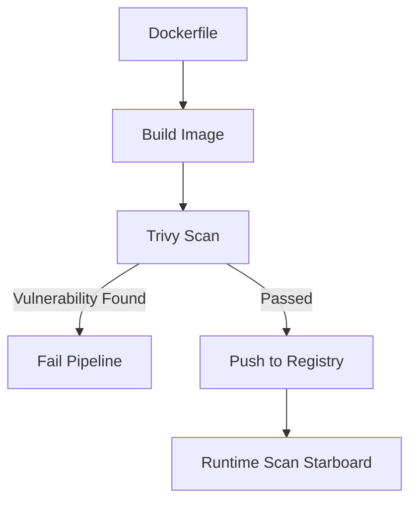

## 📌 Özet
Konteyner teknolojilerinin yaygınlaşmasıyla, dağıtılan imajların güvenliğinin sağlanması kritik bir ihtiyaç haline gelmiştir. İmaj güvenliği, temel olarak Docker imajları içerisindeki işletim sistemi paketlerinde ve uygulama bağımlılıklarında bulunan bilinen zafiyetlerin (CVE - Common Vulnerabilities and Exposures) tespit edilmesi sürecidir. Trivy, kullanımı kolay, kapsamlı tarama yeteneklerine sahip ve CI/CD süreçlerine kolay entegre edilebilen popüler bir tarayıcıdır. Clair ise özellikle imaj registery'leriyle entegre çalışacak şekilde tasarlanmış, katmanlı analiz yapan bir araçtır. İyi bir DevSecOps pratiği, imajların hem oluşturulma aşamasında (build time) hem de registry'de (runtime öncesi) sürekli olarak taranmasını ve kritik zafiyet tespit edildiğinde dağıtımın durdurulmasını gerektirir. Konteyner imajlarını minimal tutmak (distroless) saldırı yüzeyini daraltır.

## 🚀 Detaylar

### Trivy Kullanımı
Trivy, konteyner imajlarını, dosya sistemlerini, Git depolarını ve IaC kodlarını tarayabilen çok yönlü bir araçtır.

#### Basit İmaj Taraması
Lokaldeki bir imajı taramak için:
```bash
trivy image ubuntu:20.04
```

#### CI/CD Entegrasyonu
Kritik veya yüksek zafiyetlerde pipeline'ı kırmak için:
```bash
trivy image --exit-code 1 --severity HIGH,CRITICAL my-app:latest
```

### İmaj Güvenliği Temel Kuralları
- **Distroless İmajlar Kullanın:** İşletim sistemi shell'i, paket yöneticisi ve gereksiz araçlar içermeyen imajlar kullanarak saldırı yüzeyini küçültün.
- **Root Kullanıcı ile Çalıştırmayın:** `Dockerfile` içinde non-root kullanıcı tanımlayın (`USER appuser`).
- **Base Image'ları Güncel Tutun:** Zafiyet yamaları için sürekli güncel base imajlar kullanın.
- **Sadece Güvenilir Kaynaklar:** Docker Hub yerine iç organizasyonunuzda taranmış ve onaylanmış Private Registry imajlarını tercih edin.

### Mimari Görünüm


