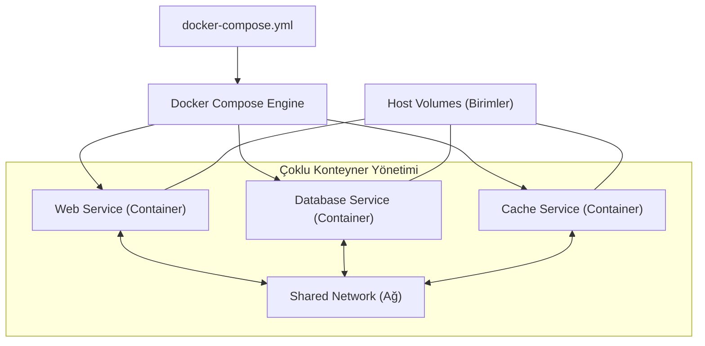

## 📌 Özet

Docker Compose, karmaşık ve çoklu konteyner içeren uygulamaları tek bir yapılandırma dosyası (YAML) üzerinden tanımlamaya ve yönetmeye olanak tanıyan kritik bir araçtır. Mikroservis mimarileri için vazgeçilmez olan bu araç, veritabanı, önbellek katmanı ve web servisi gibi birbirine bağlı bileşenlerin aynı ağ üzerinde uyum içinde çalışmasını sağlar. "docker-compose.yml" dosyası sayesinde, tüm uygulama altyapısı tek bir komutla ayağa kaldırılabilir, ölçeklendirilebilir ve yönetilebilir. Bu yaklaşım, geliştirme ortamlarının üretim ortamlarıyla birebir aynı olmasını garantileyerek, ortamlar arası uyumsuzlukları ve manuel kurulum hatalarını ortadan kaldırır.

---

## 🧠 Detay



### Tam Özellikli docker-compose.yml

```yaml
version: '3.9'

services:
  # ── Web Uygulaması ──────────────────────
  web:
    build:
      context: .
      dockerfile: Dockerfile
      args:
        - BUILD_ENV=production
    image: myapp:latest
    container_name: web_app
    restart: unless-stopped
    ports:
      - "8000:8000"
    environment:
      - DATABASE_URL=postgresql://user:pass@db:5432/mydb
      - REDIS_URL=redis://redis:6379
      - SECRET_KEY=${SECRET_KEY}   # .env dosyasından
    env_file:
      - .env
    volumes:
      - ./app:/app                 # Geliştirme: canlı kod
      - media_files:/app/media     # Named volume
    depends_on:
      db:
        condition: service_healthy
      redis:
        condition: service_started
    networks:
      - backend
      - frontend
    healthcheck:
      test: ["CMD", "curl", "-f", "http://localhost:8000/health"]
      interval: 30s
      timeout: 10s
      retries: 3
      start_period: 40s
    deploy:
      resources:
        limits:
          cpus: '1.0'
          memory: 512M

  # ── PostgreSQL ──────────────────────────
  db:
    image: postgres:15-alpine
    container_name: postgres_db
    restart: unless-stopped
    environment:
      POSTGRES_USER: user
      POSTGRES_PASSWORD: pass
      POSTGRES_DB: mydb
    volumes:
      - postgres_data:/var/lib/postgresql/data
      - ./init.sql:/docker-entrypoint-initdb.d/init.sql
    ports:
      - "5432:5432"     # Geliştirmede erişim için
    networks:
      - backend
    healthcheck:
      test: ["CMD-SHELL", "pg_isready -U user -d mydb"]
      interval: 10s
      timeout: 5s
      retries: 5

  # ── Redis ───────────────────────────────
  redis:
    image: redis:7-alpine
    container_name: redis_cache
    restart: unless-stopped
    command: redis-server --appendonly yes --maxmemory 256mb
    volumes:
      - redis_data:/data
    ports:
      - "6379:6379"
    networks:
      - backend

  # ── Nginx (Reverse Proxy) ───────────────
  nginx:
    image: nginx:alpine
    container_name: nginx_proxy
    restart: unless-stopped
    ports:
      - "80:80"
      - "443:443"
    volumes:
      - ./nginx/nginx.conf:/etc/nginx/nginx.conf:ro
      - ./nginx/certs:/etc/nginx/certs:ro
      - media_files:/app/media:ro
    depends_on:
      - web
    networks:
      - frontend

  # ── Celery Worker ───────────────────────
  celery:
    build: .
    container_name: celery_worker
    command: celery -A myapp worker -l info -c 4
    environment:
      - DATABASE_URL=postgresql://user:pass@db:5432/mydb
      - REDIS_URL=redis://redis:6379
    depends_on:
      - db
      - redis
    networks:
      - backend

# ── Volumes ─────────────────────────────────
volumes:
  postgres_data:
    driver: local
  redis_data:
    driver: local
  media_files:
    driver: local

# ── Networks ─────────────────────────────────
networks:
  backend:
    driver: bridge
  frontend:
    driver: bridge
```

### Compose Komutları

```bash
# Başlat
docker compose up              # Ön planda
docker compose up -d           # Arka planda (detach)
docker compose up --build      # Image'ı yeniden build et
docker compose up web db       # Belirli servisleri başlat

# Durdur
docker compose down            # Container sil, volume koru
docker compose down -v         # Volume da sil
docker compose down --rmi all  # Image da sil
docker compose stop            # Sadece durdur (sil değil)

# Durum
docker compose ps
docker compose logs
docker compose logs -f web
docker compose logs --tail 50 db

# Komut çalıştır
docker compose exec web bash
docker compose exec db psql -U user mydb
docker compose run --rm web python manage.py migrate

# Build
docker compose build
docker compose build web
docker compose build --no-cache

# Ölçeklendirme
docker compose up --scale worker=3

# Config kontrolü
docker compose config    # YAML'ı doğrula ve çözümlenmiş hali gör
```

### .env Dosyası

```bash
# .env
SECRET_KEY=supersecretkey123
DEBUG=False
DATABASE_URL=postgresql://user:pass@db:5432/mydb
POSTGRES_USER=user
POSTGRES_PASSWORD=pass
POSTGRES_DB=mydb
```

### Override Dosyası (Geliştirme vs Prod)

```yaml
# docker-compose.override.yml (geliştirme — otomatik yüklenir)
services:
  web:
    build:
      context: .
    volumes:
      - .:/app        # Canlı kod yükleme
    environment:
      - DEBUG=True
    command: python manage.py runserver 0.0.0.0:8000

  db:
    ports:
      - "5432:5432"   # Geliştirmede DB'ye direkt erişim
```

```bash
# Production: sadece compose.yml
docker compose -f docker-compose.yml up -d

# Geliştirme: override otomatik yüklenir
docker compose up -d

# Manuel override
docker compose -f docker-compose.yml -f docker-compose.dev.yml up
```

### Sağlıklı Bekleme (depends_on + healthcheck)

```yaml
services:
  web:
    depends_on:
      db:
        condition: service_healthy   # DB hazır olana kadar bekle

  db:
    healthcheck:
      test: ["CMD-SHELL", "pg_isready -U ${POSTGRES_USER}"]
      interval: 5s
      timeout: 5s
      retries: 10
      start_period: 10s
```

### Profiles (Opsiyonel Servisler)

```yaml
services:
  web:
    # Her zaman çalışır

  adminer:
    image: adminer
    profiles: ["tools"]    # Sadece tools profili aktifse
    ports:
      - "8080:8080"

  mailhog:
    image: mailhog/mailhog
    profiles: ["dev"]
```

```bash
docker compose --profile tools up    # adminer da dahil
docker compose --profile dev up      # mailhog da dahil
```

---

## 💡 Bağlantılar
- [[Docker - Dockerfile Yazımı]]
- [[Docker - Volume ve Veri Yönetimi]]
- [[Docker - Network Yönetimi]]
- [[Docker - Docker Swarm ve Ölçeklendirme]]

## ❓ Sorular / Anlamadıklarım

## 🔗 Kaynaklar
- docs.docker.com/compose/
- docs.docker.com/compose/compose-file/
