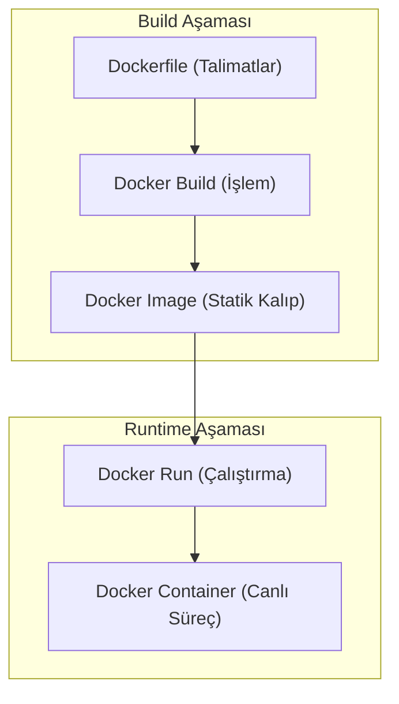

## 📌 Özet

Dockerfile, bir Docker imajının nasıl inşa edileceğini belirleyen, adım adım talimatlar içeren bir yapılandırma dosyasıdır. Bu dosya içindeki her bir komut (FROM, RUN, COPY vb.), imajın üzerine eklenen yeni bir katmanı (layer) temsil eder ve bu katmanlı yapı sayesinde Docker, imaj build süreçlerini önbelleğe alarak (cache) hızlandırır. İyi tasarlanmış bir Dockerfile, sadece uygulamanın çalışmasını sağlamakla kalmaz; aynı zamanda "Multi-stage Build" gibi tekniklerle imaj boyutunu küçültür ve gereksiz dosyaları dışarıda bırakarak güvenliği artırır. Geliştiriciler için Dockerfile yazmak, uygulamanın altyapısını kod olarak tanımlamak (Infrastructure as Code) ve dağıtım süreçlerini tüm ortamlarda standartlaştırmak anlamına gelir.

---

## 🧠 Detay



### Tüm Dockerfile Komutları

```dockerfile
# Temel image
FROM python:3.11-slim

# Metadata
LABEL maintainer="ali@example.com"
LABEL version="1.0"
LABEL description="My Python App"

# Ortam değişkeni (build + runtime)
ENV APP_ENV=production
ENV PORT=8000
ENV PYTHONDONTWRITEBYTECODE=1
ENV PYTHONUNBUFFERED=1

# Build-time argümanı (sadece build sırasında)
ARG BUILD_DATE
ARG GIT_HASH

# Çalışma dizini
WORKDIR /app

# Dosya kopyala (host → image)
COPY requirements.txt .
COPY . .

# Harici kaynak ekle (URL veya tar.gz otomatik açılır)
ADD https://example.com/config.json /app/config.json

# Komut çalıştır (build sırasında)
RUN apt-get update && apt-get install -y \
    curl \
    && rm -rf /var/lib/apt/lists/*

RUN pip install --no-cache-dir -r requirements.txt

# Port belgele (bilgi amaçlı, bağlamaz)
EXPOSE 8000

# Volume tanımla
VOLUME ["/app/data"]

# Kullanıcı değiştir (güvenlik)
RUN useradd -m appuser
USER appuser

# Sağlık kontrolü
HEALTHCHECK --interval=30s --timeout=3s --start-period=5s --retries=3 \
    CMD curl -f http://localhost:8000/health || exit 1

# Container başladığında çalışacak sabit komut
ENTRYPOINT ["python", "app.py"]

# ENTRYPOINT'e ek argüman (veya tek başına komut)
CMD ["--host", "0.0.0.0", "--port", "8000"]
```

### CMD vs ENTRYPOINT

```dockerfile
# Sadece CMD — docker run ile tamamen override edilir
CMD ["python", "app.py"]
docker run myapp python other.py  # CMD ignore edilir

# ENTRYPOINT + CMD — CMD, ENTRYPOINT'e ek argüman
ENTRYPOINT ["python", "app.py"]
CMD ["--port", "8000"]
docker run myapp --port 9000  # → python app.py --port 9000

# Shell form vs Exec form
CMD python app.py          # Shell form: /bin/sh -c "python app.py"
CMD ["python", "app.py"]   # Exec form: doğrudan çalışır (tercih et)
```

### Python Uygulaması Örneği

```dockerfile
FROM python:3.11-slim

# Ortam
ENV PYTHONDONTWRITEBYTECODE=1 \
    PYTHONUNBUFFERED=1 \
    PIP_NO_CACHE_DIR=1

WORKDIR /app

# Önce requirements — cache için
COPY requirements.txt .
RUN pip install -r requirements.txt

# Sonra uygulama kodu
COPY . .

# Güvenlik: root olmayan kullanıcı
RUN adduser --disabled-password --gecos '' appuser
USER appuser

EXPOSE 8000
CMD ["uvicorn", "main:app", "--host", "0.0.0.0", "--port", "8000"]
```

### Node.js Uygulaması Örneği

```dockerfile
FROM node:20-alpine

WORKDIR /app

COPY package*.json ./
RUN npm ci --only=production

COPY . .

RUN addgroup -S appgroup && adduser -S appuser -G appgroup
USER appuser

EXPOSE 3000
CMD ["node", "server.js"]
```

### Multi-Stage Build ⭐

Derleme ve çalıştırma aşamalarını ayırır → küçük production image.

```dockerfile
# ───── Aşama 1: Build ─────
FROM node:20 AS builder
WORKDIR /app
COPY package*.json ./
RUN npm ci
COPY . .
RUN npm run build    # dist/ klasörü üretir

# ───── Aşama 2: Production ─────
FROM nginx:alpine AS production
COPY --from=builder /app/dist /usr/share/nginx/html
EXPOSE 80
CMD ["nginx", "-g", "daemon off;"]
# Final image: ~25MB (Node build: ~1GB!)
```

```dockerfile
# Python Multi-stage
FROM python:3.11 AS builder
WORKDIR /app
COPY requirements.txt .
RUN pip install --user -r requirements.txt

FROM python:3.11-slim AS production
WORKDIR /app
COPY --from=builder /root/.local /root/.local
COPY . .
ENV PATH=/root/.local/bin:$PATH
CMD ["python", "app.py"]
```

### .dockerignore

```
# .dockerignore
__pycache__/
*.pyc
*.pyo
.git/
.gitignore
.env
.venv/
venv/
node_modules/
*.log
.DS_Store
Dockerfile*
docker-compose*
README.md
tests/
docs/
```

### Best Practices

```dockerfile
# ✅ DO: Katmanları birleştir
RUN apt-get update && apt-get install -y \
    curl \
    git \
    && rm -rf /var/lib/apt/lists/*

# ❌ DON'T: Ayrı ayrı RUN (her biri katman!)
RUN apt-get update
RUN apt-get install -y curl
RUN apt-get install -y git

# ✅ DO: Önce bağımlılıklar, sonra kod (cache)
COPY requirements.txt .
RUN pip install -r requirements.txt
COPY . .   # Kod değişse pip tekrar çalışmaz

# ❌ DON'T: Her şeyi birden kopyala
COPY . .
RUN pip install -r requirements.txt  # Her kod değişiminde pip!

# ✅ DO: Slim/Alpine base image kullan
FROM python:3.11-slim    # ~130MB
FROM python:3.11-alpine  # ~50MB (musl libc)
# FROM python:3.11       # ~1GB

# ✅ DO: Non-root user
RUN adduser --disabled-password appuser
USER appuser
```

### Boyut Karşılaştırması

| Base Image | Boyut |
|---|---|
| ubuntu:22.04 | ~77MB |
| python:3.11 | ~1.01GB |
| python:3.11-slim | ~130MB |
| python:3.11-alpine | ~52MB |
| node:20 | ~1.10GB |
| node:20-alpine | ~172MB |
| nginx:latest | ~187MB |
| nginx:alpine | ~43MB |

---

## 💡 Bağlantılar
- [[Docker - Temel Komutlar]]
- [[Docker - Docker Compose]]
- [[Docker - Registry ve Image Yönetimi]]

## ❓ Sorular / Anlamadıklarım

## 🔗 Kaynaklar
- docs.docker.com/engine/reference/builder/
- docs.docker.com/develop/develop-images/dockerfile_best-practices/
