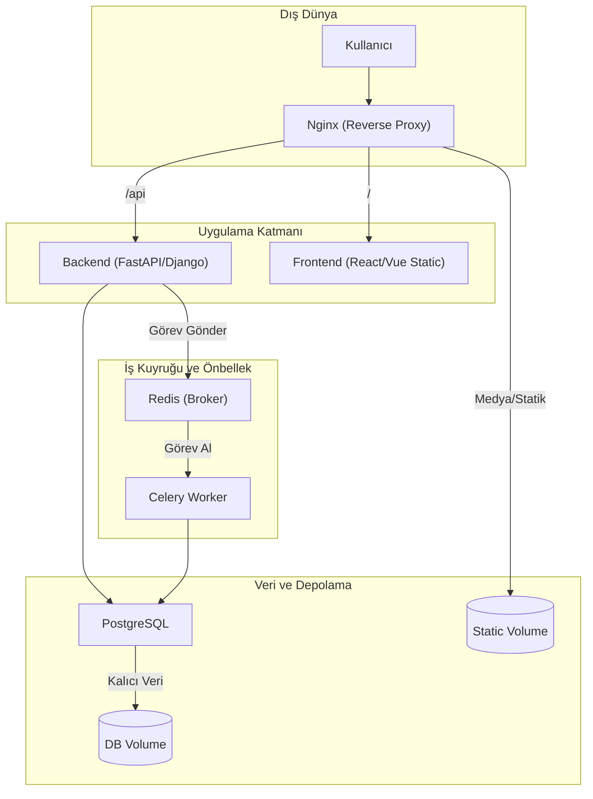

## 📌 Özet

Gerçek dünya projelerinde Docker kullanımı, tekil container'ların ötesine geçerek; veritabanları, asenkron görev kuyrukları, önbellekleme mekanizmaları ve ters vekil sunucuların (reverse proxy) bir arada çalıştığı bütünsel bir orkestrasyon sürecidir. Bu dosya, Django, FastAPI ve React gibi popüler teknolojilerin production ortamında nasıl yapılandırıldığını, statik dosyaların yönetimini ve container'lar arası ağ iletişimini somut senaryolarla ele alır. Ayrıca, geliştiricilerin günlük hayatta sıkça karşılaştığı izin sorunları, bağlantı hataları ve kaynak yönetimi gibi kritik problemlere pratik çözümler sunarak, Docker'ın profesyonel projelerdeki uygulama standartlarını belirler.

---

## 🧠 Detay

### Tam Yığın (Full-Stack) Production Mimarisi



### Senaryo 1: Django + PostgreSQL + Redis + Celery

```dockerfile
# Dockerfile (Django)
FROM python:3.11-slim AS base

ENV PYTHONDONTWRITEBYTECODE=1 \
    PYTHONUNBUFFERED=1 \
    PIP_NO_CACHE_DIR=1

WORKDIR /app

RUN apt-get update \
    && apt-get install -y libpq-dev gcc \
    && rm -rf /var/lib/apt/lists/*

COPY requirements.txt .
RUN pip install -r requirements.txt

COPY . .

RUN adduser --disabled-password --gecos '' django
RUN chown -R django:django /app
USER django

EXPOSE 8000
CMD ["gunicorn", "config.wsgi:application", "--bind", "0.0.0.0:8000", "--workers", "4"]
```

```yaml
# docker-compose.yml
version: '3.9'

services:
  web:
    build: .
    volumes:
      - .:/app
      - static:/app/staticfiles
    environment:
      - DATABASE_URL=postgresql://postgres:postgres@db:5432/mydb
      - CELERY_BROKER_URL=redis://redis:6379/0
    depends_on:
      db:
        condition: service_healthy
    ports:
      - "8000:8000"
    command: >
      sh -c "python manage.py migrate &&
             python manage.py collectstatic --noinput &&
             gunicorn config.wsgi:application --bind 0.0.0.0:8000"

  celery:
    build: .
    command: celery -A config worker -l info
    volumes:
      - .:/app
    environment:
      - DATABASE_URL=postgresql://postgres:postgres@db:5432/mydb
      - CELERY_BROKER_URL=redis://redis:6379/0
    depends_on:
      - db
      - redis

  celery-beat:
    build: .
    command: celery -A config beat -l info
    volumes:
      - .:/app
    depends_on:
      - redis

  db:
    image: postgres:15-alpine
    environment:
      POSTGRES_DB: mydb
      POSTGRES_USER: postgres
      POSTGRES_PASSWORD: postgres
    volumes:
      - postgres_data:/var/lib/postgresql/data
    healthcheck:
      test: ["CMD-SHELL", "pg_isready -U postgres"]
      interval: 5s
      retries: 5

  redis:
    image: redis:7-alpine
    volumes:
      - redis_data:/data

  nginx:
    image: nginx:alpine
    ports:
      - "80:80"
    volumes:
      - ./nginx.conf:/etc/nginx/conf.d/default.conf
      - static:/app/staticfiles
    depends_on:
      - web

volumes:
  postgres_data:
  redis_data:
  static:
```

---

### Senaryo 2: FastAPI + React (Full Stack)

```dockerfile
# Backend Dockerfile
FROM python:3.11-slim

WORKDIR /app
COPY requirements.txt .
RUN pip install --no-cache-dir -r requirements.txt
COPY . .

CMD ["uvicorn", "main:app", "--host", "0.0.0.0", "--port", "8000", "--reload"]
```

```dockerfile
# Frontend Dockerfile (Multi-stage)
# Stage 1: Build
FROM node:20-alpine AS builder
WORKDIR /app
COPY package*.json ./
RUN npm ci
COPY . .
RUN npm run build

# Stage 2: Serve
FROM nginx:alpine
COPY --from=builder /app/dist /usr/share/nginx/html
COPY nginx.conf /etc/nginx/conf.d/default.conf
EXPOSE 80
CMD ["nginx", "-g", "daemon off;"]
```

```yaml
# docker-compose.yml (Full Stack)
services:
  backend:
    build: ./backend
    ports:
      - "8000:8000"
    volumes:
      - ./backend:/app
    environment:
      - DATABASE_URL=postgresql://user:pass@db:5432/mydb

  frontend:
    build: ./frontend
    ports:
      - "3000:80"
    depends_on:
      - backend

  db:
    image: postgres:15-alpine
    environment:
      POSTGRES_USER: user
      POSTGRES_PASSWORD: pass
      POSTGRES_DB: mydb
    volumes:
      - db_data:/var/lib/postgresql/data

volumes:
  db_data:
```

---

### Senaryo 3: Nginx Reverse Proxy Yapılandırması

```nginx
# nginx.conf
upstream django {
    server web:8000;
}

server {
    listen 80;
    server_name example.com;

    # Statik dosyalar
    location /static/ {
        alias /app/staticfiles/;
        expires 1y;
        add_header Cache-Control "public, immutable";
    }

    location /media/ {
        alias /app/media/;
    }

    # API proxy
    location / {
        proxy_pass http://django;
        proxy_set_header Host $host;
        proxy_set_header X-Real-IP $remote_addr;
        proxy_set_header X-Forwarded-For $proxy_add_x_forwarded_for;
        proxy_set_header X-Forwarded-Proto $scheme;
        proxy_connect_timeout 60s;
        proxy_read_timeout 60s;
    }

    # WebSocket desteği
    location /ws/ {
        proxy_pass http://django;
        proxy_http_version 1.1;
        proxy_set_header Upgrade $http_upgrade;
        proxy_set_header Connection "upgrade";
    }
}
```

---

### Sık Karşılaşılan Sorunlar ve Çözümleri

#### Sorun 1: "Permission denied" hatası
```bash
# Container içinde dosyaya erişilemiyor
# Çözüm: Ownership ayarla
RUN chown -R appuser:appuser /app
USER appuser

# Volume'da permission sorunu
docker run -v $(pwd):/app --user $(id -u):$(id -g) myapp
```

#### Sorun 2: "Connection refused" — Container birbirine erişemiyor
```bash
# Sorun: Default bridge'de isim çözümlenmiyor
# Çözüm: Custom network kullan
docker network create mynet
docker run --network mynet --name db postgres
docker run --network mynet --name api myapi
# api container'ından: ping db → çalışır
```

#### Sorun 3: Container durduğunda veri kaybı
```bash
# Sorun: Volume tanımlanmamış
# Çözüm: Named volume ekle
docker run -v db_data:/var/lib/postgresql/data postgres

# Mevcut volumeleri listele
docker volume ls
# Backup al
docker run --rm -v db_data:/src -v $(pwd):/backup \
  alpine tar czf /backup/db_backup.tar.gz -C /src .
```

#### Sorun 4: "No space left on device"
```bash
# Docker disk kullanımı
docker system df

# Temizle
docker system prune -a --volumes

# Belirli süreden eski olanları sil
docker image prune -a --filter "until=24h"
docker container prune --filter "until=1h"
```

#### Sorun 5: Build çok yavaş
```bash
# BuildKit aktifleştir
DOCKER_BUILDKIT=1 docker build .

# Cache mount kullan
RUN --mount=type=cache,target=/root/.cache/pip \
    pip install -r requirements.txt

# Layer sırasını düzelt (sık değişenler sona)
COPY requirements.txt .        # Sık değişmez
RUN pip install -r req.txt     # Cache'lenir
COPY . .                       # Sık değişir
```

#### Sorun 6: Container sürekli yeniden başlıyor (restart loop)
```bash
# Log kontrol et
docker logs mycontainer --tail 50

# Exit code kontrol et
docker inspect mycontainer --format='{{.State.ExitCode}}'
# 0: Normal çıkış
# 1: Uygulama hatası
# 137: OOM kill (bellek yetersiz)

# Restart policy geçici devre dışı bırak
docker update --restart=no mycontainer
```

#### Sorun 7: Port zaten kullanımda
```bash
# Hangi süreç kullanıyor?
sudo lsof -i :8080
sudo netstat -tlnp | grep 8080

# Farklı port kullan
docker run -p 8081:80 nginx

# Docker port bul
docker port mycontainer
```

---

### Geliştirme vs Production Karşılaştırması

```yaml
# docker-compose.yml (base)
services:
  web:
    image: myapp
    environment:
      - DATABASE_URL

# docker-compose.override.yml (geliştirme — otomatik)
services:
  web:
    build: .
    volumes:
      - .:/app        # Canlı kod
    environment:
      - DEBUG=True
    command: python manage.py runserver 0.0.0.0:8000
  db:
    ports:
      - "5432:5432"   # Doğrudan DB erişimi

# docker-compose.prod.yml (production — manuel)
services:
  web:
    restart: always
    environment:
      - DEBUG=False
    deploy:
      resources:
        limits:
          memory: 1G
```

```bash
# Geliştirme
docker compose up -d

# Production
docker compose -f docker-compose.yml -f docker-compose.prod.yml up -d
```

---

### Hızlı Başvuru: Yararlı One-Liners

```bash
# Tüm çalışan containerları durdur
docker stop $(docker ps -q)

# Image ID'ye göre sil
docker rmi $(docker images -q myapp)

# Container IP'sini öğren
docker inspect -f '{{range .NetworkSettings.Networks}}{{.IPAddress}}{{end}}' mycontainer

# Container'dan host'a port forward (çalışırken)
ssh -NL 5432:localhost:5432 user@dockerhost

# Container dosyasını düzenle
docker exec -it mycontainer vi /app/config.yml

# Tüm logları tek komutla
docker compose logs --tail=100 --follow

# Container'ı sıfırla (sil + yeniden başlat)
docker compose rm -sf web && docker compose up -d web
```

---

## 💡 Bağlantılar
- [[Docker - Docker Compose]]
- [[Docker - Network Yönetimi]]
- [[Docker - Güvenlik Best Practices]]
- [[Docker - Monitoring ve Logging]]

## ❓ Sorular / Anlamadıklarım

## 🔗 Kaynaklar
- docs.docker.com/compose/production/
- awesome-docker (github.com/veggiemonk/awesome-docker)
