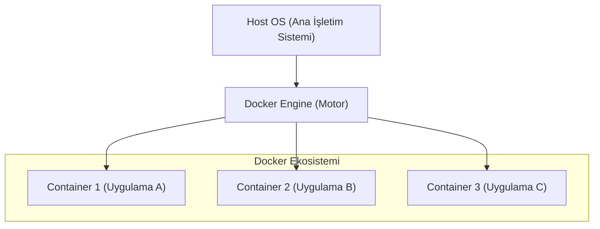
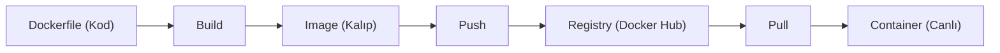

## 📌 Özet

Docker, uygulamaların her ortamda tutarlı bir şekilde çalışmasını sağlamak amacıyla uygulama ve tüm bağımlılıklarını izole edilmiş "konteyner" yapıları içinde paketleyen güçlü bir platformdur. Yazılım geliştirme süreçlerinde sıkça karşılaşılan "benim makinemde çalışıyordu" sorununu, işletim sistemi düzeyinde sanallaştırma yaparak ve standart bir paketleme formatı sunarak kökten çözer. Sanal makinelerin aksine, konteynerler doğrudan ana makinenin işletim sistemi çekirdeğini paylaşarak çok daha hafif, hızlı ve verimli bir kaynak kullanımı sunar. Bu teknoloji sayesinde, geliştiriciler uygulamalarını bir kez paketleyip bulut, yerel sunucu veya test ortamları gibi herhangi bir yerde güvenle çalıştırabilirler.

---

## 🧠 Detay



### 🗺️ Docker İş Akışı (Workflow)



### VM vs Container

```
VM                          Container
┌─────────────────┐         ┌─────────────────┐
│   Uygulama A    │         │  App A │  App B  │
│   Guest OS      │         ├────────┴─────────┤
│   Hypervisor    │         │  Docker Engine   │
│   Host OS       │         │  Host OS         │
│   Donanım       │         │  Donanım         │
└─────────────────┘         └─────────────────┘
GB'larca, dakikalar         MB'larca, saniyeler
```

| Özellik | VM | Container |
|---|---|---|
| Boyut | GB | MB |
| Başlatma | Dakikalar | Saniyeler |
| İzolasyon | Tam (kendi OS) | Süreç düzeyinde |
| Kaynak kullanım | Yüksek | Düşük |

### Temel Kavramlar

| Kavram | Açıklama |
|---|---|
| **Image** | Salt okunur şablon. Uygulamanın mavi kopyası |
| **Container** | Image'ın çalışan örneği |
| **Dockerfile** | Image oluşturmak için talimat dosyası |
| **Registry** | Image deposu (Docker Hub, ECR, GCR) |
| **Volume** | Kalıcı veri depolama |
| **Network** | Konteynerler arası iletişim |
| **Layer** | Her Dockerfile komutu bir katman oluşturur |

### Docker Mimarisi

```
┌──────────────────────────────────────────┐
│  Docker Client (CLI)                     │
│  docker build / run / pull / push        │
└──────────────┬───────────────────────────┘
               │ REST API
┌──────────────▼───────────────────────────┐
│  Docker Daemon (dockerd)                  │
│  ┌──────────┐  ┌──────────┐  ┌────────┐ │
│  │ Images   │  │Containers│  │Volumes │ │
│  └──────────┘  └──────────┘  └────────┘ │
└──────────────────────────────────────────┘
               │
┌──────────────▼───────────────────────────┐
│  Docker Registry (Docker Hub)            │
└──────────────────────────────────────────┘
```

### Kurulum Kontrolü

```bash
docker --version
docker info
docker run hello-world
```

### Image Katmanları

```
FROM python:3.11          # Layer 1: Base image
RUN apt-get update        # Layer 2: OS paketleri
COPY requirements.txt .   # Layer 3: Requirements
RUN pip install -r req..  # Layer 4: Python paketleri
COPY . .                  # Layer 5: Uygulama kodu
```

Her katman cache'lenir. Değişen katmandan sonrakiler yeniden build edilir.

---

## 💡 Bağlantılar
- [[Docker - Temel Komutlar]]
- [[Docker - Dockerfile Yazımı]]
- [[Docker - Docker Compose]]

## ❓ Sorular / Anlamadıklarım

## 🔗 Kaynaklar
- docs.docker.com/get-started
- Play with Docker (labs.play-with-docker.com)
