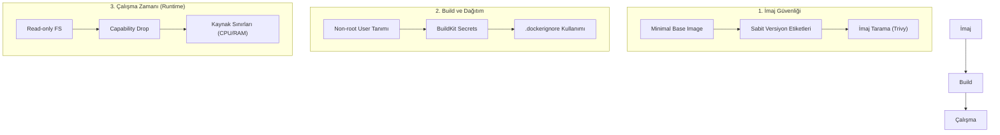

## 📌 Özet

Docker güvenliği, container'ların çalıştığı ortamdan kullanılan imajların içeriğine kadar uzanan çok katmanlı bir "savunma derinliği" (defense in depth) yaklaşımı gerektirir. Varsayılan Docker yapılandırmaları genellikle kullanım kolaylığına odaklandığı için, güvenlik best practice'lerini uygulamak geliştiricinin sorumluluğundadır. Bu süreç; uygulamaları root yetkileri olmayan kullanıcılarla çalıştırmak, "slim" veya "distroless" gibi minimal saldırı yüzeyine sahip taban imajlar seçmek ve hassas verileri (secrets) asla imaj katmanlarına gömmeden güvenli yöntemlerle yönetmek gibi temel adımları içerir. Ayrıca, çalışma zamanında kaynak sınırlandırması yapmak ve dosya sistemini salt-okunur (read-only) olarak ayarlamak, olası bir sızıntının sisteme verebileceği zararı minimize eder.

---

## 🧠 Detay

### Güvenlik Katmanları Mimarisi



### 1. Non-Root User (En Kritik!)

```dockerfile
# ❌ Kötü — root olarak çalışır
FROM python:3.11-slim
COPY . /app
CMD ["python", "/app/app.py"]

# ✅ İyi — non-root user
FROM python:3.11-slim

RUN addgroup --system appgroup && \
    adduser --system --ingroup appgroup appuser

WORKDIR /app
COPY --chown=appuser:appgroup . .
RUN pip install -r requirements.txt

USER appuser
CMD ["python", "app.py"]
```

```bash
# Çalışan container'ın user'ını kontrol et
docker exec mycontainer whoami
docker exec mycontainer id
```

### 2. Minimal Base Image

```dockerfile
# Küçük = Az saldırı yüzeyi
FROM python:3.11-slim        # ✅ slim
FROM python:3.11-alpine      # ✅ alpine (daha küçük)
FROM gcr.io/distroless/python3-debian11  # ✅ distroless (shell yok!)
FROM scratch                 # ✅ Boş (sadece Go binary'leri için)

# FROM python:3.11            # ❌ Gereksiz büyük
# FROM ubuntu:latest          # ❌ latest kullanma!
```

### 3. Secret Yönetimi

```dockerfile
# ❌ ASLA — secret'ı image'a göm
ENV API_KEY=supersecret123
COPY .env /app/.env
RUN curl -H "Authorization: Bearer mysecret" ...

# ✅ Çalışma zamanında environment
docker run -e API_KEY=${API_KEY} myapp

# ✅ Docker Secret (Swarm)
docker secret create api_key ./api_key.txt
docker service create \
  --secret api_key \
  myapp
```

```dockerfile
# ✅ Build zamanı secret (BuildKit)
# --secret dosyayı image'a yazmaz
# syntax=docker/dockerfile:1
FROM python:3.11-slim
RUN --mount=type=secret,id=pip_token \
    pip install --extra-index-url \
    https://$(cat /run/secrets/pip_token)@private.pypi.org/simple/ \
    mypackage
```

```bash
# BuildKit ile secret kullan
DOCKER_BUILDKIT=1 docker build \
  --secret id=pip_token,src=./token.txt \
  -t myapp .
```

### 4. Read-Only Filesystem

```bash
# Root filesystem salt okunur
docker run --read-only myapp

# Yazılacak dizinleri tmpfs yap
docker run --read-only \
  --tmpfs /tmp \
  --tmpfs /var/run \
  myapp
```

```yaml
# compose.yml
services:
  app:
    read_only: true
    tmpfs:
      - /tmp
      - /var/run
```

### 5. Capability Kısıtlama

```bash
# Tüm capability'leri drop et, sadece gerekeni ekle
docker run --cap-drop ALL --cap-add NET_BIND_SERVICE myapp

# Yaygın tehlikeli capability'ler
# SYS_ADMIN, NET_ADMIN, SYS_PTRACE — asla verme!
```

```yaml
# compose.yml
services:
  app:
    cap_drop:
      - ALL
    cap_add:
      - NET_BIND_SERVICE   # 1024 altı port için
```

### 6. Kaynak Sınırlama

```bash
docker run \
  --memory="512m" \          # Max RAM
  --memory-swap="512m" \     # Swap yok (memory = swap)
  --cpus="1.5" \             # Max 1.5 CPU
  --pids-limit 100 \         # Max süreç sayısı
  --ulimit nofile=1024:1024 \ # File descriptor limiti
  myapp
```

```yaml
services:
  app:
    deploy:
      resources:
        limits:
          cpus: '1.0'
          memory: 512M
        reservations:
          cpus: '0.5'
          memory: 256M
```

### 7. Güvenlik Taraması

```bash
# Trivy (en kapsamlı)
trivy image python:3.11-slim
trivy image --severity HIGH,CRITICAL myapp:latest
trivy fs .                    # Dockerfile ve bağımlılıkları tara
trivy config .                # Dockerfile best practices kontrol

# Docker Scout
docker scout cves myapp:latest
docker scout quickview myapp:latest

# Grype
grype myapp:latest
```

### 8. Dockerfile Lint

```bash
# Hadolint — Dockerfile linter
docker run --rm -i hadolint/hadolint < Dockerfile

# Dockle — container image linter
dockle myapp:latest
```

### 9. Ağ Güvenliği

```yaml
services:
  db:
    networks:
      - internal     # Sadece iç ağ
    # ports: — açma! Dış erişim yok

  api:
    networks:
      - internal
      - public

networks:
  internal:
    internal: true   # İnternete çıkış yok
  public:
    driver: bridge
```

### 10. .dockerignore Güvenliği

```
# .dockerignore — hassas dosyaları dışla
.env
.env.local
.env.production
*.pem
*.key
*.crt
id_rsa
.ssh/
secrets/
.git/
```

### Güvenlik Kontrol Listesi

- [ ] Non-root user kullanılıyor mu?
- [ ] Minimal base image seçildi mi?
- [ ] Secret'lar image'da değil mi?
- [ ] .dockerignore tanımlı mı?
- [ ] latest tag yerine sabit versiyon mi?
- [ ] Güvenlik taraması yapıldı mı?
- [ ] Read-only filesystem değerlendirildi mi?
- [ ] Kaynak sınırlamaları var mı?
- [ ] Gereksiz port açık mı?
- [ ] Capability'ler kısıtlandı mı?

### Docker Bench Security

```bash
# Tüm Docker güvenlik yapılandırmasını kontrol et
docker run --rm -it \
  --net host \
  --pid host \
  --userns host \
  --cap-add audit_control \
  -v /etc:/etc:ro \
  -v /usr/bin/containerd:/usr/bin/containerd:ro \
  -v /usr/bin/runc:/usr/bin/runc:ro \
  -v /usr/lib/systemd:/usr/lib/systemd:ro \
  -v /var/lib:/var/lib:ro \
  -v /var/run/docker.sock:/var/run/docker.sock:ro \
  docker/docker-bench-security
```

---

## 💡 Bağlantılar
- [[Docker - Dockerfile Yazımı]]
- [[Docker - Network Yönetimi]]
- [[Docker - Registry ve Image Yönetimi]]

## ❓ Sorular / Anlamadıklarım

## 🔗 Kaynaklar
- docs.docker.com/engine/security/
- OWASP Docker Security Cheat Sheet
