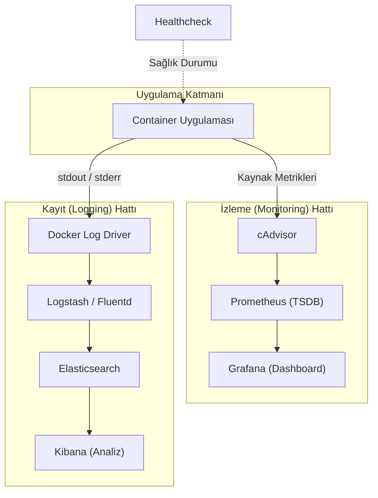

## 📌 Özet

Docker ekosisteminde izleme (monitoring) ve kayıt tutma (logging), container tabanlı uygulamaların sağlığını, performansını ve güvenliğini sağlamak için vazgeçilmezdir. Log yönetimi, container'ların ürettiği standart çıktıları (stdout/stderr) yakalayarak yerel dosyalara veya ELK (Elasticsearch, Logstash, Kibana) gibi merkezi sistemlere ileten esnek "log driver" mekanizmalarına dayanır. İzleme tarafında ise `docker stats` gibi yerleşik komutların ötesinde, cAdvisor ile kaynak kullanım metrikleri toplanır, Prometheus ile depolanır ve Grafana üzerinden görselleştirilir. Bu süreçler, Healthcheck mekanizmalarıyla birleşerek uygulamaların sadece çalışır durumda olmasını değil, aynı zamanda sağlıklı hizmet vermesini garanti altına alır.

---

## 🧠 Detay

### İzleme ve Log Akış Mimarisi



### Temel İzleme Komutları

```bash
# Canlı kaynak kullanımı
docker stats
docker stats mycontainer
docker stats --no-stream           # Anlık (sürekli değil)
docker stats --format "table {{.Name}}\t{{.CPUPerc}}\t{{.MemUsage}}"

# Süreçleri görüntüle
docker top mycontainer

# Sağlık durumu
docker inspect --format='{{.State.Health.Status}}' mycontainer

# Olayları izle
docker events
docker events --filter container=mycontainer
docker events --since 1h
```

### Log Yönetimi

```bash
# Log görüntüle
docker logs mycontainer
docker logs -f mycontainer         # Canlı takip
docker logs --tail 100 mycontainer
docker logs --since 2024-01-01 mycontainer
docker logs --since 1h mycontainer
docker logs -t mycontainer         # Zaman damgası

# Log driver seçenekleri
docker run --log-driver json-file \
  --log-opt max-size=10m \
  --log-opt max-file=3 \
  myapp
```

### Log Driver'ları

```yaml
# compose.yml — log yapılandırması
services:
  app:
    logging:
      driver: json-file          # Varsayılan
      options:
        max-size: "10m"
        max-file: "3"

  # Diğer log driver'ları:
  app2:
    logging:
      driver: syslog
      options:
        syslog-address: "tcp://192.168.0.42:123"

  app3:
    logging:
      driver: gelf               # Graylog
      options:
        gelf-address: "udp://localhost:12201"

  app4:
    logging:
      driver: fluentd
      options:
        fluentd-address: localhost:24224

  app5:
    logging:
      driver: awslogs
      options:
        awslogs-region: us-east-1
        awslogs-group: myapp-logs
```

### ELK Stack ile Log Toplama

```yaml
# docker-compose-elk.yml
version: '3.9'

services:
  elasticsearch:
    image: elasticsearch:8.11.0
    environment:
      - discovery.type=single-node
      - xpack.security.enabled=false
    volumes:
      - es_data:/usr/share/elasticsearch/data
    ports:
      - "9200:9200"

  logstash:
    image: logstash:8.11.0
    volumes:
      - ./logstash.conf:/usr/share/logstash/pipeline/logstash.conf
    ports:
      - "5044:5044"
    depends_on:
      - elasticsearch

  kibana:
    image: kibana:8.11.0
    ports:
      - "5601:5601"
    depends_on:
      - elasticsearch

volumes:
  es_data:
```

### Prometheus + Grafana ile Metrik İzleme

```yaml
# docker-compose-monitoring.yml
services:
  prometheus:
    image: prom/prometheus:latest
    volumes:
      - ./prometheus.yml:/etc/prometheus/prometheus.yml
      - prometheus_data:/prometheus
    ports:
      - "9090:9090"
    command:
      - '--config.file=/etc/prometheus/prometheus.yml'
      - '--storage.tsdb.retention.time=15d'

  grafana:
    image: grafana/grafana:latest
    ports:
      - "3000:3000"
    environment:
      - GF_SECURITY_ADMIN_PASSWORD=admin
    volumes:
      - grafana_data:/var/lib/grafana
    depends_on:
      - prometheus

  cadvisor:
    image: gcr.io/cadvisor/cadvisor:latest
    volumes:
      - /:/rootfs:ro
      - /var/run:/var/run:ro
      - /sys:/sys:ro
      - /var/lib/docker/:/var/lib/docker:ro
    ports:
      - "8080:8080"

  node_exporter:
    image: prom/node-exporter:latest
    volumes:
      - /proc:/host/proc:ro
      - /sys:/host/sys:ro
      - /:/rootfs:ro
    ports:
      - "9100:9100"

volumes:
  prometheus_data:
  grafana_data:
```

```yaml
# prometheus.yml
global:
  scrape_interval: 15s

scrape_configs:
  - job_name: 'cadvisor'
    static_configs:
      - targets: ['cadvisor:8080']

  - job_name: 'node-exporter'
    static_configs:
      - targets: ['node_exporter:9100']

  - job_name: 'myapp'
    static_configs:
      - targets: ['myapp:8000']
    metrics_path: /metrics
```

### Healthcheck

```dockerfile
# Dockerfile
HEALTHCHECK --interval=30s \
            --timeout=10s \
            --start-period=30s \
            --retries=3 \
    CMD curl -f http://localhost:8000/health || exit 1

# HTTP endpoint
HEALTHCHECK CMD wget --no-verbose --tries=1 --spider \
    http://localhost:8000/health || exit 1

# DB sağlık
HEALTHCHECK CMD pg_isready -U postgres || exit 1
```

```yaml
# compose.yml
services:
  app:
    healthcheck:
      test: ["CMD", "curl", "-f", "http://localhost:8000/health"]
      interval: 30s
      timeout: 10s
      retries: 3
      start_period: 40s
```

### Özet Dashboard

```bash
# Tüm container durumu
docker ps --format "table {{.Names}}\t{{.Status}}\t{{.Ports}}"

# Tüm kaynak kullanımı
docker stats --no-stream --format \
  "table {{.Name}}\t{{.CPUPerc}}\t{{.MemUsage}}\t{{.NetIO}}\t{{.BlockIO}}"

# Disk kullanımı
docker system df -v
```

---

## 💡 Bağlantılar
- [[Docker - Temel Komutlar]]
- [[Docker - Docker Compose]]
- [[Docker - Swarm ve Ölçeklendirme]]

## ❓ Sorular / Anlamadıklarım

## 🔗 Kaynaklar
- docs.docker.com/config/containers/logging/
- prometheus.io/docs/
