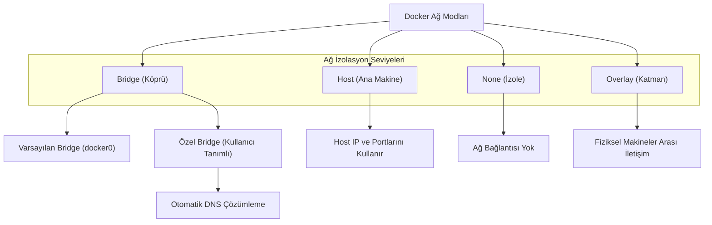

## 📌 Özet

Docker ağ yönetimi, konteynerlerin birbirleriyle, ana makineyle (host) ve dış dünyayla nasıl iletişim kuracağını belirleyen kritik bir katmandır. Docker, farklı kullanım senaryolarına uygun olarak Bridge, Host, Overlay ve None gibi çeşitli ağ sürücüleri sunar. Özel köprü ağları (Custom Bridge Networks), konteynerler arasında otomatik DNS çözümlemesi sağlayarak mikroservislerin birbirlerini IP adresleri yerine isimleri üzerinden bulmasına olanak tanır. Güvenli bir mimari kurmak için, servisleri mantıksal ağlara ayırmak ve dış dünyaya sadece gerekli portları açmak, konteynerize edilmiş uygulamaların ağ güvenliğini sağlamanın temel yoludur.

---

## 🧠 Detay



### Network Türleri

| Tür | Kullanım | DNS |
|---|---|---|
| **bridge** | Tek host, container-container | Sadece custom'da |
| **host** | Host ağını paylaş | Host DNS |
| **none** | Ağ yok, tam izolasyon | — |
| **overlay** | Çok host (Swarm) | Evet |
| **macvlan** | MAC adresi ata | Evet |

### Bridge Network

```
Default Bridge (docker0):
┌───────────────────────────────┐
│  Host                         │
│  ┌──────────┐  ┌──────────┐  │
│  │ cont-A   │  │ cont-B   │  │
│  │172.17.0.2│  │172.17.0.3│  │
│  └────┬─────┘  └────┬─────┘  │
│       └──────┬───────┘        │
│          docker0               │
│         172.17.0.1            │
│              │                 │
│          eth0 (Host)          │
│         192.168.1.5           │
└───────────────────────────────┘
```

```bash
# Varsayılan bridge — container ismiyle DNS çalışmaz
docker run --name a alpine
docker run --name b alpine ping a  # ❌ Çalışmaz!

# Custom bridge — DNS ile isim çözümleme
docker network create mynet
docker run --network mynet --name a alpine
docker run --network mynet --name b alpine ping a  # ✅ Çalışır!
```

### Network Komutları

```bash
# Listeleme
docker network ls

# Oluşturma
docker network create mynet
docker network create --driver bridge mynet
docker network create --subnet 172.20.0.0/16 --gateway 172.20.0.1 mynet

# Detay
docker network inspect mynet

# Container bağla/ayır
docker network connect mynet mycontainer
docker network disconnect mynet mycontainer

# Sil
docker network rm mynet
docker network prune    # Kullanılmayanları sil
```

### Custom Bridge — İzole Ağ

```bash
# Servisler kendi ağında konuşur, dışarıya sadece port ile çıkar
docker network create backend-net
docker network create frontend-net

# DB — sadece backend'de
docker run -d --network backend-net --name db postgres

# API — hem backend hem frontend
docker run -d --network backend-net --name api myapi
docker network connect frontend-net api

# Nginx — sadece frontend, dışarıya 80 açık
docker run -d --network frontend-net -p 80:80 --name nginx nginx
```

### Port Yönlendirme

```bash
# -p host_port:container_port
docker run -p 8080:80 nginx        # localhost:8080 → container:80
docker run -p 127.0.0.1:8080:80   # Sadece loopback
docker run -p 80                   # Rastgele host port

# Tüm portları aç (-P)
docker run -P nginx    # EXPOSE edilen tüm portlar rastgele açılır

# Port görüntüle
docker port mycontainer
```

### Host Network

```bash
# Container, host ağını paylaşır (port binding gereksiz)
docker run --network host nginx
# nginx:80 → host:80 (direkt)

# Linux'ta çalışır, Mac/Win'de sınırlı
```

### Docker Compose'da Network

```yaml
services:
  nginx:
    networks:
      - frontend

  api:
    networks:
      - frontend
      - backend

  db:
    networks:
      - backend

networks:
  frontend:
    driver: bridge
  backend:
    driver: bridge
    internal: true    # Dış erişim yok!
```

```yaml
# Harici network kullan
networks:
  existing_net:
    external: true
    name: my-existing-network
```

### Container DNS Çözümleme

```bash
# Custom network'te isimle erişim
# Servis adı = hostname
docker compose exec web ping db      # ✅ db:5432
docker compose exec web ping redis   # ✅ redis:6379

# Aliases
docker run --network mynet \
  --network-alias db \
  --network-alias database \
  postgres
# Her ikisiyle de erişilir
```

### Ağ Güvenliği Best Practices

```yaml
services:
  web:
    networks:
      - public     # Internete açık
      - private    # İç servislerle

  api:
    networks:
      - private    # Sadece iç ağ

  db:
    networks:
      - private

networks:
  public:
    driver: bridge
  private:
    driver: bridge
    internal: true   # Dış bağlantı yok
```

### Ağ Topolojisi Örneği

```
Internet
    │
    ▼
┌──────────────────────────────────────┐
│  Nginx (public + internal network)   │
│  Port 80, 443 açık                   │
└──────────┬───────────────────────────┘
           │ internal network
    ┌──────▼──────┐
    │   API/Web   │ ─────► Redis (cache)
    │  (internal) │
    └──────┬──────┘
           │ db network
    ┌──────▼──────┐
    │  PostgreSQL │
    │  (db only)  │
    └─────────────┘
```

---

## 💡 Bağlantılar
- [[Docker - Temel Komutlar]]
- [[Docker - Docker Compose]]
- [[Docker - Docker Swarm ve Ölçeklendirme]]

## ❓ Sorular / Anlamadıklarım

## 🔗 Kaynaklar
- docs.docker.com/network/
