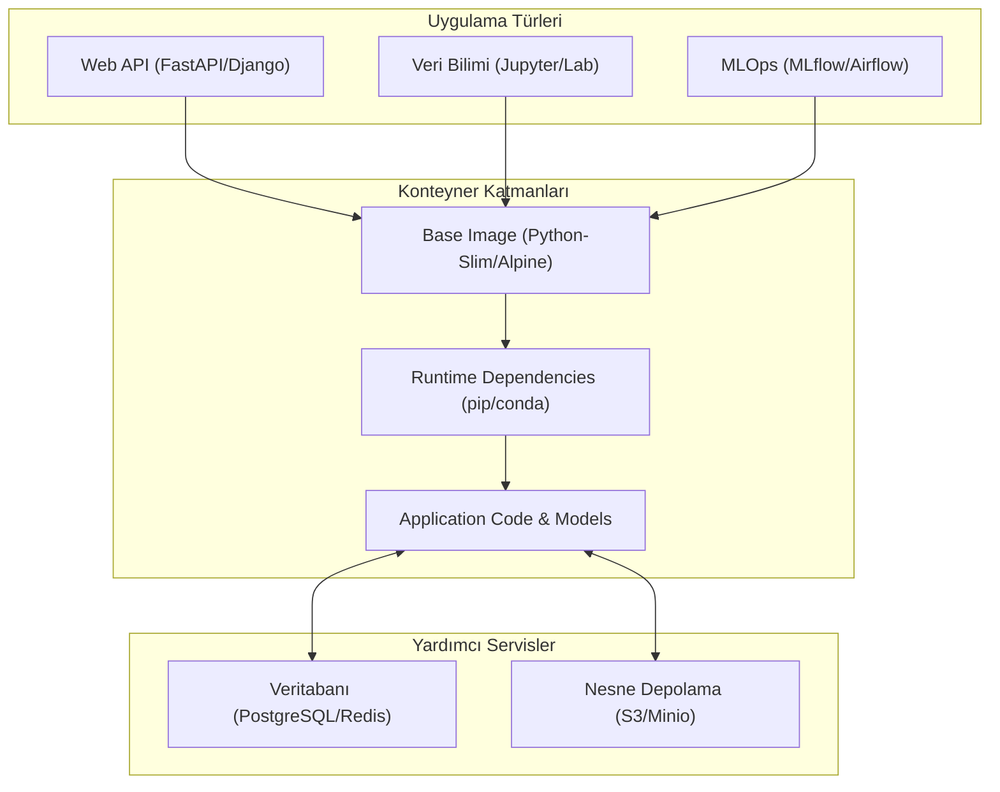

## 📌 Özet

Python tabanlı web uygulamaları ve veri bilimi projelerinde Docker, bağımlılık karmaşasını çözen ve "benim makinemde çalışıyordu" sorununu ortadan kaldıran standart bir dağıtım formatı sunar. FastAPI ve Django gibi modern web çatılarından, Jupyter Notebook ve MLflow gibi veri bilimi ekosisteminin temel taşlarına kadar her araç, Docker container'ları sayesinde izole ve ölçeklenebilir bir yapıya kavuşur. Özellikle büyük veri kütüphaneleri ve karmaşık sistem bağımlılıkları gerektiren ML projelerinde, Docker imajları geliştirme sürecini hızlandırırken canlı ortamda (production) tutarlılık sağlar. Bu rehber, Python projelerini production-ready (üretim düzeyinde) Dockerize etmek için gerekli olan en iyi uygulamaları, güvenlik ayarlarını ve orkestrasyon şablonlarını içermektedir.

---

## 🧠 Detay

### Python ve ML Docker Ekosistemi



### FastAPI Uygulaması

```dockerfile
# Dockerfile
FROM python:3.11-slim

ENV PYTHONDONTWRITEBYTECODE=1 \
    PYTHONUNBUFFERED=1 \
    PIP_NO_CACHE_DIR=1 \
    PIP_DISABLE_PIP_VERSION_CHECK=1

WORKDIR /app

# Bağımlılıkları önce kopyala (cache için)
COPY requirements.txt .
RUN pip install --no-cache-dir -r requirements.txt

# Non-root kullanıcı
RUN adduser --disabled-password --gecos '' appuser && \
    chown -R appuser:appuser /app
USER appuser

# Uygulama kodu
COPY --chown=appuser:appuser . .

EXPOSE 8000

HEALTHCHECK --interval=30s --timeout=10s --retries=3 \
    CMD python -c "import urllib.request; urllib.request.urlopen('http://localhost:8000/health')"

CMD ["uvicorn", "main:app", "--host", "0.0.0.0", "--port", "8000", "--workers", "4"]
```

```yaml
# docker-compose.yml
version: '3.9'

services:
  api:
    build: .
    ports:
      - "8000:8000"
    environment:
      - DATABASE_URL=postgresql://user:pass@db:5432/mydb
      - REDIS_URL=redis://redis:6379/0
      - SECRET_KEY=${SECRET_KEY}
    depends_on:
      db:
        condition: service_healthy
      redis:
        condition: service_started
    volumes:
      - ./app:/app/app    # Geliştirmede canlı kod
    restart: unless-stopped

  db:
    image: postgres:15-alpine
    environment:
      POSTGRES_USER: user
      POSTGRES_PASSWORD: pass
      POSTGRES_DB: mydb
    volumes:
      - postgres_data:/var/lib/postgresql/data
    healthcheck:
      test: ["CMD-SHELL", "pg_isready -U user -d mydb"]
      interval: 5s
      retries: 5

  redis:
    image: redis:7-alpine
    command: redis-server --maxmemory 256mb --maxmemory-policy allkeys-lru

volumes:
  postgres_data:
```

### Django Uygulaması (Gunicorn + Nginx)

```dockerfile
# Dockerfile
FROM python:3.11-slim AS base

ENV PYTHONDONTWRITEBYTECODE=1 \
    PYTHONUNBUFFERED=1

WORKDIR /app

RUN apt-get update && apt-get install -y \
    libpq-dev \
    && rm -rf /var/lib/apt/lists/*

COPY requirements.txt .
RUN pip install --no-cache-dir -r requirements.txt

FROM base AS production

COPY . .

RUN python manage.py collectstatic --noinput

RUN adduser --disabled-password --gecos '' django && \
    chown -R django:django /app
USER django

EXPOSE 8000
CMD ["gunicorn", "myproject.wsgi:application", \
     "--bind", "0.0.0.0:8000", \
     "--workers", "4", \
     "--timeout", "120"]
```

```nginx
# nginx/nginx.conf
server {
    listen 80;

    location /static/ {
        alias /app/staticfiles/;
    }

    location /media/ {
        alias /app/media/;
    }

    location / {
        proxy_pass http://web:8000;
        proxy_set_header Host $host;
        proxy_set_header X-Real-IP $remote_addr;
        proxy_set_header X-Forwarded-For $proxy_add_x_forwarded_for;
    }
}
```

### Jupyter Notebook Ortamı

```dockerfile
# Dockerfile.jupyter
FROM jupyter/datascience-notebook:latest

# Ek paketler
RUN pip install --no-cache-dir \
    lightgbm \
    xgboost \
    catboost \
    shap \
    plotly \
    mlflow \
    scikit-learn \
    imbalanced-learn

# Özel konfigürasyon
COPY jupyter_notebook_config.py /home/jovyan/.jupyter/

WORKDIR /home/jovyan/work

EXPOSE 8888
```

```yaml
# docker-compose.yml (Jupyter)
services:
  jupyter:
    build:
      context: .
      dockerfile: Dockerfile.jupyter
    ports:
      - "8888:8888"
    volumes:
      - ./notebooks:/home/jovyan/work     # Notebooks
      - ./data:/home/jovyan/work/data     # Veri
      - ./models:/home/jovyan/work/models # Modeller
    environment:
      - JUPYTER_ENABLE_LAB=yes
      - GRANT_SUDO=yes
    command: start-notebook.sh --NotebookApp.token='' --NotebookApp.password=''
    # Production'da token/password ekle!
```

### MLflow Tracking Server

```yaml
# docker-compose.yml (MLflow)
services:
  mlflow:
    image: python:3.11-slim
    command: >
      bash -c "pip install mlflow psycopg2-binary boto3 &&
               mlflow server
               --backend-store-uri postgresql://user:pass@db:5432/mlflow
               --default-artifact-root s3://my-mlflow-bucket/artifacts
               --host 0.0.0.0
               --port 5000"
    ports:
      - "5000:5000"
    environment:
      - AWS_ACCESS_KEY_ID=${AWS_ACCESS_KEY_ID}
      - AWS_SECRET_ACCESS_KEY=${AWS_SECRET_ACCESS_KEY}
      - AWS_DEFAULT_REGION=us-east-1
    depends_on:
      - db

  db:
    image: postgres:15-alpine
    environment:
      POSTGRES_USER: user
      POSTGRES_PASSWORD: pass
      POSTGRES_DB: mlflow
    volumes:
      - mlflow_db:/var/lib/postgresql/data

volumes:
  mlflow_db:
```

### Geliştirme vs Production Compose

```yaml
# docker-compose.yml (base)
services:
  web:
    build: .
    environment:
      - DATABASE_URL=${DATABASE_URL}

# docker-compose.override.yml (geliştirme — otomatik yüklenir)
services:
  web:
    build:
      context: .
      target: development
    volumes:
      - .:/app          # Canlı kod
      - /app/.venv      # venv'i bind mount'tan koru
    environment:
      - DEBUG=True
      - RELOAD=True
    command: uvicorn main:app --host 0.0.0.0 --port 8000 --reload
    ports:
      - "8000:8000"

  db:
    ports:
      - "5432:5432"     # Direkt DB erişimi
```

```bash
# Geliştirme
docker compose up

# Production
docker compose -f docker-compose.yml up -d
```

### Celery Worker (Django/FastAPI)

```yaml
services:
  web:
    build: .
    command: uvicorn main:app --host 0.0.0.0 --port 8000

  celery_worker:
    build: .
    command: celery -A myapp worker -l info -c 4 -Q default,high
    environment:
      - CELERY_BROKER_URL=redis://redis:6379/0
      - CELERY_RESULT_BACKEND=redis://redis:6379/1
    depends_on:
      - redis
      - db

  celery_beat:
    build: .
    command: celery -A myapp beat -l info --scheduler django_celery_beat.schedulers:DatabaseScheduler
    depends_on:
      - redis
      - db

  flower:
    build: .
    command: celery -A myapp flower --port=5555
    ports:
      - "5555:5555"
    depends_on:
      - redis
```

### Makefile ile Docker Komutları

```makefile
# Makefile
.PHONY: build up down logs shell migrate test

build:
	docker compose build

up:
	docker compose up -d

down:
	docker compose down

logs:
	docker compose logs -f

shell:
	docker compose exec web bash

migrate:
	docker compose exec web python manage.py migrate

test:
	docker compose exec web pytest -v

clean:
	docker compose down -v --rmi local
	docker system prune -f
```

---

## 💡 Bağlantılar
- [[Docker - Dockerfile Yazımı]]
- [[Docker - Docker Compose]]
- [[Docker - Volume ve Veri Yönetimi]]
- [[ML - Veri Ön İşleme Pipeline]]

## ❓ Sorular / Anlamadıklarım

## 🔗 Kaynaklar
- FastAPI Docker Deployment Docs
- Django Docker Best Practices
- jupyter/docker-stacks GitHub
