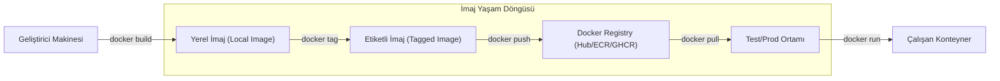

## 📌 Özet

Docker Registry, oluşturulan imajların güvenli bir şekilde saklandığı, sürümlendiği ve dağıtıldığı merkezi bir depo sistemidir. En yaygın kullanılan genel registry Docker Hub olsa da, kurumsal ihtiyaçlar için AWS ECR, Google Artifact Registry veya öz-barındırılan (self-hosted) Harbor gibi özel çözümler tercih edilir. İmaj etiketleme (tagging) stratejileri, sürümlerin takibini kolaylaştırırken; imaj tarama araçları, depolanan yazılımlardaki güvenlik açıklarını tespit etmek için kritik bir rol oynar. Etkili bir registry yönetimi, CI/CD süreçlerinin sorunsuz işlemesini ve konteynerize edilmiş uygulamaların hızlı bir şekilde farklı ortamlara yayılmasını sağlar.

---

## 🧠 Detay



### Docker Hub

```bash
# Giriş yap
docker login
docker login -u username -p password

# Image push
docker tag myapp:latest username/myapp:latest
docker push username/myapp:latest

# Image pull
docker pull username/myapp:latest
docker pull username/myapp:1.0

# Çıkış yap
docker logout
```

### Image Tag Stratejisi

```bash
# Semantic versioning
docker tag myapp username/myapp:1.2.3        # Tam versiyon
docker tag myapp username/myapp:1.2          # Minor versiyon
docker tag myapp username/myapp:1            # Major versiyon
docker tag myapp username/myapp:latest       # En güncel

# Git commit hash ile
GIT_HASH=$(git rev-parse --short HEAD)
docker tag myapp username/myapp:${GIT_HASH}

# Tarih ile
docker tag myapp username/myapp:$(date +%Y%m%d)

# Ortam ile
docker tag myapp username/myapp:prod
docker tag myapp username/myapp:staging
```

### Private Registry — Docker Registry

```bash
# Yerel registry başlat
docker run -d -p 5000:5000 --name registry \
  -v registry_data:/var/lib/registry \
  registry:2

# Image push
docker tag myapp localhost:5000/myapp:latest
docker push localhost:5000/myapp:latest

# Image pull
docker pull localhost:5000/myapp:latest

# Registry'yi listele
curl http://localhost:5000/v2/_catalog
curl http://localhost:5000/v2/myapp/tags/list
```

### Harbor (Kurumsal Registry)

```bash
# Harbor üzerinden
docker login harbor.company.com
docker tag myapp harbor.company.com/project/myapp:1.0
docker push harbor.company.com/project/myapp:1.0
```

### AWS ECR

```bash
# AWS CLI ile login
aws ecr get-login-password --region us-east-1 | \
  docker login --username AWS \
  --password-stdin 123456789.dkr.ecr.us-east-1.amazonaws.com

# Repository oluştur
aws ecr create-repository --repository-name myapp

# Push
docker tag myapp 123456789.dkr.ecr.us-east-1.amazonaws.com/myapp:latest
docker push 123456789.dkr.ecr.us-east-1.amazonaws.com/myapp:latest
```

### GitHub Container Registry (GHCR)

```bash
# Token ile giriş
echo $GITHUB_TOKEN | docker login ghcr.io -u USERNAME --password-stdin

# Push
docker tag myapp ghcr.io/username/myapp:latest
docker push ghcr.io/username/myapp:latest
```

### Image Güvenlik Taraması

```bash
# Docker Scout (Docker Hub entegrasyonu)
docker scout cves myapp:latest
docker scout recommendations myapp:latest

# Trivy (açık kaynak)
trivy image myapp:latest
trivy image --severity HIGH,CRITICAL myapp:latest

# Snyk
snyk container test myapp:latest
```

### Image Sıkıştırma ve Optimizasyon

```bash
# Dive — katman analizi
dive myapp:latest
# Her katmanın boyutunu ve verimliliğini gösterir

# docker-slim — image küçültme
docker-slim build myapp:latest
# Otomatik 30x küçültme (kullanılmayan dosyaları çıkarır)

# Squash layers (deneysel)
docker build --squash -t myapp:squashed .
```

### CI/CD Pipeline Örneği

```yaml
# .github/workflows/docker.yml
name: Docker Build & Push

on:
  push:
    branches: [main]
    tags: ['v*']

jobs:
  build:
    runs-on: ubuntu-latest
    steps:
      - uses: actions/checkout@v4

      - name: Docker Buildx kur
        uses: docker/setup-buildx-action@v3

      - name: GHCR giriş
        uses: docker/login-action@v3
        with:
          registry: ghcr.io
          username: ${{ github.actor }}
          password: ${{ secrets.GITHUB_TOKEN }}

      - name: Metadata hazırla
        uses: docker/metadata-action@v5
        id: meta
        with:
          images: ghcr.io/${{ github.repository }}
          tags: |
            type=semver,pattern={{version}}
            type=semver,pattern={{major}}.{{minor}}
            type=sha

      - name: Build & Push
        uses: docker/build-push-action@v5
        with:
          context: .
          push: true
          tags: ${{ steps.meta.outputs.tags }}
          labels: ${{ steps.meta.outputs.labels }}
          cache-from: type=gha
          cache-to: type=gha,mode=max
```

### Registry Karşılaştırma

| Registry | Ücretsiz | Private | Özellik |
|---|---|---|---|
| Docker Hub | Sınırlı | Ücretli | En yaygın |
| GHCR | Evet | Evet | GitHub entegrasyonu |
| AWS ECR | Ücretli | Evet | AWS ekosistemi |
| Google GCR | Ücretli | Evet | GCP ekosistemi |
| Harbor | Self-hosted | Evet | Kurumsal, açık kaynak |
| Quay.io | Sınırlı | Evet | Red Hat |

---

## 💡 Bağlantılar
- [[Docker - Dockerfile Yazımı]]
- [[Docker - Güvenlik Best Practices]]

## ❓ Sorular / Anlamadıklarım

## 🔗 Kaynaklar
- docs.docker.com/registry/
- hub.docker.com
