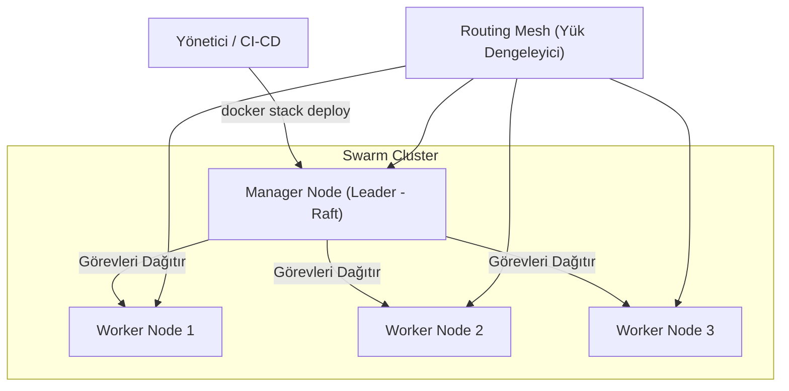

## 📌 Özet

Docker Swarm, birden fazla Docker host'unu bir araya getirerek tek bir sanal kaynak havuzu gibi yönetmenizi sağlayan, Docker ekosistemine yerleşik bir orkestrasyon aracıdır. Kubernetes'e göre çok daha hızlı kurulum ve düşük öğrenme eğrisi sunan bu yapı, mikroservislerin ölçeklendirilmesi, hata toleransı ve yük dengeleme gibi kritik görevleri otomatikleştirir. "Manager" düğümleri cluster yönetiminden ve görev dağıtımından sorumluyken, "Worker" düğümleri ise tanımlanan servislerin container'larını çalıştırır. Swarm'un en güçlü yanlarından biri, servis güncellemelerini kesintisiz bir şekilde (rolling updates) gerçekleştirebilmesi ve bir hata durumunda otomatik olarak önceki sürüme dönebilmesidir (rollback).

---

## 🧠 Detay

### Swarm Mimarisi



```
┌────────────────────────────────────────┐
│  Swarm Cluster                         │
│                                        │
│  ┌──────────────┐                      │
│  │   Manager    │ ← docker swarm init  │
│  │   Node 1     │ ← Raft konsensüs     │
│  └──────┬───────┘                      │
│         │                              │
│  ┌──────▼───────┐  ┌──────────────┐   │
│  │   Worker     │  │   Worker     │   │
│  │   Node 2     │  │   Node 3     │   │
│  └──────────────┘  └──────────────┘   │
└────────────────────────────────────────┘
```

| Rol | Görev |
|---|---|
| **Manager** | Cluster yönetimi, iş dağıtımı, Raft konsensüs |
| **Worker** | Container çalıştırır |

### Swarm Kurulumu

```bash
# Manager'ı başlat
docker swarm init --advertise-addr 192.168.1.10

# Worker token'ı al
docker swarm join-token worker

# Worker'ı ekle (worker node'da çalıştır)
docker swarm join \
  --token SWMTKN-1-xxxxx \
  192.168.1.10:2377

# Node listesi
docker node ls

# Node promote (worker → manager)
docker node promote worker-node-1

# Node demote
docker node demote manager-node-2

# Swarm'dan ayrıl
docker swarm leave
docker swarm leave --force   # Manager için
```

### Service Yönetimi

```bash
# Service oluştur
docker service create \
  --name web \
  --replicas 3 \
  --publish 80:80 \
  --network mynet \
  nginx

# Service listele
docker service ls
docker service ps web        # Replica'ları gör
docker service logs web
docker service logs -f web

# Ölçeklendirme
docker service scale web=5
docker service update --replicas 5 web

# Güncelleme (rolling update)
docker service update \
  --image nginx:1.25 \
  --update-parallelism 2 \     # Aynı anda 2 replica güncelle
  --update-delay 10s \         # Aralarında 10 saniye bekle
  web

# Rollback
docker service rollback web

# Service sil
docker service rm web
```

### Stack (Compose ile Swarm)

```yaml
# docker-stack.yml
version: '3.9'

services:
  web:
    image: myapp:1.0
    deploy:
      replicas: 3
      update_config:
        parallelism: 1
        delay: 10s
        failure_action: rollback
      restart_policy:
        condition: on-failure
        delay: 5s
        max_attempts: 3
      placement:
        constraints:
          - node.role == worker
          - node.labels.disk == ssd
      resources:
        limits:
          cpus: '0.5'
          memory: 256M
    ports:
      - "80:80"
    networks:
      - webnet
    secrets:
      - db_password
    configs:
      - nginx_config

  db:
    image: postgres:15
    deploy:
      replicas: 1
      placement:
        constraints:
          - node.role == manager
    volumes:
      - db_data:/var/lib/postgresql/data
    networks:
      - webnet

networks:
  webnet:
    driver: overlay

volumes:
  db_data:

secrets:
  db_password:
    external: true

configs:
  nginx_config:
    file: ./nginx.conf
```

```bash
# Stack deploy
docker stack deploy -c docker-stack.yml mystack

# Stack listele
docker stack ls
docker stack services mystack
docker stack ps mystack

# Stack kaldır
docker stack rm mystack
```

### Secrets (Swarm)

```bash
# Secret oluştur
echo "supersecretpassword" | docker secret create db_password -
docker secret create ssl_cert ./cert.pem

# Secret listele
docker secret ls
docker secret inspect db_password

# Secret sil
docker secret rm db_password
```

```yaml
# Stack'te kullanım
services:
  db:
    secrets:
      - db_password

secrets:
  db_password:
    external: true   # Zaten oluşturuldu

# Container içinde: /run/secrets/db_password
```

### Rolling Update Stratejisi

```bash
docker service update \
  --image myapp:2.0 \
  --update-order start-first \    # Önce yeni başlat, sonra eskiyi sil
  --update-parallelism 1 \
  --update-delay 30s \
  --update-failure-action rollback \
  --rollback-parallelism 2 \
  myapp
```

### Node Etiketleme ve Placement

```bash
# Node'a etiket ekle
docker node update --label-add disk=ssd worker-1
docker node update --label-add region=eu worker-2

# Placement constraint
docker service create \
  --constraint 'node.labels.disk == ssd' \
  --constraint 'node.role == worker' \
  myapp
```

### Swarm vs Kubernetes

| Özellik | Docker Swarm | Kubernetes |
|---|---|---|
| Karmaşıklık | Basit | Karmaşık |
| Kurulum | Dakikalar | Saatler |
| Ölçek | Orta | Büyük |
| Öğrenme eğrisi | Kolay | Zor |
| Ekosistem | Küçük | Büyük |
| Production olgunluğu | Yeterli | Üstün |

---

## 💡 Bağlantılar
- [[Docker - Docker Compose]]
- [[Docker - Network Yönetimi]]
- [[Docker - Monitoring ve Logging]]

## ❓ Sorular / Anlamadıklarım

## 🔗 Kaynaklar
- docs.docker.com/engine/swarm/
